# WiFi Scanning Subsystem - Level 2 Architecture

```mermaid
graph TB
    %% Hardware Interface Layer
    subgraph HWI ["Hardware Interface Layer"]
        WLAN2["WiFi Adapter (wlan2)<br/>Monitor Mode Interface"]
        AIRMON["Airmon-ng<br/>Interface Manager"]
        IFACE_CTRL["Interface Control<br/>ip/iw commands"]
    end

    %% Radio Frame Capture Layer  
    subgraph RFC ["Radio Frame Capture Layer"]
        MONITOR["Monitor Mode<br/>Raw 802.11 Frames"]
        CHANNELS["Channel Hopper<br/>1,6,11 + Full Spectrum"]
        FRAME_FILTER["Frame Filter<br/>Management/Data/Control"]
    end

    %% Kismet Engine Core
    subgraph KEC ["Kismet Engine Core"]
        KISMET_CORE["Kismet Core Engine<br/>kismet --no-daemonize"]
        DATASOURCE["Data Source Manager<br/>linuxwifi driver"]
        TRACKER["Device Tracker<br/>max 10,000 devices"]
        PACKETDECODER["Packet Decoder<br/>802.11 Frame Analysis"]
    end

    %% Signal Analysis Engine
    subgraph SAE ["Signal Analysis Engine"]
        SIGNAL_PROC["Signal Processing<br/>RSSI/SNR Analysis"]
        TRIANGULATION["Triangulation Engine<br/>Distance Estimation"]
        ANTENNA_COMP["Antenna Compensation<br/>Sensitivity Factors"]
        FINGERPRINT["Device Fingerprinting<br/>OUI/Manufacturer DB"]
    end

    %% GPS Integration Layer
    subgraph GIL ["GPS Integration Layer"]
        GPS_CLIENT["GPSD Client<br/>localhost:2947"]
        COORD_TAG["Coordinate Tagging<br/>Lat/Lon/Alt Assignment"]
        LOCATION_HIST["Location History<br/>Track Movement"]
        GEO_FENCE["Geo-fencing<br/>Area-based Filtering"]
    end

    %% Data Processing Pipeline
    subgraph DPP ["Data Processing Pipeline"]
        REAL_TIME["Real-time Processor<br/>Live Detection"]
        POST_PROC["Post-collection Processor<br/>Batch Analysis"]
        DEDUPLICATION["Deduplication Engine<br/>Unique Device Tracking"]
        WHITELIST["Whitelist/Blacklist<br/>SSID/MAC Filtering"]
    end

    %% Export Format Layer
    subgraph EFL ["Export Format Layer"]
        WIGLE_EXP["WigleCSV Exporter<br/>Standardized Format"]
        PCAPNG_EXP["PCAPNG Exporter<br/>Raw Packet Capture"]
        KISMET_EXP["Kismet Log Exporter<br/>Native Format"]
        JSON_EXP["JSON API<br/>REST Endpoints"]
    end

    %% File Management System
    subgraph FMS ["File Management System"]
        LOG_MGMT["Log Management<br/>${KISMET_DATA_DIR}/"]
        SESSION_MGMT["Session Management<br/>Persistent Storage"]
        ROTATION["File Rotation<br/>Size/Time Limits"]
        ARCHIVE["Archive System<br/>Compressed Storage"]
    end

    %% TAK Integration Interface
    subgraph TII ["TAK Integration Interface"]
        WIGLE_READER["WigleCSV Reader<br/>File Monitoring"]
        TAK_CONVERTER["TAK Format Converter<br/>CoT XML Generation"]
        MULTI_CAST["Multicast Broadcaster<br/>TAK Server Integration"]
        WEB_DASH["Web Dashboard<br/>Port 6969 Interface"]
    end

    %% Network Database Layer
    subgraph NDL ["Network Database Layer"]
        DEVICE_DB["Device Database<br/>SQLite/Memory Store"]
        NETWORK_DB["Network Database<br/>SSID/BSSID Registry"]
        MANUF_DB["Manufacturer DB<br/>/etc/kismet/manuf"]
        STATS_DB["Statistics DB<br/>Signal Strength History"]
    end

    %% Configuration Management
    subgraph CFG ["Configuration Management"]
        KISMET_CONF["Kismet Config<br/>~/.kismet/kismet_site.conf"]
        TEMPLATE_CONF["Template Config<br/>kismet-config.template.conf"]
        DYNAMIC_CONF["Dynamic Config<br/>Runtime Parameters"]
        ENV_VARS["Environment Variables<br/>KISMET_DATA_DIR, etc."]
    end

    %% Data Flow Connections
    WLAN2 --> MONITOR
    AIRMON --> WLAN2
    IFACE_CTRL --> WLAN2
    
    MONITOR --> CHANNELS
    CHANNELS --> FRAME_FILTER
    FRAME_FILTER --> KISMET_CORE
    
    KISMET_CORE --> DATASOURCE
    DATASOURCE --> TRACKER
    TRACKER --> PACKETDECODER
    PACKETDECODER --> SIGNAL_PROC
    
    SIGNAL_PROC --> TRIANGULATION
    TRIANGULATION --> ANTENNA_COMP
    ANTENNA_COMP --> FINGERPRINT
    
    GPS_CLIENT --> COORD_TAG
    COORD_TAG --> LOCATION_HIST
    LOCATION_HIST --> GEO_FENCE
    
    FINGERPRINT --> REAL_TIME
    GEO_FENCE --> REAL_TIME
    REAL_TIME --> POST_PROC
    POST_PROC --> DEDUPLICATION
    DEDUPLICATION --> WHITELIST
    
    WHITELIST --> WIGLE_EXP
    WHITELIST --> PCAPNG_EXP
    WHITELIST --> KISMET_EXP
    WHITELIST --> JSON_EXP
    
    WIGLE_EXP --> LOG_MGMT
    PCAPNG_EXP --> LOG_MGMT
    KISMET_EXP --> LOG_MGMT
    JSON_EXP --> LOG_MGMT
    
    LOG_MGMT --> SESSION_MGMT
    SESSION_MGMT --> ROTATION
    ROTATION --> ARCHIVE
    
    WIGLE_EXP --> WIGLE_READER
    WIGLE_READER --> TAK_CONVERTER
    TAK_CONVERTER --> MULTI_CAST
    TAK_CONVERTER --> WEB_DASH
    
    TRACKER --> DEVICE_DB
    DEVICE_DB --> NETWORK_DB
    FINGERPRINT --> MANUF_DB
    SIGNAL_PROC --> STATS_DB
    
    KISMET_CONF --> KISMET_CORE
    TEMPLATE_CONF --> KISMET_CONF
    DYNAMIC_CONF --> KISMET_CORE
    ENV_VARS --> KISMET_CORE

    %% Styling
    classDef hardware fill:#ffcccc,stroke:#ff6666,stroke-width:2px
    classDef radio fill:#ccffcc,stroke:#66ff66,stroke-width:2px
    classDef engine fill:#ccccff,stroke:#6666ff,stroke-width:2px
    classDef processing fill:#ffffcc,stroke:#ffff66,stroke-width:2px
    classDef data fill:#ffccff,stroke:#ff66ff,stroke-width:2px
    classDef integration fill:#ccffff,stroke:#66ffff,stroke-width:2px

    class WLAN2,AIRMON,IFACE_CTRL hardware
    class MONITOR,CHANNELS,FRAME_FILTER radio
    class KISMET_CORE,DATASOURCE,TRACKER,PACKETDECODER engine
    class SIGNAL_PROC,TRIANGULATION,ANTENNA_COMP,FINGERPRINT,REAL_TIME,POST_PROC,DEDUPLICATION,WHITELIST processing
    class WIGLE_EXP,PCAPNG_EXP,KISMET_EXP,JSON_EXP,LOG_MGMT,SESSION_MGMT,ROTATION,ARCHIVE,DEVICE_DB,NETWORK_DB,MANUF_DB,STATS_DB data
    class GPS_CLIENT,COORD_TAG,LOCATION_HIST,GEO_FENCE,WIGLE_READER,TAK_CONVERTER,MULTI_CAST,WEB_DASH integration
```



## Component Details

### Hardware Interface Layer

#### WiFi Adapter (wlan2)
- **Purpose**: Primary WiFi interface for monitoring 802.11 traffic
- **Configuration**: Monitor mode capable USB WiFi adapter
- **Supported Modes**: Monitor, Managed (runtime switching)
- **Channel Coverage**: 2.4GHz and 5GHz bands
- **Location**: Physical USB adapter on Raspberry Pi

#### Airmon-ng Interface Manager
- **Purpose**: Professional WiFi interface management tool
- **Functions**: 
  - Monitor mode activation/deactivation
  - Interface state management
  - Conflicting process termination
- **Fallback**: Manual iw/ip commands for monitor mode setup
- **Interface Names**: wlan2 → wlan2mon (when using airmon-ng)

#### Interface Control
- **Commands Used**:
  ```bash
  sudo ip link set wlan2 down/up
  sudo iw dev wlan2 set monitor none
  sudo iw dev wlan2 set type managed
  ```
- **State Verification**: Interface mode and status checking
- **Error Handling**: Graceful fallback between management methods

### Radio Frame Capture Layer

#### Monitor Mode Operation
- **Frame Types Captured**:
  - Management frames (beacons, probe requests/responses)
  - Data frames (encrypted/unencrypted traffic)
  - Control frames (ACK, RTS/CTS)
- **Promiscuous Mode**: Captures all 802.11 traffic in range
- **No Association**: Passive monitoring without network joining

#### Channel Hopping Engine
- **Default Channels**: 1, 6, 11 (primary 2.4GHz channels)
- **Hop Speed**: 5 channels per second (configurable)
- **Full Spectrum**: Optional scanning of all available channels
- **Dwell Time**: Optimized for beacon frame capture

#### Frame Filtering
- **Management Frame Priority**: Focus on network discovery frames
- **Beacon Frame Analysis**: SSID, BSSID, encryption, signal strength
- **Probe Request Tracking**: Client device discovery
- **Noise Filtering**: Elimination of non-relevant traffic

### Kismet Engine Core

#### Core Engine Architecture
- **Process Model**: Single-threaded with non-daemonized operation
- **Resource Limits**: 10,000 device tracking limit
- **Memory Management**: Efficient device state caching
- **Performance Tuning**: Optimized for Raspberry Pi hardware

#### Data Source Manager
- **Driver Type**: linuxwifi (native Linux WiFi driver)
- **Interface Binding**: Dynamic source configuration
- **Channel Management**: Automated channel hopping control
- **Error Recovery**: Automatic reconnection on interface failures

#### Device Tracker
- **Unique Identification**: BSSID-based device fingerprinting
- **State Management**: Device appearance/disappearance tracking
- **Relationship Mapping**: Client-to-AP associations
- **Signal History**: RSSI trend analysis over time

#### Packet Decoder
- **802.11 Standards**: Support for a/b/g/n/ac protocols
- **Encryption Detection**: WEP/WPA/WPA2/WPA3 identification
- **Vendor Parsing**: OUI-based manufacturer identification
- **Protocol Analysis**: Frame type classification and parsing

### Signal Analysis Engine

#### Signal Processing
- **RSSI Measurement**: Received Signal Strength Indication
- **SNR Calculation**: Signal-to-Noise Ratio analysis
- **Signal Quality**: Link quality assessment
- **Temporal Analysis**: Signal strength variation over time

#### Triangulation Engine
- **Distance Estimation**: RSSI-based distance calculation
- **Path Loss Models**: Free space and environmental loss models
- **Accuracy Factors**: Environmental compensation algorithms
- **Multi-point Analysis**: Signal strength from multiple locations

#### Antenna Compensation
- **Sensitivity Factors**:
  - Standard: 1.0x baseline
  - Alfa Card: 1.5x sensitivity boost
  - High Gain: 2.0x sensitivity boost
  - RPi Internal: 0.7x (reduced sensitivity)
  - Custom: User-defined factor
- **Calibration**: Real-world signal strength adjustment
- **Hardware Detection**: Automatic antenna type recognition

#### Device Fingerprinting
- **OUI Database**: /etc/kismet/manuf manufacturer lookup
- **Device Classification**: Router, mobile device, IoT categorization
- **Behavior Analysis**: Traffic pattern identification
- **Vendor Signatures**: Unique manufacturer characteristics

### GPS Integration Layer

#### GPSD Client Integration
- **Connection**: localhost:2947 TCP connection
- **Protocol**: GPSD JSON protocol support
- **Reconnection**: Automatic reconnection on GPS failures
- **Error Handling**: Graceful operation without GPS when unavailable

#### Coordinate Tagging
- **Real-time Positioning**: GPS coordinates attached to detections
- **Timestamp Correlation**: GPS time synchronization
- **Accuracy Metadata**: GPS fix quality and accuracy information
- **Altitude Tracking**: 3D positioning for elevation-aware analysis

#### Location History
- **Track Recording**: Device movement pattern analysis
- **Waypoint Storage**: Significant location marking
- **Route Optimization**: Efficient scanning path planning
- **Coverage Mapping**: Area coverage visualization

#### Geo-fencing
- **Boundary Definition**: Geographic area restrictions
- **Include/Exclude Zones**: Targeted scanning areas
- **Alert Triggers**: Location-based event notifications
- **Privacy Zones**: Sensitive area exclusion

### Data Processing Pipeline

#### Real-time Processing Mode
- **Live Detection**: Immediate device discovery and classification
- **Streaming Output**: Continuous data flow to export systems
- **Low Latency**: Minimal delay between detection and reporting
- **Resource Optimized**: Efficient processing for continuous operation

#### Post-collection Processing Mode
- **Batch Analysis**: Comprehensive analysis of collected data
- **Deep Processing**: Advanced signal analysis and correlation
- **Historical Correlation**: Pattern recognition across time periods
- **Optimization**: Computationally intensive algorithms

#### Deduplication Engine
- **Device Uniqueness**: BSSID-based device identification
- **Temporal Merging**: Multiple detections of same device
- **Signal Aggregation**: Best signal strength selection
- **State Reconciliation**: Consistent device state maintenance

#### Whitelist/Blacklist Filtering
- **SSID Filtering**: Network name-based inclusion/exclusion
- **MAC Address Filtering**: Hardware address-based filtering
- **Dynamic Lists**: Runtime filter modification
- **Pattern Matching**: Regex-based filter patterns

### Export Format Layer

#### WigleCSV Exporter
- **Standard Format**: WiGLE.net compatible CSV format
- **Field Mapping**: GPS coordinates, signal strength, encryption
- **Timestamp Format**: ISO 8601 standardized timestamps
- **File Naming**: Unique timestamped filenames

#### PCAPNG Exporter
- **Raw Packets**: Complete 802.11 frame capture
- **Metadata Preservation**: GPS coordinates and signal strength
- **Standard Format**: Wireshark-compatible packet capture
- **Compression**: Optional gzip compression

#### Kismet Log Exporter
- **Native Format**: Kismet's internal log format
- **Complete Data**: All available metadata and analysis
- **Binary Efficiency**: Optimized storage format
- **Session Continuity**: Persistent session data

#### JSON API
- **REST Endpoints**: HTTP-based data access
- **Real-time Queries**: Live device status queries
- **Batch Export**: Historical data retrieval
- **WebSocket Support**: Real-time data streaming

### File Management System

#### Log Management
- **Directory Structure**: ${KISMET_DATA_DIR}/ organized storage
- **File Organization**: Date/time-based file naming
- **Access Control**: Proper file permissions and ownership
- **Concurrent Access**: Safe multi-process file access

#### Session Management
- **Persistent Storage**: Session state preservation across restarts
- **Session Recovery**: Automatic session restoration
- **State Synchronization**: Consistent session state management
- **Session Isolation**: Multiple concurrent session support

#### File Rotation
- **Size Limits**: Automatic rotation based on file size
- **Time Limits**: Scheduled rotation for manageable file sizes
- **Retention Policy**: Configurable file retention periods
- **Compression**: Automatic compression of rotated files

#### Archive System
- **Long-term Storage**: Compressed historical data storage
- **Retrieval System**: Efficient archive data access
- **Backup Integration**: Integration with backup systems
- **Cleanup Automation**: Automatic old file cleanup

### TAK Integration Interface

#### WigleCSV Reader
- **File Monitoring**: Real-time file change detection
- **Parsing Engine**: Efficient CSV parsing and validation
- **Data Transformation**: Format conversion for TAK compatibility
- **Error Handling**: Graceful handling of malformed data

#### TAK Format Converter
- **CoT XML Generation**: Cursor-on-Target XML message creation
- **Coordinate Transformation**: GPS to TAK coordinate system
- **Device Mapping**: WiFi devices to TAK entities
- **Metadata Preservation**: Signal strength and device info in TAK

#### Multicast Broadcaster
- **TAK Server Integration**: Direct TAK server communication
- **Multicast Support**: UDP multicast message distribution
- **Unicast Fallback**: Direct server connection option
- **Protocol Compliance**: TAK protocol standard compliance

#### Web Dashboard
- **Port 6969**: Flask-based web interface
- **Real-time Updates**: Live device discovery visualization
- **Configuration Interface**: Runtime parameter adjustment
- **Status Monitoring**: System health and performance metrics

### Network Database Layer

#### Device Database
- **SQLite Backend**: Lightweight database for device storage
- **Memory Optimization**: In-memory caching for performance
- **Schema Design**: Efficient device relationship modeling
- **Index Optimization**: Fast device lookup and queries

#### Network Database
- **SSID Registry**: Network name and encryption tracking
- **BSSID Database**: Hardware address and manufacturer mapping
- **Encryption Tracking**: Security protocol usage statistics
- **Network Relationships**: AP-to-client relationship mapping

#### Manufacturer Database
- **OUI Lookup**: IEEE OUI assignment database
- **Vendor Identification**: Device manufacturer resolution
- **Update Mechanism**: Regular database update capability
- **Custom Entries**: Local vendor database additions

#### Statistics Database
- **Signal Strength History**: RSSI tracking over time
- **Device Frequency**: Appearance frequency statistics
- **Coverage Statistics**: Area coverage metrics
- **Performance Metrics**: System performance tracking

### Configuration Management

#### Kismet Configuration
- **Site Configuration**: ~/.kismet/kismet_site.conf
- **Runtime Parameters**: Dynamic configuration updates
- **Security Settings**: Authentication and access control
- **Source Definition**: Interface and capture parameters

#### Template Configuration
- **Base Template**: kismet-config.template.conf
- **Environment Substitution**: Variable replacement in templates
- **Deployment Automation**: Automated configuration generation
- **Version Control**: Template versioning and tracking

#### Dynamic Configuration
- **Runtime Updates**: Live configuration changes
- **Parameter Validation**: Configuration value validation
- **Rollback Capability**: Configuration change rollback
- **Hot Reload**: Configuration updates without restart

#### Environment Variables
- **KISMET_DATA_DIR**: Primary data storage location
- **LOG_DIR**: Log file storage location  
- **Configuration Paths**: Template and config file locations
- **Runtime Behavior**: Process behavior modification

## Data Flow Summary

The WiFi scanning subsystem operates as a comprehensive pipeline that transforms raw 802.11 radio signals into structured, location-tagged network intelligence. The process begins with the WiFi adapter in monitor mode capturing all available 802.11 frames across multiple channels. The Kismet engine processes these frames in real-time, extracting network information, analyzing signal characteristics, and tracking device relationships.

GPS coordinates from the integrated GPS subsystem are tagged to all discoveries, enabling geographic correlation of network intelligence. The system maintains both real-time and post-collection processing modes, with sophisticated filtering and deduplication to ensure data quality.

Multiple export formats accommodate various use cases, from standardized WigleCSV files for network databases to raw packet captures for detailed analysis. The TAK integration interface enables real-time tactical situational awareness by converting WiFi discoveries into TAK-compatible formats for military and emergency response applications.

The entire subsystem is designed for continuous operation on resource-constrained hardware while maintaining professional-grade functionality and data integrity.