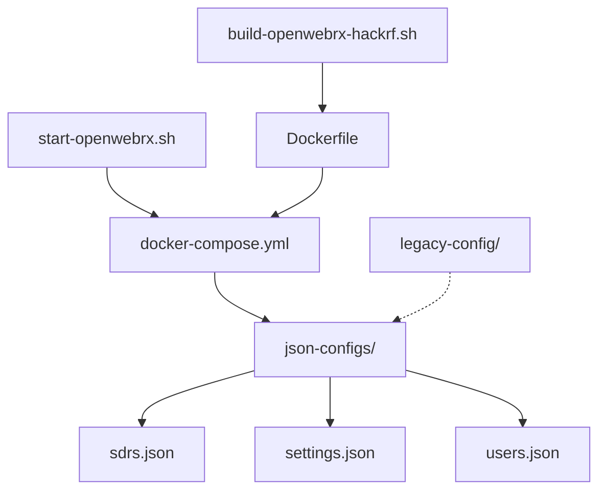

# Working Configuration Archive Index

This document provides a complete index of all files in the working configuration archive with their purposes and relationships.

## Directory Structure

```
working-config-archive/
├── ARCHIVE_INDEX.md            # This file - complete archive index
├── README.md                   # Main archive documentation
├── TEMPLATE_GUIDE.md           # Configuration templates and examples
├── docker/                     # Docker Compose configurations
│   ├── README.md              # Docker configuration documentation
│   └── docker-compose.yml     # ✅ Working Docker Compose setup
├── dockerfile-configs/         # Docker build configurations
│   ├── README.md              # Dockerfile documentation
│   └── Dockerfile             # ✅ Custom OpenWebRX + HackRF container
├── json-configs/               # Current working JSON configurations
│   ├── README.md              # JSON configuration documentation
│   ├── sdrs.json              # ✅ SDR device and profile definitions
│   ├── settings.json          # ✅ OpenWebRX application settings
│   ├── users.json             # ✅ User authentication configuration
│   └── openwebrx-hackrf-config.json  # ✅ Alternative HackRF configuration
├── legacy-config/              # Backup and legacy configurations
│   ├── README.md              # Legacy configuration documentation
│   ├── config_webrx_hackrf.py # 📋 Original Python configuration
│   ├── sdrs.json              # 📋 Previous working SDR config
│   ├── settings.json          # 📋 Previous application settings
│   ├── users.json             # 📋 Previous user authentication
│   ├── index.json             # 📋 Docker backup metadata
│   └── manifest.json          # 📋 Docker image manifest
└── scripts/                    # Operational scripts
    ├── README.md              # Scripts documentation
    ├── start-openwebrx.sh     # ✅ Service startup and health check
    └── build-openwebrx-hackrf.sh  # ✅ Container build automation
```

## File Status Legend

- ✅ **Currently Working** - Verified and in active use
- 📋 **Reference/Backup** - Legacy files for troubleshooting
- 📖 **Documentation** - Explanatory documentation files

## Core Working Configuration

### Essential Files for Deployment

These files constitute the minimum working configuration:

1. **`docker/docker-compose.yml`** - Primary deployment configuration
2. **`json-configs/sdrs.json`** - SDR hardware and frequency definitions
3. **`json-configs/settings.json`** - Application settings and display config
4. **`json-configs/users.json`** - Authentication (username: admin, password: hackrf)
5. **`scripts/start-openwebrx.sh`** - Automated startup with health checks

### Extended Configuration (Optional but Recommended)

6. **`dockerfile-configs/Dockerfile`** - Custom container build (for advanced users)
7. **`scripts/build-openwebrx-hackrf.sh`** - Complete build automation

## Configuration Dependencies

### File Relationships



### Critical Dependencies

| File | Depends On | Purpose |
|------|-----------|---------|
| docker-compose.yml | json-configs/*.json | Mounts config directory |
| sdrs.json | HackRF hardware | Defines SDR device |
| settings.json | sdrs.json profiles | References SDR profiles |
| start-openwebrx.sh | docker-compose.yml | Uses compose file |
| Dockerfile | Source repositories | Builds from scratch |

## Quick Reference Guide

### Deployment Scenarios

#### Scenario 1: Standard Deployment (Recommended)
**Files needed:**
- `docker/docker-compose.yml`
- `json-configs/sdrs.json`
- `json-configs/settings.json`  
- `json-configs/users.json`
- `scripts/start-openwebrx.sh`

**Steps:**
1. Copy files to target system
2. Run `./scripts/start-openwebrx.sh`
3. Access http://localhost:8073

#### Scenario 2: Custom Container Build
**Files needed:**
- All from Scenario 1
- `dockerfile-configs/Dockerfile`
- `scripts/build-openwebrx-hackrf.sh`

**Steps:**
1. Copy files to target system
2. Run `./scripts/build-openwebrx-hackrf.sh`
3. Access http://localhost:8073

#### Scenario 3: Emergency Rollback
**Files needed:**
- `legacy-config/sdrs.json`
- `legacy-config/settings.json`
- `legacy-config/users.json`

**Steps:**
1. Copy legacy files to json-configs/
2. Restart container
3. Test functionality

### Configuration Customization

#### Change Frequency Bands
**Edit:** `json-configs/sdrs.json`  
**Section:** `sdrs.hackrf.profiles`  
**Documentation:** `json-configs/README.md`

#### Modify Access Credentials
**Edit:** `json-configs/users.json`  
**Generate Hash:** `echo -n "password" | sha256sum`  
**Documentation:** `json-configs/README.md`

#### Adjust Container Resources
**Edit:** `docker/docker-compose.yml`  
**Section:** `deploy.resources`  
**Documentation:** `docker/README.md`

#### Add Custom Startup Checks
**Edit:** `scripts/start-openwebrx.sh`  
**Section:** Pre-flight checks (lines 30-70)  
**Documentation:** `scripts/README.md`

## Hardware Compatibility

### Verified Working Hardware

| Component | Model | Version | Status |
|-----------|-------|---------|--------|
| **SDR** | HackRF One | Any | ✅ Fully Supported |
| **Host** | Raspberry Pi 4 | 4GB/8GB | ✅ Recommended |
| **Host** | Raspberry Pi 3 | Any | ⚠️ Limited (reduce resources) |
| **USB** | USB 2.0+ | Any | ✅ Required |
| **OS** | Raspberry Pi OS | Bookworm | ✅ Tested |
| **Docker** | Docker CE | 24.0+ | ✅ Required |

### Configuration per Hardware

#### Raspberry Pi 3
**Modifications needed:**
- Reduce memory limit in docker-compose.yml to 512M
- Increase startup timeout in start-openwebrx.sh
- Use lower sample rates in sdrs.json

#### Desktop/Server Systems
**Optimizations available:**
- Increase memory limits to 2G+
- Use multiple CPU cores
- Enable additional SDR devices

## Security Configuration

### Current Security Level: Development/Local Use

**Security Features:**
- Web interface password protection (admin/hackrf)
- No external service integrations
- Container isolation
- Non-root container execution

**Security Limitations:**
- Default password
- HTTP only (no HTTPS)
- No access logging
- Privileged container mode

### Production Security Hardening

**Required Changes:**
1. Change default password in users.json
2. Bind to localhost only in docker-compose.yml
3. Implement reverse proxy with SSL
4. Enable audit logging
5. Disable debug mode in settings.json

**Files to modify:**
- `json-configs/users.json` - New password hash
- `docker/docker-compose.yml` - Port binding to 127.0.0.1
- `json-configs/settings.json` - Disable debug mode

## Troubleshooting Reference

### Common Issues and Solutions

| Issue | Check File | Solution |
|-------|-----------|----------|
| HackRF not detected | docker-compose.yml | Verify USB device mounting |
| Container won't start | json-configs/*.json | Validate JSON syntax |
| No web interface | users.json | Check authentication config |
| Poor reception | sdrs.json | Adjust RF gain settings |
| High CPU usage | docker-compose.yml | Reduce resource limits |

### Debug Configuration

**Enable debugging:**
1. Edit `json-configs/settings.json`
2. Set `"debug": true`
3. Restart container
4. Check logs: `docker-compose logs -f`

### Recovery Procedures

**Complete system failure:**
1. Copy entire `legacy-config/` to `json-configs/`
2. Restart container
3. Verify operation

**Partial failure:**
- SDR issues: Copy `legacy-config/sdrs.json`
- Auth issues: Copy `legacy-config/users.json`
- Display issues: Copy `legacy-config/settings.json`

## Version History

### Current Version (2025-06-15)
- **Status:** ✅ Production Ready
- **OpenWebRX:** Latest (1.2+)
- **Configuration Format:** JSON v2
- **Features:** Native HackRF driver, multiple bands, health checks

### Legacy Version (2025-06-14)
- **Status:** 📋 Reference Only
- **OpenWebRX:** 1.0-1.2
- **Configuration Format:** Python + JSON
- **Features:** Basic HackRF support

## Archive Maintenance

### Regular Tasks

**Monthly:**
- Test complete deployment from archive
- Validate JSON configuration files
- Update documentation for any changes
- Test emergency rollback procedures

**Quarterly:**
- Review security configuration
- Update base Docker images
- Test with latest OpenWebRX releases
- Backup archive to external storage

### Update Procedures

**When adding new working configurations:**
1. Test thoroughly in isolated environment
2. Document in appropriate README.md
3. Update this index file
4. Create backup of previous version

**When deprecating configurations:**
1. Move to legacy-config/ directory
2. Update documentation with deprecation notes
3. Test that current configs still work without deprecated files

## Support and Documentation

### Primary Documentation Files

1. **`README.md`** - Main archive overview and quick start
2. **`TEMPLATE_GUIDE.md`** - Configuration templates and examples
3. **`docker/README.md`** - Docker-specific configuration
4. **`json-configs/README.md`** - JSON configuration details
5. **`scripts/README.md`** - Script usage and customization

### External References

- **OpenWebRX Documentation:** https://github.com/jketterl/openwebrx
- **HackRF Documentation:** https://hackrf.readthedocs.io/
- **Docker Compose Reference:** https://docs.docker.com/compose/
- **Amateur Radio Bands:** http://www.arrl.org/band-plan

---

**Archive Status:** ✅ Complete and Verified  
**Last Updated:** 2025-06-15  
**Total Files:** 23 (7 working configs, 6 legacy files, 10 documentation)  
**Archive Size:** ~500KB (configs + docs)  
**Backup Status:** Ready for deployment or emergency rollback