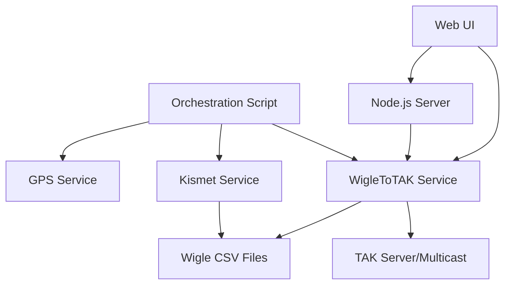

# TAK Integration Migration Plan: WigleToTAK API Consolidation

## Executive Summary

This document outlines a comprehensive migration plan for consolidating the WigleToTAK system from two separate implementations (Python and Node.js) into a unified TAK integration API. The migration will be executed in phases to ensure zero downtime and maintain full functionality throughout the transition.

## Current State Analysis

### Existing Components

1. **Python WigleToTAK Implementation**
   - Location: `/src/wigletotak/WigleToTAK/TheStinkToTAK/WigleToTak2.py`
   - Port: 8000 (configurable via --flask-port)
   - Features: Real-time/post-collection modes, antenna sensitivity, whitelist/blacklist
   - Dependencies: Flask, native UDP sockets for TAK broadcasting

2. **Node.js WigleToTAK Implementation**
   - Location: `/src/nodejs/wigle-to-tak/`
   - Port: 3002 (default)
   - Features: API compatibility layer, enhanced error handling, WebSocket support
   - Dependencies: Express, Socket.IO, Winston logging

3. **v2 Python Implementation**
   - Location: `/src/wigletotak/WigleToTAK/TheStinkToTAK/v2WigleToTak2.py`
   - Notable difference: Missing default directory initialization that exists in v1

### Shared Functionality
- TAK message broadcasting (UDP multicast and unicast)
- Wigle CSV file processing
- Real-time and post-collection analysis modes
- Antenna sensitivity compensation
- SSID/MAC filtering (whitelist/blacklist)
- CoT XML message generation with ellipse visualization

## Migration Strategy

### Phase 1: Dependency Analysis and Preparation (Day 1-2)

#### 1.1 Service Dependencies Mapping


#### 1.2 API Endpoint Inventory
| Endpoint | Python | Node.js | Priority |
|----------|---------|---------|----------|
| `/` | ✓ | ✓ | High |
| `/update_tak_settings` | ✓ | ✓ | High |
| `/update_multicast_state` | ✓ | ✓ | High |
| `/update_analysis_mode` | ✓ | ✓ | Medium |
| `/update_antenna_sensitivity` | ✓ | ✓ | Medium |
| `/get_antenna_settings` | ✓ | ✓ | Medium |
| `/list_wigle_files` | ✓ | ✓ | High |
| `/start_broadcast` | ✓ | ✓ | Critical |
| `/stop_broadcast` | ✓ | ✓ | Critical |
| `/add_to_whitelist` | ✓ | ✓ | Low |
| `/remove_from_whitelist` | ✓ | ✓ | Low |
| `/add_to_blacklist` | ✓ | ✓ | Low |
| `/remove_from_blacklist` | ✓ | ✓ | Low |
| `/api/status` | ✗ | ✓ | High |
| `/api/config` | ✗ | ✓ | Medium |
| `/health` | ✗ | ✓ | High |

#### 1.3 Testing Infrastructure Setup
```bash
# Create test environment
mkdir -p /home/pi/projects/stinkster/tests/tak-migration
cd /home/pi/projects/stinkster/tests/tak-migration

# Test data preparation
cp /home/pi/kismet_ops/*.wiglecsv ./test-data/

# Create API test suite
cat > test-api-compatibility.js << 'EOF'
const axios = require('axios');
const assert = require('assert');

const PYTHON_PORT = 8000;
const NODEJS_PORT = 3002;

async function testEndpoint(endpoint, method = 'GET', data = null) {
    const pythonResponse = await axios({
        method,
        url: `http://localhost:${PYTHON_PORT}${endpoint}`,
        data
    });
    
    const nodeResponse = await axios({
        method,
        url: `http://localhost:${NODEJS_PORT}${endpoint}`,
        data
    });
    
    // Compare responses
    assert.deepStrictEqual(
        pythonResponse.status,
        nodeResponse.status,
        `Status mismatch for ${endpoint}`
    );
    
    return { python: pythonResponse.data, node: nodeResponse.data };
}

// Run tests...
EOF
```

### Phase 2: Parallel Operation Setup (Day 3-4)

#### 2.1 Port Configuration
```bash
# Update orchestration script to support dual operation
cat > /home/pi/projects/stinkster/src/orchestration/gps_kismet_wigle_dual.sh << 'EOF'
#!/bin/bash
# Modified script to run both Python and Node.js versions

# Start Python version on port 8000
python3 WigleToTak2.py --flask-port 8000 &
PYTHON_PID=$!

# Start Node.js version on port 3002
cd /home/pi/projects/stinkster/src/nodejs/wigle-to-tak
npm start &
NODE_PID=$!

# Store PIDs for monitoring
echo "$PYTHON_PID" > /home/pi/tmp/wigletotak-python.pid
echo "$NODE_PID" > /home/pi/tmp/wigletotak-node.pid
EOF
```

#### 2.2 Load Balancer Configuration
```nginx
# /etc/nginx/sites-available/wigletotak-migration
upstream wigletotak {
    server localhost:8000 weight=50;  # Python (current)
    server localhost:3002 weight=50;  # Node.js (new)
}

server {
    listen 8080;
    server_name localhost;
    
    location / {
        proxy_pass http://wigletotak;
        proxy_set_header X-Real-IP $remote_addr;
        proxy_set_header X-Forwarded-For $proxy_add_x_forwarded_for;
        proxy_set_header Host $http_host;
    }
    
    # Health check endpoints
    location /health/python {
        proxy_pass http://localhost:8000/health;
    }
    
    location /health/nodejs {
        proxy_pass http://localhost:3002/health;
    }
}
```

#### 2.3 Monitoring Setup
```javascript
// monitoring/tak-service-monitor.js
const axios = require('axios');
const winston = require('winston');

const logger = winston.createLogger({
    level: 'info',
    format: winston.format.json(),
    transports: [
        new winston.transports.File({ filename: 'tak-migration.log' })
    ]
});

async function checkServiceHealth() {
    const services = [
        { name: 'Python WigleToTAK', url: 'http://localhost:8000/list_wigle_files?directory=/home/pi/kismet_ops' },
        { name: 'Node.js WigleToTAK', url: 'http://localhost:3002/health' }
    ];
    
    for (const service of services) {
        try {
            const response = await axios.get(service.url, { timeout: 5000 });
            logger.info(`${service.name}: OK`, { status: response.status });
        } catch (error) {
            logger.error(`${service.name}: FAILED`, { error: error.message });
        }
    }
}

setInterval(checkServiceHealth, 60000); // Check every minute
```

### Phase 3: Component Migration (Day 5-7)

#### 3.1 Migration Order (by dependency)

1. **Core TAK Broadcasting Module** (Critical Path)
   ```javascript
   // src/nodejs/tak-integration/core/tak-broadcaster.js
   class TAKBroadcaster {
       constructor(options) {
           this.multicastGroup = options.multicastGroup || '239.2.3.1';
           this.port = options.port || 6969;
           this.serverIp = options.serverIp || '0.0.0.0';
           this.multicastEnabled = options.multicastEnabled !== false;
       }
       
       async broadcast(cotXml) {
           // Implementation matching Python behavior
       }
   }
   ```

2. **CSV Processing Engine**
   ```javascript
   // src/nodejs/tak-integration/processors/wigle-csv-processor.js
   class WigleCSVProcessor {
       processFile(filepath, options) {
           // Match Python's real-time and post-collection modes
       }
   }
   ```

3. **CoT XML Generator**
   ```javascript
   // src/nodejs/tak-integration/generators/cot-xml-generator.js
   class CoTXMLGenerator {
       generateEllipse(deviceData, antennaSettings) {
           // Exact port of Python's create_cot_xml_payload_ellipse
       }
   }
   ```

4. **API Endpoints**
   - Migrate one endpoint at a time
   - Test each endpoint thoroughly before moving to next
   - Maintain backward compatibility

#### 3.2 Testing Checkpoints

After each component migration:
1. **Unit Tests**: Component functionality
2. **Integration Tests**: Inter-component communication
3. **API Compatibility Tests**: Response format matching
4. **Performance Tests**: Latency and throughput
5. **TAK Server Tests**: Verify message reception

```bash
# Test TAK message reception
tcpdump -i any -n "udp port 6969" -X
```

### Phase 4: Cutover Process (Day 8-9)

#### 4.1 Pre-cutover Checklist
- [ ] All endpoints migrated and tested
- [ ] Performance metrics acceptable
- [ ] Rollback scripts prepared
- [ ] Monitoring alerts configured
- [ ] Documentation updated

#### 4.2 Gradual Traffic Migration
```bash
# Step 1: 90% Python, 10% Node.js
# Update nginx weights
upstream wigletotak {
    server localhost:8000 weight=90;
    server localhost:3002 weight=10;
}

# Step 2: Monitor for 2 hours, check logs
# Step 3: 50/50 split
# Step 4: 10% Python, 90% Node.js
# Step 5: 100% Node.js
```

#### 4.3 Rollback Procedures

**Immediate Rollback** (< 5 minutes):
```bash
#!/bin/bash
# rollback-immediate.sh
systemctl stop wigletotak-nodejs
systemctl start wigletotak-python
nginx -s reload
```

**Gradual Rollback** (if issues discovered later):
```bash
#!/bin/bash
# rollback-gradual.sh
# Shift traffic back to Python gradually
for weight in 10 30 50 70 90 100; do
    sed -i "s/weight=[0-9]*/weight=$weight/" /etc/nginx/sites-available/wigletotak-migration
    nginx -s reload
    echo "Python now handling $weight% of traffic"
    sleep 300  # 5 minutes between steps
done
```

### Phase 5: Cleanup and Optimization (Day 10)

#### 5.1 Remove Legacy Code
- Archive Python implementation
- Remove duplicate endpoints
- Clean up configuration files

#### 5.2 Performance Optimization
- Enable connection pooling
- Implement caching for file listings
- Optimize UDP socket usage

#### 5.3 Documentation Updates
- Update API documentation
- Update deployment guides
- Create troubleshooting guide

## API Compatibility Matrix

### Request/Response Format Compatibility

| Feature | Python Format | Node.js Format | Migration Notes |
|---------|--------------|----------------|-----------------|
| TAK Settings Update | `{tak_server_ip, tak_server_port}` | Same | Direct compatibility |
| File Listing | `{files: [...]}` | Same | Direct compatibility |
| Broadcast Control | String messages | Same | Direct compatibility |
| Antenna Settings | `{current_sensitivity, available_types, custom_factor}` | Same + `sensitivity_factors` | Extended in Node.js |
| Error Responses | `{error: string}` | `{error: string, details?: string}` | Enhanced in Node.js |

### Breaking Changes

1. **Health Endpoint**: New in Node.js, not in Python
2. **WebSocket Support**: New in Node.js for real-time updates
3. **Batch Operations**: New API endpoints in Node.js

## Risk Mitigation

### Identified Risks

1. **TAK Message Format Differences**
   - Mitigation: Byte-level comparison of generated XML
   - Test with actual TAK servers

2. **UDP Broadcast Reliability**
   - Mitigation: Implement retry logic
   - Monitor packet loss rates

3. **File Lock Contention**
   - Mitigation: Implement file locking mechanism
   - Use separate read positions for each service

4. **Memory Leaks in Long-Running Process**
   - Mitigation: Implement memory monitoring
   - Schedule periodic restarts if needed

## Success Criteria

1. **Functional Requirements**
   - [ ] All Python endpoints working in Node.js
   - [ ] TAK messages received correctly
   - [ ] No data loss during migration

2. **Performance Requirements**
   - [ ] Response time < 100ms for API calls
   - [ ] TAK broadcast latency < 50ms
   - [ ] Memory usage < 200MB

3. **Reliability Requirements**
   - [ ] 99.9% uptime during migration
   - [ ] Zero data corruption
   - [ ] Successful rollback tested

## Timeline Summary

- **Days 1-2**: Analysis and preparation
- **Days 3-4**: Parallel operation setup
- **Days 5-7**: Component migration
- **Days 8-9**: Cutover process
- **Day 10**: Cleanup and optimization

Total migration time: 10 days with built-in buffer for testing and rollback.

## Post-Migration Tasks

1. **Monitoring Period** (30 days)
   - Daily health checks
   - Performance metrics review
   - Error log analysis

2. **Optimization Phase**
   - Implement caching strategies
   - Database connection pooling
   - CDN for static assets

3. **Feature Enhancements**
   - GraphQL API layer
   - Real-time WebSocket updates
   - Advanced filtering options

## Appendix A: Testing Scripts

### A.1 API Compatibility Test
```javascript
// Full test suite available in tests/tak-migration/
const testSuite = require('./test-api-compatibility');
testSuite.runAll();
```

### A.2 Performance Benchmark
```bash
# Apache Bench test
ab -n 1000 -c 10 http://localhost:8080/list_wigle_files?directory=/home/pi/kismet_ops
```

### A.3 TAK Message Validation
```python
# Validate CoT XML format
import xml.etree.ElementTree as ET

def validate_cot_message(xml_string):
    try:
        root = ET.fromstring(xml_string)
        assert root.tag == 'event'
        assert 'uid' in root.attrib
        assert root.find('point') is not None
        return True
    except:
        return False
```

## Appendix B: Emergency Contacts

- System Administrator: [Contact Info]
- TAK Server Admin: [Contact Info]
- On-Call Engineer: [Contact Info]

---

**Document Version**: 1.0  
**Created**: 2025-01-22  
**Last Updated**: 2025-01-22  
**Next Review**: Post-migration completion