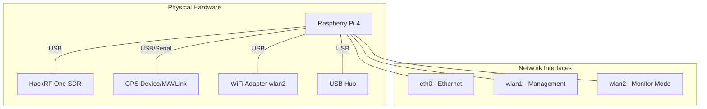
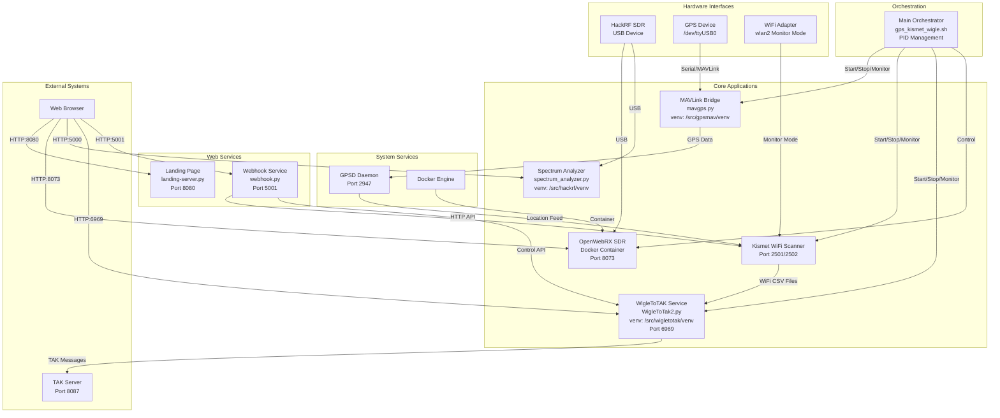
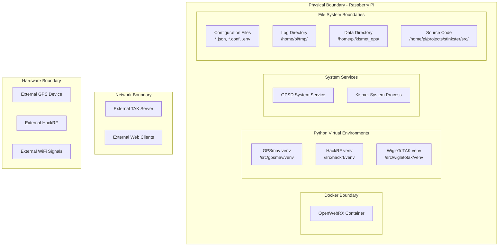
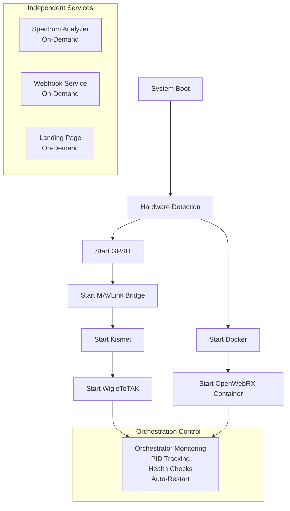

# Level 0: Stinkster System Overview

## System Architecture Diagram

```mermaid
C4Context
    title Stinkster System - Complete Architecture Overview

    Person(operator, "Operator", "System operator monitoring WiFi/GPS/SDR")
    
    System_Boundary(stinkster, "Stinkster System") {
        Container(orchestration, "Orchestration Layer", "Bash Scripts", "Main service coordination and process management")
        
        Container_Boundary(sdr_subsystem, "SDR Subsystem") {
            Container(openwebrx, "OpenWebRX", "Docker/Web", "Web-based SDR receiver")
            Container(spectrum, "Spectrum Analyzer", "Python/Flask", "Real-time spectrum analysis")
        }
        
        Container_Boundary(gps_subsystem, "GPS Subsystem") {
            Container(mavbridge, "MAVLink Bridge", "Python", "Converts MAVLink to GPSD")
            Container(gpsd, "GPSD Service", "System Service", "GPS daemon providing location data")
        }
        
        Container_Boundary(wifi_subsystem, "WiFi Subsystem") {
            Container(kismet, "Kismet", "C++/Service", "WiFi scanning and packet capture")
            Container(wigletak, "WigleToTAK", "Python/Flask", "Converts WiFi data to TAK format")
        }
        
        Container_Boundary(web_layer, "Web Interface Layer") {
            Container(landing, "Landing Page", "Python/Flask", "Main dashboard")
            Container(webhooks, "Webhook Service", "Python/Flask", "Integration endpoints")
        }
    }
    
    System_Ext(tak_server, "TAK Server", "Team Awareness Kit server for tactical mapping")
    System_Ext(gps_device, "GPS Device", "MAVLink GPS or serial GPS device")
    System_Ext(hackrf, "HackRF SDR", "Software Defined Radio hardware")
    System_Ext(wifi_adapter, "WiFi Adapter", "Monitor mode capable wireless interface")
    
    Rel(operator, landing, "Accesses", "HTTP/Web Browser")
    Rel(operator, openwebrx, "Monitors", "HTTP:8073")
    Rel(operator, spectrum, "Analyzes", "HTTP:5000")
    Rel(operator, wigletak, "Views", "HTTP:6969")
    
    Rel(orchestration, sdr_subsystem, "Manages", "Process Control")
    Rel(orchestration, gps_subsystem, "Manages", "Process Control")
    Rel(orchestration, wifi_subsystem, "Manages", "Process Control")
    
    Rel(gps_device, mavbridge, "Provides", "MAVLink/Serial")
    Rel(mavbridge, gpsd, "Feeds", "TCP:2947")
    Rel(gpsd, kismet, "Location Data", "TCP:2947")
    
    Rel(hackrf, openwebrx, "RF Data", "USB")
    Rel(hackrf, spectrum, "RF Data", "USB")
    
    Rel(wifi_adapter, kismet, "802.11 Frames", "Monitor Mode")
    Rel(kismet, wigletak, "WiFi CSV Data", "File System")
    Rel(wigletak, tak_server, "TAK Messages", "TCP:8087")
    
    Rel(webhooks, kismet, "API Calls", "HTTP:2501")
    Rel(webhooks, wigletak, "Control", "HTTP:6969")
```

## Complete System Topology

### Hardware Layer


### Service Architecture & Data Flow



### Service Communication Matrix

| Service | Listens On | Connects To | Protocol | Purpose |
|---------|------------|-------------|----------|---------|
| **GPSD** | :2947 | GPS Device | TCP/Serial | GPS data distribution |
| **MAVLink Bridge** | - | /dev/ttyUSB0, :2947 | Serial/TCP | GPS protocol conversion |
| **Kismet** | :2501, :2502 | :2947, wlan2 | HTTP/TCP/802.11 | WiFi scanning + GPS |
| **WigleToTAK** | :6969 | Kismet files, TAK Server | HTTP/TCP | WiFi to TAK conversion |
| **OpenWebRX** | :8073 | HackRF | HTTP/USB | Web SDR interface |
| **Spectrum Analyzer** | :5000 | HackRF | HTTP/USB | Real-time spectrum |
| **Landing Page** | :8080 | - | HTTP | Main dashboard |
| **Webhooks** | :5001 | :2501, :6969 | HTTP | API integration |

### Physical and Logical Boundaries



### Service Dependencies & Startup Order



## Key Integration Points

### 1. GPS Data Flow
```
MAVLink Device → mavgps.py → GPSD (port 2947) → Kismet → WigleToTAK → TAK Server
```

### 2. WiFi Scanning Pipeline
```
WiFi Signals → wlan2 (monitor) → Kismet → .wiglecsv files → WigleToTAK → TAK Messages
```

### 3. SDR Operations
```
RF Spectrum → HackRF → [OpenWebRX Container | Spectrum Analyzer] → Web Interface
```

### 4. Service Orchestration
```
gps_kismet_wigle.sh → Process Management → PID Tracking → Health Monitoring → Auto-Restart
```

## External Interfaces

| Interface | Type | Purpose | Access Point |
|-----------|------|---------|--------------|
| **Web Dashboard** | HTTP | Main system control | http://pi-ip:8080 |
| **SDR Receiver** | HTTP | Real-time SDR | http://pi-ip:8073 |
| **Spectrum Analyzer** | HTTP/WebSocket | RF analysis | http://pi-ip:5000 |
| **WigleToTAK Interface** | HTTP | WiFi tracking | http://pi-ip:6969 |
| **TAK Integration** | TCP | Tactical data export | External TAK Server |
| **Kismet API** | HTTP | WiFi data access | http://pi-ip:2501 |
| **GPSD Interface** | TCP | GPS data access | port 2947 |

## Configuration Management

The system uses a hierarchical configuration approach:

1. **Environment Variables** (`.env` file) - Sensitive credentials and system paths
2. **JSON Configuration** (`config.json`) - Service-specific settings
3. **Template Files** (`*.template.*`) - Default configurations for deployment
4. **Component Configs** - Individual service configuration files

## System Monitoring & Management

- **Process Management**: PID files in `/home/pi/tmp/`
- **Log Aggregation**: Centralized logging in `/home/pi/tmp/`
- **Health Checks**: Orchestrator monitors all services
- **Auto-Recovery**: Automatic restart on service failure
- **Backup System**: Configuration and data backup capabilities

This system provides a comprehensive SDR, WiFi scanning, and GPS tracking platform with TAK integration, all coordinated through a robust orchestration layer with web-based monitoring and control interfaces.