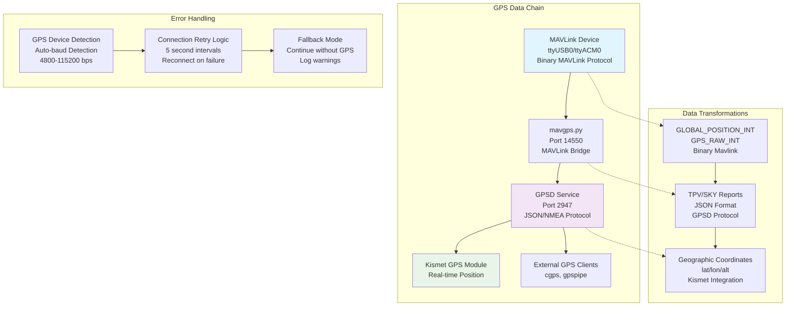
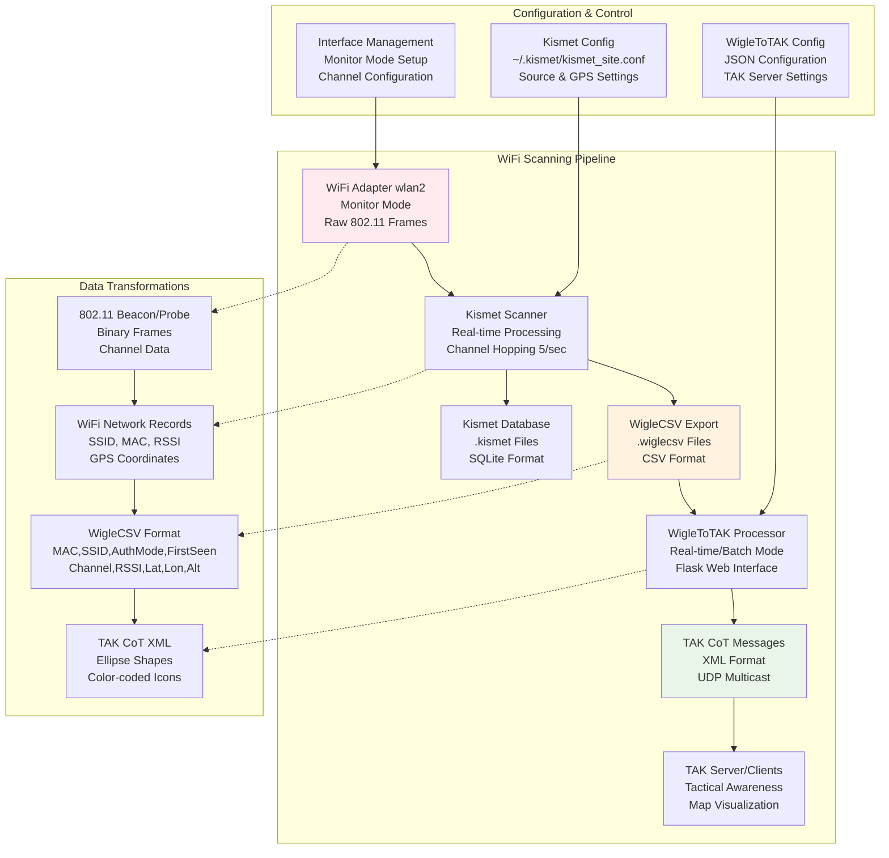
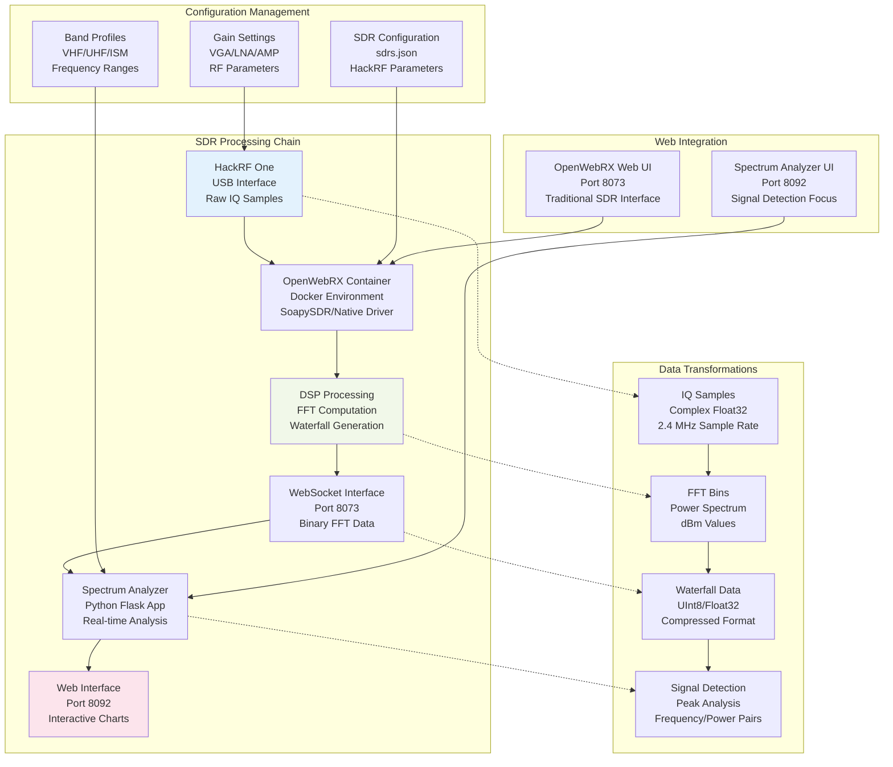
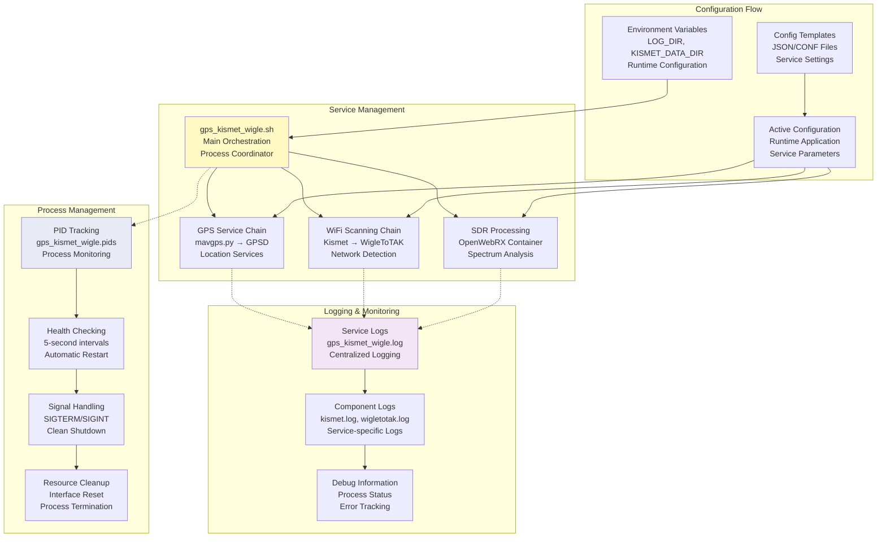
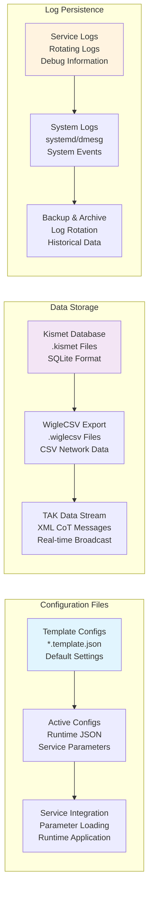

# Level 1 Data Flow Diagram - Stinkster System

This document provides a detailed analysis of data movement through the Stinkster system, showing how GPS data, WiFi scan data, SDR data, and control signals flow between components with specific transformations, protocols, and storage mechanisms.

## Overview

The Stinkster system processes three primary data streams:
1. **GPS Data Flow**: MAVLink → mavgps.py → GPSD → Kismet
2. **WiFi Data Flow**: WiFi adapter → Kismet → .wiglecsv → WigleToTAK → TAK
3. **SDR Data Flow**: HackRF → OpenWebRX → Spectrum Analyzer → Web interface

## 1. GPS Data Flow (Real-time Location Services)



### GPS Data Format Transformations

1. **MAVLink to GPSD Conversion** (mavgps.py):
   - Input: Binary MAVLink messages (GLOBAL_POSITION_INT, GPS_RAW_INT)
   - Output: JSON GPSD protocol (TPV, SKY, VERSION messages)
   - Frequency: Real-time, ~10Hz updates
   - Error handling: Automatic reconnection, signal validation

2. **GPSD to Kismet Integration**:
   - Protocol: JSON over TCP (port 2947)
   - Data: lat/lon coordinates, altitude, speed, timestamp
   - Validation: Fix type checking, accuracy validation

## 2. WiFi Data Flow (Wireless Network Scanning)



### WiFi Data Format Transformations

1. **802.11 Frame Processing** (Kismet):
   - Input: Raw wireless frames in monitor mode
   - Processing: SSID extraction, signal strength measurement, GPS tagging
   - Output: Structured database records with location data
   - Frequency: Real-time, 5 channels/second hop rate

2. **WigleCSV Generation**:
   ```csv
   MAC,SSID,AuthMode,FirstSeen,Channel,RSSI,CurrentLatitude,CurrentLongitude,AltitudeMeters,AccuracyMeters,Type
   ```
   - GPS coordinates attached to each WiFi detection
   - Real-time file updates or batch processing mode

3. **TAK CoT XML Generation** (WigleToTAK):
   - Input: CSV records with WiFi + GPS data
   - Output: XML Cursor-on-Target messages with ellipse shapes
   - Features: Color coding, antenna sensitivity adjustment, filtering
   - Delivery: UDP multicast (239.2.3.1:6969) or direct TAK server

## 3. SDR Data Flow (Software Defined Radio)



### SDR Data Format Transformations

1. **IQ Sample Processing** (OpenWebRX):
   - Input: Raw IQ samples from HackRF (complex float32)
   - Processing: FFT computation, power spectrum calculation
   - Output: Binary waterfall data via WebSocket
   - Sample Rate: 2.4 MHz default, configurable

2. **FFT Data Analysis** (Spectrum Analyzer):
   - Input: Binary FFT data from OpenWebRX WebSocket
   - Processing: Peak detection, signal identification
   - Output: Frequency/power pairs with confidence levels
   - Real-time: Signal detection and threshold analysis

3. **Web Interface Integration**:
   - OpenWebRX: Traditional SDR waterfall interface (port 8073)
   - Spectrum Analyzer: Signal detection focus (port 8092)
   - Data sharing: WebSocket protocol for real-time updates

## 4. Service Orchestration & Control Flow



## 5. Configuration & Data Persistence



## 6. Network & Communication Protocols

### Port Mapping & Network Services
- **2947**: GPSD service (JSON protocol)
- **6969**: WigleToTAK web interface
- **8073**: OpenWebRX web interface
- **8092**: Spectrum analyzer interface
- **14550**: MAVLink TCP connection
- **239.2.3.1:6969**: TAK multicast group

### Data Protocols
1. **MAVLink**: Binary protocol for drone/GPS communication
2. **GPSD JSON**: Standard GPS daemon protocol
3. **IEEE 802.11**: Raw wireless frame capture
4. **TAK CoT XML**: Tactical awareness markup
5. **WebSocket**: Real-time web communication
6. **UDP Multicast**: TAK message distribution

## 7. Error Handling & Fallback Mechanisms

```mermaid
flowchart TD
    subgraph "GPS Error Handling"
        A[Device Detection Failure] --> B[Auto-baud Testing<br/>4800-115200 bps<br/>NMEA Validation]
        B --> C[Connection Retry<br/>5-second intervals<br/>Reconnection Logic]
        C --> D[Fallback Mode<br/>Continue without GPS<br/>Warning Logs]
    end
    
    subgraph "WiFi Error Handling"
        E[Interface Setup Failure] --> F[Monitor Mode Retry<br/>airmon-ng/manual<br/>Interface Recovery]
        F --> G[Kismet Restart<br/>Process Recovery<br/>Configuration Reload]
        G --> H[Service Continuation<br/>Degraded Mode<br/>No WiFi Scanning]
    end
    
    subgraph "SDR Error Handling"
        I[HackRF Detection Failure] --> J[Driver Fallback<br/>SoapySDR→Native<br/>Configuration Switch]
        J --> K[Container Restart<br/>Docker Recovery<br/>Service Reload]
        K --> L[Demo Mode<br/>Simulated Data<br/>Testing Interface]
    end
    
    style A fill:#ffebee
    style E fill:#ffebee
    style I fill:#ffebee
    style D fill:#e8f5e8
    style H fill:#e8f5e8
    style L fill:#e8f5e8
```



## 8. Real-time vs Batch Processing

### Real-time Data Flows
- **GPS Updates**: 10Hz position updates from MAVLink to GPSD
- **WiFi Scanning**: Continuous channel hopping, immediate detection
- **SDR Processing**: Live FFT computation and spectrum display
- **TAK Broadcasting**: Immediate CoT message transmission

### Batch Processing
- **WigleCSV Generation**: File-based WiFi data export
- **Post-collection Analysis**: Historical WiFi scan processing
- **Log Aggregation**: Periodic log file rotation and archival
- **Configuration Updates**: Template-based config generation

## Summary

The Stinkster system implements a sophisticated data flow architecture that:

1. **Integrates Multiple Data Sources**: GPS, WiFi, and SDR data streams
2. **Provides Real-time Processing**: Live updates with sub-second latency
3. **Implements Robust Error Handling**: Fallback modes and automatic recovery
4. **Maintains Data Persistence**: Configuration templates and log archives
5. **Supports Multiple Interfaces**: Web UIs, APIs, and direct data access
6. **Enables Tactical Integration**: TAK-compatible output for military/emergency use

The modular design allows each component to operate independently while maintaining tight integration for coordinated operation across GPS tracking, wireless network scanning, and radio frequency analysis capabilities.