# Level 1 Service Mesh Architecture

This document provides a comprehensive view of the Stinkster service mesh, including all inter-service communication patterns, network protocols, container orchestration, and process dependencies.

## Service Mesh Overview

The Stinkster platform implements a multi-tier service mesh architecture combining containerized services, native system services, and Python microservices with sophisticated orchestration and monitoring capabilities.

### Core Network Architecture

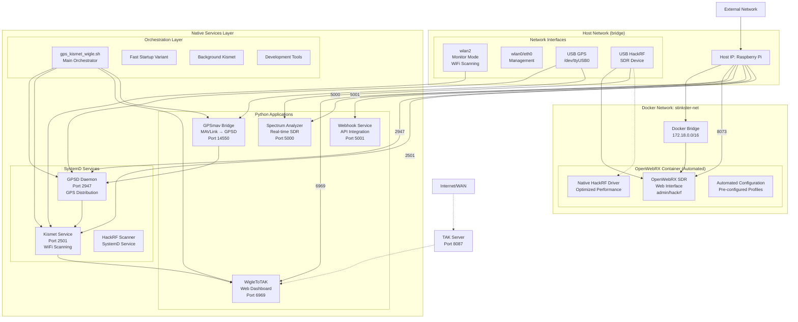

## Detailed Service Communication Patterns

### 1. GPS Data Flow Architecture

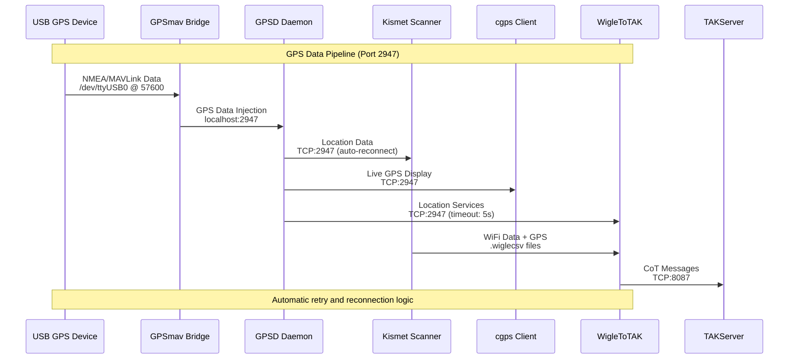

### 2. Container Orchestration & Networking

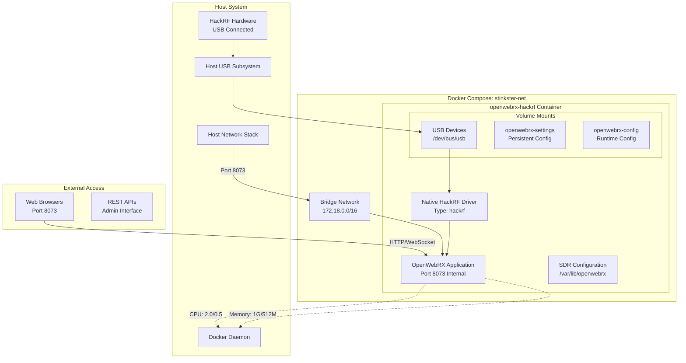

### 3. Process Startup Dependencies & Health Monitoring

```mermaid
stateDiagram-v2
    [*] --> SystemBoot
    
    SystemBoot --> GPSDetection: Auto-detect GPS devices
    GPSDetection --> GPSDStart: Configure /dev/ttyUSB0
    
    state GPSDStart {
        [*] --> StopExisting
        StopExisting --> StartSocket: systemctl stop gpsd
        StartSocket --> StartService: systemctl start gpsd.socket
        StartService --> VerifyGPSD: systemctl start gpsd
        VerifyGPSD --> GPSDReady: gpspipe -w -n 1
    }
    
    GPSDReady --> GPSmavStart: If MAVLink source
    GPSmavStart --> cgpsStart: Background GPS display
    
    cgpsStart --> KismetPrep: Delay 5-15s
    
    state KismetPrep {
        [*] --> InterfaceCheck
        InterfaceCheck --> MonitorMode: wlan2 validation
        MonitorMode --> KismetConfig: Dynamic config generation
        KismetConfig --> KismetLaunch: Background start
    }
    
    KismetLaunch --> KismetReady: PID file created
    KismetReady --> WigleStart: Delay 15s
    
    state WigleStart {
        [*] --> VenvCheck
        VenvCheck --> VenvCreate: If missing
        VenvCreate --> VenvActivate
        VenvActivate --> WigleLaunch: Python process
    }
    
    WigleLaunch --> MonitoringLoop: All services running
    
    state MonitoringLoop {
        [*] --> PIDCheck
        PIDCheck --> ProcessCheck: Every 5s
        ProcessCheck --> HealthCheck: Critical processes
        HealthCheck --> PIDCheck: All healthy
        
        ProcessCheck --> FailureDetected: Process died
        FailureDetected --> Cleanup: Exit orchestrator
        
        HealthCheck --> CriticalFailure: Missing critical process
        CriticalFailure --> Cleanup
    }
    
    Cleanup --> [*]: Graceful shutdown
```

### 4. Inter-Service Communication Protocols

```mermaid
graph TB
    %% Communication Protocol Types
    subgraph "Protocol Categories"
        TCPComm[TCP/IP Communication]
        HTTPComm[HTTP/REST APIs]
        WSComm[WebSocket Streaming]
        FileComm[File-based IPC]
        ProcComm[Process Management]
    end
    
    %% TCP/IP Services
    subgraph "TCP Services"
        GPSD2947[GPSD<br/>Port 2947<br/>JSON Protocol]
        Kismet2501[Kismet<br/>Port 2501<br/>HTTP API/WebSocket]
        MAVProxy[MAVProxy<br/>Port 14550-14552<br/>MAVLink UDP]
        TAKExt[TAK Server<br/>Port 8087<br/>CoT/XML]
    end
    
    %% HTTP Services
    subgraph "HTTP Services"
        WigleHTTP[WigleToTAK<br/>Port 6969<br/>Flask/REST]
        SpectrumHTTP[Spectrum Analyzer<br/>Port 5000<br/>Flask/SocketIO]
        WebhookHTTP[Webhook Service<br/>Port 5001<br/>REST API]
        OpenWebRXHTTP[OpenWebRX<br/>Port 8073<br/>Web Interface]
    end
    
    %% File-based IPC
    subgraph "File Communication"
        WigleCSV[Kismet .wiglecsv<br/>WiFi scan results]
        PIDFiles[PID Files<br/>Process tracking]
        LogFiles[Log Files<br/>Centralized logging]
        ConfigFiles[Dynamic Config<br/>Runtime updates]
    end
    
    %% Communication Flows
    GPSD2947 --> WigleHTTP: GPS coordinates
    GPSD2947 --> Kismet2501: Location data
    Kismet2501 --> WigleCSV: Scan results
    WigleCSV --> WigleHTTP: File parsing
    WigleHTTP --> TAKExt: CoT messages
    
    %% Process Management
    PIDFiles --> ProcComm: Health monitoring
    LogFiles --> ProcComm: Error detection
    
    %% WebSocket Streaming
    SpectrumHTTP --> WSComm: Real-time FFT
    Kismet2501 --> WSComm: Live scanning
```

## Network Port Mappings & Security

### Port Allocation Matrix

| Service | Port | Protocol | Access | Purpose | Security |
|---------|------|----------|--------|---------|----------|
| **GPSD** | 2947 | TCP | Internal | GPS data distribution | Localhost only |
| **Kismet** | 2501 | HTTP/WS | Internal | WiFi scanning API | Admin auth |
| **WigleToTAK** | 6969 | HTTP | External | Web dashboard | Flask session |
| **Spectrum Analyzer** | 5000 | HTTP/WS | External | Real-time SDR | CORS enabled |
| **Webhook Service** | 5001 | HTTP | External | API integration | API key auth |
| **OpenWebRX** | 8073 | HTTP/WS | External | SDR web interface | Admin login |
| **MAVProxy** | 14550-14552 | UDP | Internal | MAVLink distribution | Localhost only |
| **TAK Server** | 8087 | TCP | External | CoT message sink | External service |

### Security Boundaries & Authentication

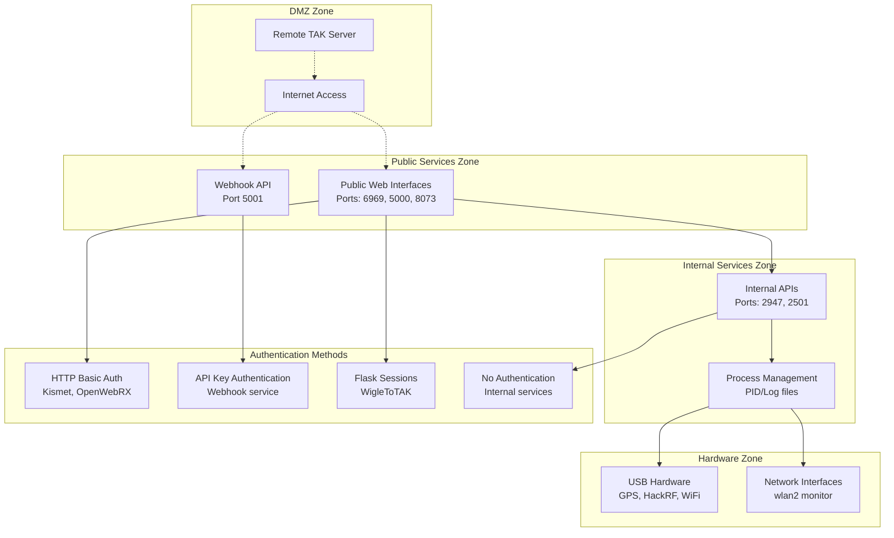

## Load Balancing & Failover Patterns

### Service Resilience Architecture

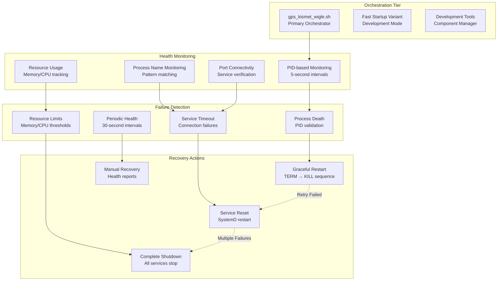

### Restart and Retry Logic

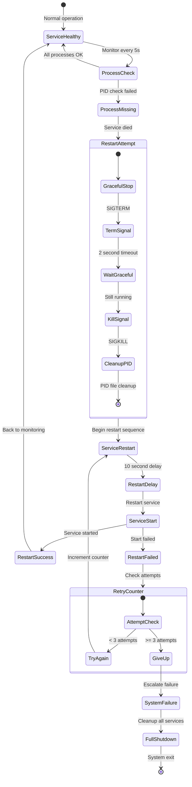

## Monitoring and Logging Interconnections

### Centralized Logging Architecture

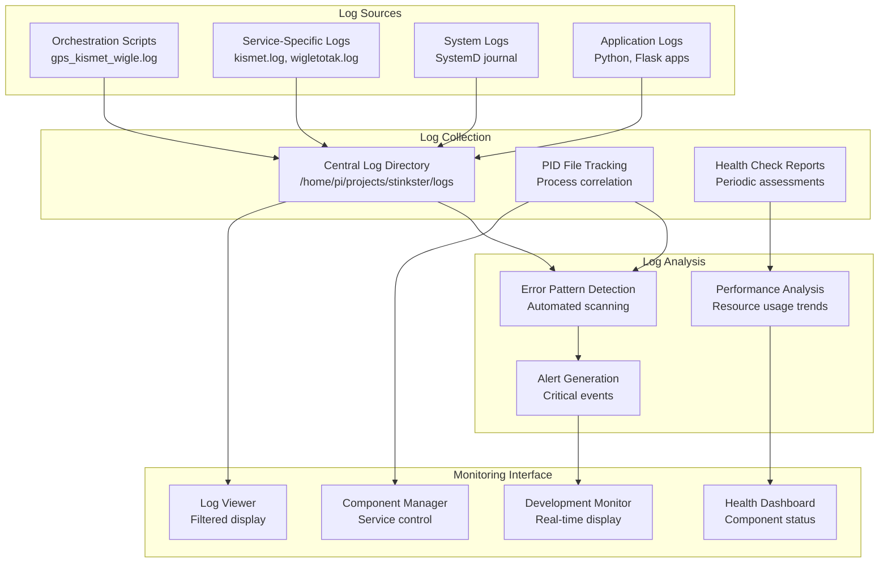

### Real-time Monitoring Dashboard

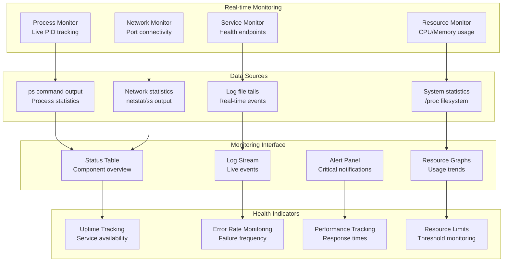

## Service Discovery and Registration

### Dynamic Service Management

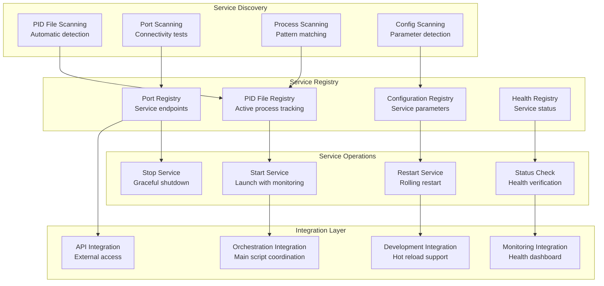

## Container Orchestration Relationships

### Docker Service Integration

```mermaid
graph TB
    %% Docker Infrastructure
    subgraph "Docker Infrastructure"
        DockerEngine[Docker Engine<br/>Container runtime]
        DockerCompose[Docker Compose<br/>Service orchestration]
        DockerNet[Docker Networks<br/>stinkster-net bridge]
        DockerVol[Docker Volumes<br/>Persistent storage]
    end
    
    %% Container Services
    subgraph "Containerized Services"
        OpenWebRXCont[OpenWebRX Container<br/>openwebrx-hackrf]
        VolumeConfig[Volume Mounts<br/>Config persistence]
        USBAccess[USB Device Access<br/>Privileged mode]
        NetworkExpose[Network Exposure<br/>Port 8073]
    end
    
    %% Host Integration
    subgraph "Host System Integration"
        SystemD[SystemD Services<br/>Native services]
        USBSubsystem[USB Subsystem<br/>Hardware access]
        NetworkStack[Network Stack<br/>Host networking]
        FileSystem[File System<br/>Volume mounts]
    end
    
    %% Native Services
    subgraph "Native Service Layer"
        GPSD[GPSD Service<br/>GPS daemon]
        Kismet[Kismet Service<br/>WiFi scanning]
        PythonApps[Python Applications<br/>Microservices]
        OrchScripts[Orchestration Scripts<br/>Process management]
    end
    
    %% Service Relationships
    DockerEngine --> OpenWebRXCont
    DockerCompose --> DockerNet
    DockerNet --> NetworkExpose
    DockerVol --> VolumeConfig
    
    %% Host Integration
    USBSubsystem --> USBAccess
    NetworkStack --> NetworkExpose
    FileSystem --> VolumeConfig
    SystemD --> GPSD
    SystemD --> Kismet
    
    %% Cross-layer Communication
    PythonApps -.-> OpenWebRXCont: API integration
    OrchScripts -.-> DockerEngine: Container management
    GPSD -.-> PythonApps: Data sharing
    Kismet -.-> PythonApps: WiFi data
```

### Resource Management and Limits

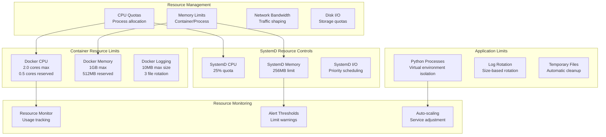

## Summary

The Stinkster service mesh demonstrates a sophisticated multi-layer architecture that successfully integrates:

### Key Architectural Strengths:

1. **Hybrid Container/Native Architecture**: Seamless integration between Docker containers and native system services
2. **Robust Process Management**: Comprehensive PID tracking, health monitoring, and graceful failure recovery
3. **Flexible Network Architecture**: Multi-protocol communication supporting TCP, HTTP, WebSocket, and file-based IPC
4. **Hardware Integration**: Direct USB device access with proper privilege management
5. **Development Support**: Hot reload, component management, and debugging tools
6. **Security Boundaries**: Layered security with appropriate authentication for each service tier

### Service Mesh Benefits:

- **High Availability**: Multiple retry mechanisms and automatic failover
- **Scalability**: Resource limits and monitoring prevent system overload
- **Maintainability**: Centralized logging and health monitoring
- **Flexibility**: Development and production modes with different orchestration strategies
- **Integration**: External TAK server integration with proper CoT message formatting

This architecture provides a solid foundation for reliable operation in challenging environments where hardware dependencies, network interfaces, and external services must work together seamlessly while maintaining system stability and observability.