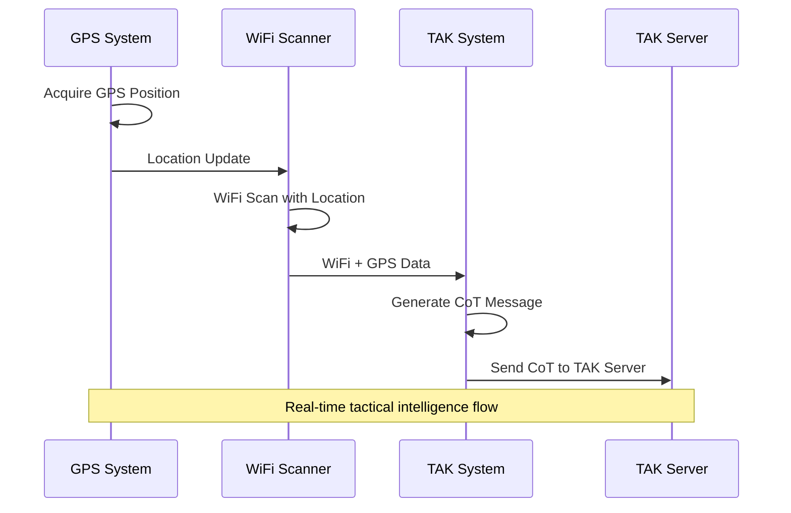
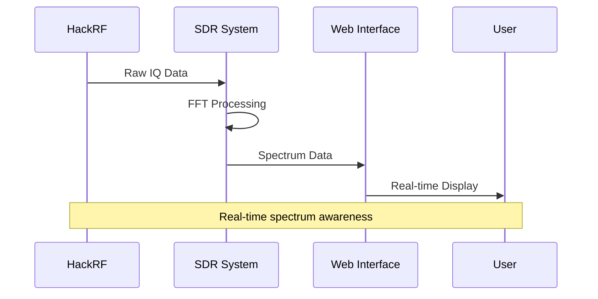
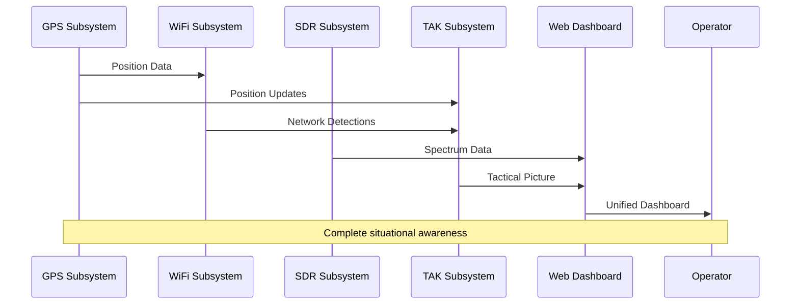
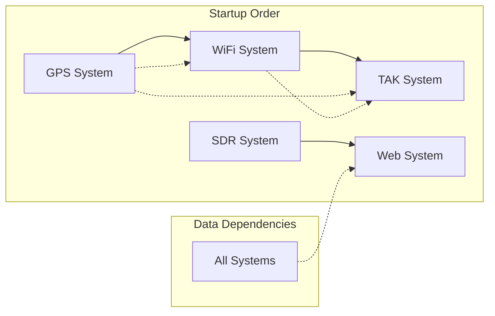
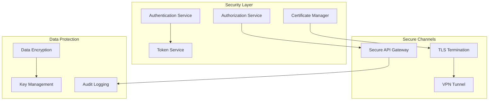
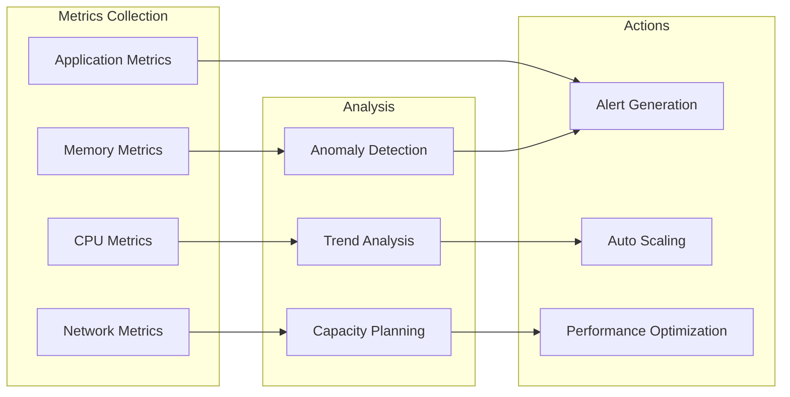
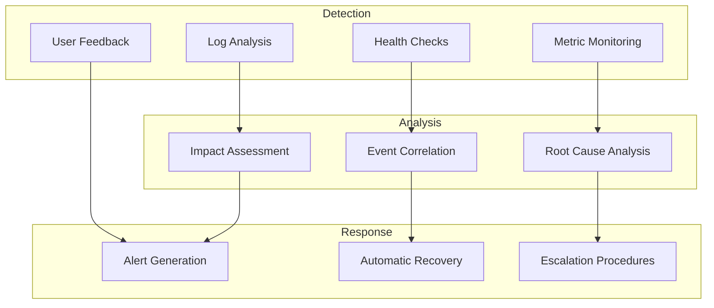
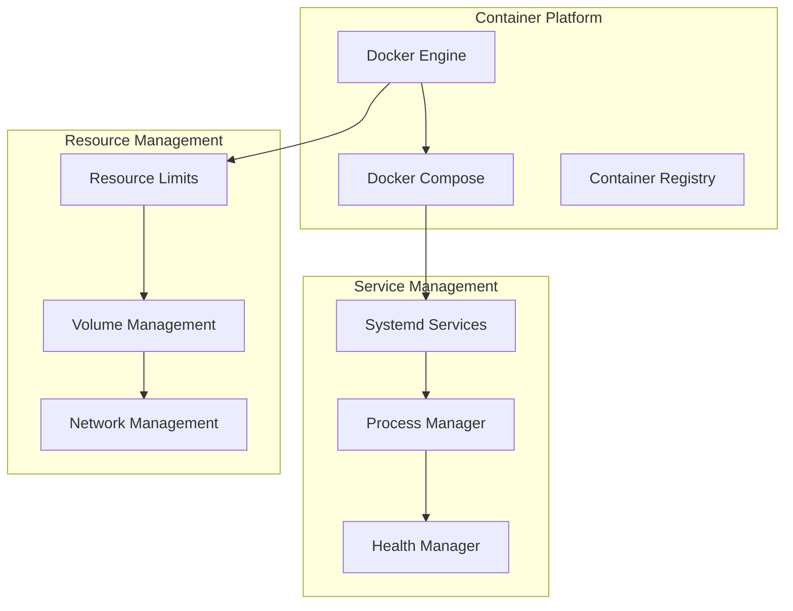

# Integration Overview

## Navigation
- [← Back to Architecture Overview](./README.md)
- [Level 1: System Overview](./system-overview.md)
- [Level 2: Subsystems](./subsystems/README.md)
- [Level 3: Components](./components/README.md)

## Overview

This document provides a comprehensive view of how all Stinkster subsystems integrate to form a cohesive tactical intelligence platform. It covers data flow patterns, communication protocols, security boundaries, and operational dependencies.

## System Integration Architecture

```mermaid
graph TB
    subgraph "Integration Layer"
        subgraph "Data Bus"
            EVENT_BUS[Event Bus]
            DATA_PIPELINE[Data Pipeline]
            MESSAGE_QUEUE[Message Queue]
        end
        
        subgraph "API Gateway"
            REST_GATEWAY[REST Gateway]
            WEBSOCKET_HUB[WebSocket Hub]
            AUTH_PROXY[Auth Proxy]
        end
        
        subgraph "Configuration Hub"
            CONFIG_MGR[Configuration Manager]
            TEMPLATE_ENGINE[Template Engine]
            VALIDATION_SVC[Validation Service]
        end
        
        subgraph "Monitoring Hub"
            HEALTH_MONITOR[Health Monitor]
            PERF_COLLECTOR[Performance Collector]
            ALERT_MANAGER[Alert Manager]
        end
    end
    
    subgraph "Core Subsystems"
        GPS_SUB[GPS Subsystem]
        WIFI_SUB[WiFi Subsystem]
        SDR_SUB[SDR Subsystem]
        TAK_SUB[TAK Subsystem]
        WEB_SUB[Web Subsystem]
    end
    
    subgraph "External Systems"
        TAK_SERVER[TAK Server]
        GPS_HARDWARE[GPS Hardware]
        HACKRF_HW[HackRF Hardware]
        WIFI_ADAPTER[WiFi Adapter]
        WEB_CLIENTS[Web Clients]
    end
    
    %% Subsystem connections to integration layer
    GPS_SUB --> EVENT_BUS
    WIFI_SUB --> EVENT_BUS
    SDR_SUB --> EVENT_BUS
    TAK_SUB --> EVENT_BUS
    WEB_SUB --> EVENT_BUS
    
    %% Data flow
    EVENT_BUS --> DATA_PIPELINE
    DATA_PIPELINE --> MESSAGE_QUEUE
    
    %% API integration
    GPS_SUB --> REST_GATEWAY
    WIFI_SUB --> REST_GATEWAY
    SDR_SUB --> REST_GATEWAY
    TAK_SUB --> REST_GATEWAY
    WEB_SUB --> WEBSOCKET_HUB
    
    %% Configuration flow
    CONFIG_MGR --> GPS_SUB
    CONFIG_MGR --> WIFI_SUB
    CONFIG_MGR --> SDR_SUB
    CONFIG_MGR --> TAK_SUB
    CONFIG_MGR --> WEB_SUB
    
    %% Monitoring flow
    GPS_SUB --> HEALTH_MONITOR
    WIFI_SUB --> HEALTH_MONITOR
    SDR_SUB --> HEALTH_MONITOR
    TAK_SUB --> HEALTH_MONITOR
    WEB_SUB --> HEALTH_MONITOR
    
    %% External connections
    GPS_SUB --> GPS_HARDWARE
    WIFI_SUB --> WIFI_ADAPTER
    SDR_SUB --> HACKRF_HW
    TAK_SUB --> TAK_SERVER
    WEB_SUB --> WEB_CLIENTS
    
    %% Styling
    classDef integration fill:#e1f5fe
    classDef subsystem fill:#f3e5f5
    classDef external fill:#fff3e0
    
    class EVENT_BUS,DATA_PIPELINE,MESSAGE_QUEUE,REST_GATEWAY,WEBSOCKET_HUB,AUTH_PROXY,CONFIG_MGR,TEMPLATE_ENGINE,VALIDATION_SVC,HEALTH_MONITOR,PERF_COLLECTOR,ALERT_MANAGER integration
    class GPS_SUB,WIFI_SUB,SDR_SUB,TAK_SUB,WEB_SUB subsystem
    class TAK_SERVER,GPS_HARDWARE,HACKRF_HW,WIFI_ADAPTER,WEB_CLIENTS external
```

## Primary Data Flows

### 1. Location-Aware WiFi Scanning Flow

### 2. Spectrum Monitoring Flow

### 3. Integrated Situational Awareness Flow

## Integration Patterns

### Event-Driven Architecture
- **Publisher-Subscriber**: Subsystems publish events to shared event bus
- **Event Sourcing**: All state changes captured as events
- **Command Query Responsibility Segregation (CQRS)**: Separate read/write operations
- **Saga Pattern**: Coordinate complex multi-subsystem transactions

### API Integration Patterns
- **REST APIs**: Standard HTTP-based interfaces for configuration and control
- **WebSocket Streams**: Real-time data streaming for live updates
- **Message Queues**: Asynchronous communication between components
- **Service Mesh**: Network-level service-to-service communication

### Data Integration Patterns
- **Pipeline Architecture**: Sequential data processing stages
- **Fan-out/Fan-in**: Parallel processing with result aggregation
- **Circuit Breaker**: Fault tolerance for external dependencies
- **Bulkhead Pattern**: Resource isolation between subsystems

## Cross-Subsystem Dependencies

### Runtime Dependencies

### Configuration Dependencies
- **Shared Configuration**: Common settings used across multiple subsystems
- **Template Inheritance**: Configuration templates with inheritance hierarchy
- **Validation Chains**: Cross-system configuration validation
- **Hot Reload Coordination**: Synchronized configuration updates

### Resource Dependencies
- **Hardware Sharing**: USB devices shared between subsystems
- **Network Ports**: Port allocation and conflict resolution
- **File System**: Shared directories and file locking
- **Memory Management**: Shared memory pools and resource limits

## Security Integration

### Authentication and Authorization

### Security Boundaries
- **Network Segmentation**: Isolated network zones for different security levels
- **Process Isolation**: Container and process-level security boundaries
- **Data Classification**: Sensitive data handling and protection
- **Audit Trails**: Comprehensive logging of security-relevant events

## Performance Integration

### Resource Management
- **CPU Allocation**: Process priority and CPU affinity management
- **Memory Management**: Shared memory pools and garbage collection coordination
- **I/O Throttling**: Bandwidth allocation and prioritization
- **Storage Management**: Disk space allocation and cleanup coordination

### Load Balancing and Scaling
- **Horizontal Scaling**: Multiple instance deployment for high-load components
- **Vertical Scaling**: Resource allocation optimization
- **Auto-scaling**: Dynamic resource allocation based on load
- **Circuit Breaking**: Automatic load shedding during overload conditions

### Performance Monitoring

## Error Handling and Recovery

### Fault Tolerance Patterns
- **Graceful Degradation**: Reduced functionality when subsystems fail
- **Bulkhead Pattern**: Failure isolation between subsystems
- **Circuit Breaker**: Automatic service isolation during failures
- **Retry with Backoff**: Intelligent retry strategies for transient failures

### Recovery Strategies
- **Hot Standby**: Immediate failover to backup systems
- **Checkpoint/Restore**: State preservation and recovery
- **Self-Healing**: Automatic problem detection and correction
- **Manual Recovery**: Guided recovery procedures for complex failures

### Monitoring and Alerting

## Configuration Integration

### Centralized Configuration Management
- **Configuration Templates**: Reusable configuration templates
- **Environment-Specific Overrides**: Environment-specific configuration values
- **Validation Framework**: Cross-system configuration validation
- **Change Management**: Controlled configuration change processes

### Configuration Synchronization
- **Version Control**: Git-based configuration version control
- **Deployment Pipeline**: Automated configuration deployment
- **Rollback Capabilities**: Safe configuration rollback procedures
- **Audit Trail**: Complete configuration change history

## Deployment and Operations

### Container Orchestration

### Operational Procedures
- **Startup Sequences**: Coordinated system startup procedures
- **Shutdown Procedures**: Graceful system shutdown with dependency management
- **Backup and Restore**: Comprehensive backup and restore procedures
- **Disaster Recovery**: Emergency recovery procedures and failover plans

## Testing Integration

### Integration Testing Strategy
- **End-to-End Testing**: Complete workflow validation
- **Contract Testing**: Interface compatibility testing
- **Load Testing**: System performance under load
- **Chaos Engineering**: Fault injection and resilience testing

### Test Environment Management
- **Test Data Management**: Realistic test data generation and management
- **Environment Provisioning**: Automated test environment creation
- **Test Isolation**: Isolated test environments to prevent interference
- **Continuous Integration**: Automated testing in CI/CD pipelines

## Documentation Cross-References

### Architecture Documentation
- [System Overview](./system-overview.md) - High-level system architecture
- [GPS Subsystem](./subsystems/gps-subsystem.md) - GPS integration details
- [WiFi Subsystem](./subsystems/wifi-subsystem.md) - WiFi scanning architecture
- [SDR Subsystem](./subsystems/sdr-subsystem.md) - Software-defined radio components
- [TAK Subsystem](./subsystems/tak-subsystem.md) - TAK integration architecture
- [Web Subsystem](./subsystems/web-subsystem.md) - Web interface architecture

### Component Documentation
- [Spectrum Analyzer](./components/spectrum-analyzer.md) - Detailed spectrum analyzer implementation
- [Service Orchestration](./components/service-orchestration.md) - Process management details
- [Configuration Management](./components/configuration-management.md) - Configuration system details

### Operational Documentation
- [Configuration Guide](../CONFIGURATION.md) - System configuration procedures
- [Development Guide](../dev/DEVELOPMENT_GUIDE.md) - Development environment setup
- [Security Audit](../SECURITY_AUDIT.md) - Security implementation details
- [Dependencies](../DEPENDENCIES.md) - System dependency analysis

### Setup and Deployment
- [HackRF Setup](../HACKRF_DOCKER_SETUP.md) - HackRF configuration procedures
- [OpenWebRX Setup](../OPENWEBRX_SETUP.md) - OpenWebRX deployment guide
- [Service Orchestration](../SERVICE_ORCHESTRATION_ANALYSIS.md) - Service management analysis

This integration overview provides the foundation for understanding how all Stinkster components work together to provide comprehensive tactical intelligence capabilities.