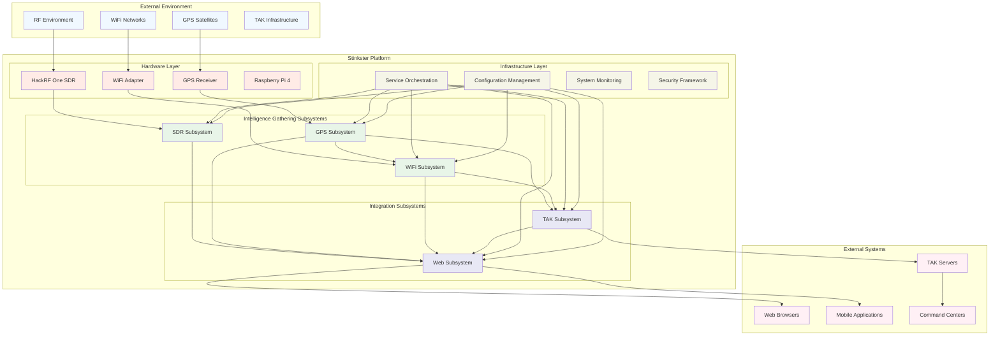
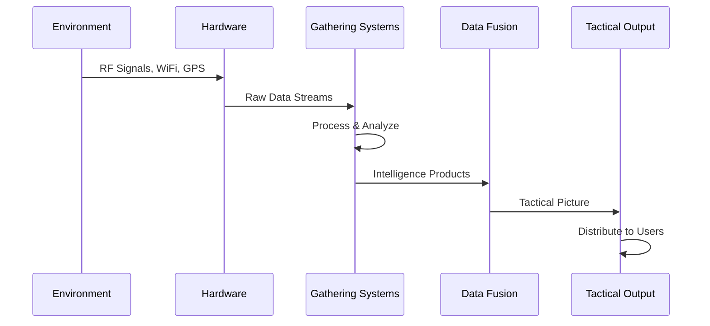
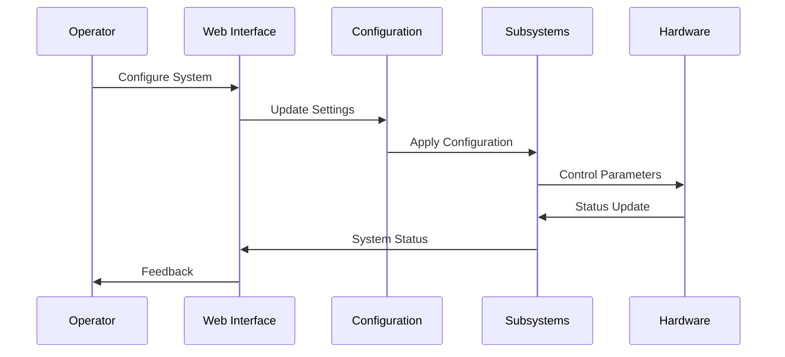

# Level 1: System Overview

## Navigation
- [← Back to Architecture Overview](./README.md)
- [Level 2: Subsystems](./subsystems/README.md)
- [Level 3: Components](./components/README.md)

## Overview

The Stinkster system is a comprehensive tactical intelligence platform that combines Software Defined Radio (SDR), WiFi scanning, GPS tracking, and Team Awareness Kit (TAK) integration to provide real-time situational awareness for military and emergency response operations.

## System Architecture

## System Capabilities

### Intelligence Gathering
- **RF Spectrum Analysis**: Real-time spectrum monitoring from 1 MHz to 6 GHz
- **WiFi Network Intelligence**: Comprehensive 802.11 network scanning and device tracking
- **Geospatial Intelligence**: Precise GPS positioning with MAVLink protocol support
- **Signal Intelligence**: Automated signal detection and classification

### Tactical Integration
- **TAK Compatibility**: Full integration with Team Awareness Kit ecosystem
- **Real-time Data Fusion**: Correlation of RF, WiFi, and location intelligence
- **Multi-platform Support**: Web, mobile, and desktop client access
- **Standards Compliance**: Military and emergency response communication standards

### Operational Features
- **Portable Deployment**: Raspberry Pi-based platform for field operations
- **Real-time Processing**: Sub-second latency for time-critical intelligence
- **Scalable Architecture**: Modular design supporting mission-specific configurations
- **Secure Communications**: Encrypted data transmission and secure authentication

## Primary Data Flows

### Intelligence Collection Flow

### Command and Control Flow

## Subsystem Responsibilities

### [GPS Subsystem](./subsystems/gps-subsystem.md)
- **Primary Function**: Location services and geospatial data management
- **Key Technologies**: MAVLink, GPSD, coordinate transformation
- **Integration Points**: Provides location context to WiFi and TAK subsystems
- **External Interfaces**: GPS receivers, navigation systems, mapping services

### [WiFi Subsystem](./subsystems/wifi-subsystem.md)
- **Primary Function**: Wireless network intelligence gathering
- **Key Technologies**: Kismet, monitor mode, device fingerprinting
- **Integration Points**: Receives location data from GPS, feeds data to TAK
- **External Interfaces**: WiFi adapters, wireless networks, signal analyzers

### [SDR Subsystem](./subsystems/sdr-subsystem.md)
- **Primary Function**: Software-defined radio operations and spectrum analysis
- **Key Technologies**: HackRF, OpenWebRX (Docker-automated), FFT processing, signal detection
- **Integration Points**: Standalone operation with web visualization
- **External Interfaces**: HackRF hardware, RF antennas, web browsers
- **Deployment**: Automated Docker setup with native HackRF drivers
- **Access**: Web interface at port 8073 with admin/hackrf credentials

### [TAK Subsystem](./subsystems/tak-subsystem.md)
- **Primary Function**: Team Awareness Kit integration and tactical data conversion
- **Key Technologies**: CoT messaging, WigleToTAK conversion, tactical protocols
- **Integration Points**: Aggregates GPS and WiFi data for tactical distribution
- **External Interfaces**: TAK servers, tactical networks, command systems

### [Web Subsystem](./subsystems/web-subsystem.md)
- **Primary Function**: Unified web interfaces and user interaction
- **Key Technologies**: Flask, WebSocket, responsive design, real-time visualization
- **Integration Points**: Aggregates data from all subsystems for unified presentation
- **External Interfaces**: Web browsers, mobile devices, external APIs

## Technology Stack

### Hardware Platform
- **Primary Platform**: Raspberry Pi 4 (4GB+ RAM recommended)
- **SDR Hardware**: HackRF One for RF operations
- **WiFi Hardware**: USB WiFi adapters with monitor mode support
- **GPS Hardware**: USB GPS receivers or MAVLink-compatible devices

### Software Architecture
- **Operating System**: Raspberry Pi OS (Debian-based)
- **Container Platform**: Docker for service isolation (automated OpenWebRX deployment)
- **Programming Languages**: Python, Bash, JavaScript
- **Web Technologies**: Flask, SocketIO, HTML5, CSS3, OpenWebRX web interface
- **Database**: SQLite for local data, file-based for configuration
- **SDR Integration**: Native HackRF drivers with automated Docker orchestration

### Communication Protocols
- **Internal**: REST APIs, WebSocket, Unix sockets, shared files
- **External**: HTTP/HTTPS, TCP/UDP, Multicast, TAK protocols
- **Hardware**: USB, Serial, SPI, I2C for device communication

## Performance Characteristics

### Real-time Processing
- **GPS Updates**: 1-10 Hz position updates
- **WiFi Scanning**: 100-1000 device detections per minute
- **Spectrum Analysis**: 10-20 Hz spectrum updates
- **TAK Messaging**: Real-time CoT message generation
- **Web Response**: Sub-second response times

### Resource Requirements
- **CPU**: Multi-core ARM or x86 processor
- **Memory**: 4GB RAM minimum, 8GB recommended
- **Storage**: 32GB minimum, 64GB+ for extended operations
- **Network**: 100Mbps Ethernet, WiFi for management

### Scalability Factors
- **Geographic Coverage**: Limited by RF and WiFi range
- **Device Capacity**: Thousands of tracked devices
- **User Capacity**: Multiple concurrent web users
- **Data Retention**: Configurable based on storage capacity

## Security Architecture

### Security Zones
- **Hardware Zone**: Physical device security and access control
- **System Zone**: Operating system and container security
- **Application Zone**: Service-level security and authentication
- **Network Zone**: Communication security and encryption
- **Data Zone**: Information classification and protection

### Security Controls
- **Authentication**: Web-based user authentication
- **Authorization**: Role-based access control
- **Encryption**: TLS/SSL for all network communications
- **Audit Logging**: Comprehensive security event logging
- **Physical Security**: Tamper detection and secure boot

## Deployment Models

### Tactical Deployment
- **Mobile Platform**: Vehicle or backpack-mounted system
- **Power Requirements**: 12V DC or battery operation
- **Communication**: Mesh networking or satellite connectivity
- **Environmental**: Ruggedized housing for field conditions

### Fixed Installation
- **Facility Deployment**: Permanent installation in buildings
- **Network Integration**: Enterprise network connectivity
- **Redundancy**: High availability and failover capabilities
- **Monitoring**: Integration with enterprise monitoring systems

### Laboratory/Training
- **Development Environment**: Full-featured development platform
- **Simulation**: Synthetic data generation for testing
- **Training**: Educational and demonstration configurations
- **Research**: Experimental features and capabilities

## Integration Patterns

### Event-Driven Architecture
- **Publisher-Subscriber**: Real-time event distribution
- **Message Queuing**: Asynchronous communication
- **Event Sourcing**: Complete event history tracking
- **CQRS**: Separate read/write optimization

### API-First Design
- **RESTful APIs**: Standard HTTP-based interfaces
- **WebSocket Streams**: Real-time bidirectional communication
- **GraphQL**: Flexible data querying capabilities
- **OpenAPI**: Comprehensive API documentation

### Microservices Pattern
- **Service Isolation**: Independent service deployment
- **Circuit Breaker**: Fault tolerance and resilience
- **Service Discovery**: Dynamic service registration
- **Load Balancing**: Traffic distribution and scaling

## Related Documentation
- [Subsystem Architecture](./subsystems/README.md)
- [Component Details](./components/README.md)
- [Integration Overview](./integration-overview.md)
- [Configuration Guide](../CONFIGURATION.md)
- [Development Guide](../dev/DEVELOPMENT_GUIDE.md)