# Spectrum Analyzer Component

## Navigation
- [← Back to Components](./README.md)
- [← Back to SDR Subsystem](../subsystems/sdr-subsystem.md)
- [← Back to Architecture Overview](../README.md)

## Overview

The Spectrum Analyzer component provides real-time radio frequency spectrum analysis using HackRF One SDR hardware. It implements a complete DSP pipeline from raw IQ data acquisition through FFT processing to web-based visualization.

## Component Architecture

```mermaid
graph TB
    subgraph "Spectrum Analyzer Component"
        subgraph "Hardware Interface Layer"
            HACKRF_IF[HackRF Interface]
            USB_MGR[USB Manager]
            DEVICE_CTRL[Device Controller]
        end
        
        subgraph "Signal Processing Layer"
            IQ_BUFFER[IQ Buffer Manager]
            FFT_ENGINE[FFT Engine]
            WINDOW_FUNC[Window Functions]
            AVERAGING[Signal Averaging]
            CALIBRATION[Calibration Engine]
        end
        
        subgraph "Data Management Layer"
            SPECTRUM_CACHE[Spectrum Cache]
            HISTORY_MGR[History Manager]
            EXPORT_ENGINE[Export Engine]
            CONFIG_LOADER[Config Loader]
        end
        
        subgraph "Web Interface Layer"
            FLASK_APP[Flask Application]
            SOCKETIO_SRV[SocketIO Server]
            API_ENDPOINTS[API Endpoints]
            STATIC_HANDLER[Static File Handler]
        end
        
        subgraph "Visualization Layer"
            PLOT_GENERATOR[Plot Generator]
            WATERFALL_GEN[Waterfall Generator]
            JSON_FORMATTER[JSON Formatter]
            IMAGE_EXPORT[Image Export]
        end
    end
    
    subgraph "External Interfaces"
        HACKRF_HW[HackRF Hardware]
        WEB_CLIENT[Web Browser]
        CONFIG_FILE[Configuration File]
        LOG_SYSTEM[Logging System]
    end
    
    %% Hardware connections
    HACKRF_HW --> USB_MGR
    USB_MGR --> HACKRF_IF
    HACKRF_IF --> DEVICE_CTRL
    
    %% Signal processing pipeline
    DEVICE_CTRL --> IQ_BUFFER
    IQ_BUFFER --> WINDOW_FUNC
    WINDOW_FUNC --> FFT_ENGINE
    FFT_ENGINE --> AVERAGING
    AVERAGING --> CALIBRATION
    
    %% Data management
    CALIBRATION --> SPECTRUM_CACHE
    SPECTRUM_CACHE --> HISTORY_MGR
    CONFIG_FILE --> CONFIG_LOADER
    CONFIG_LOADER --> DEVICE_CTRL
    
    %% Web interface
    FLASK_APP --> SOCKETIO_SRV
    FLASK_APP --> API_ENDPOINTS
    FLASK_APP --> STATIC_HANDLER
    WEB_CLIENT --> FLASK_APP
    
    %% Visualization
    SPECTRUM_CACHE --> PLOT_GENERATOR
    SPECTRUM_CACHE --> WATERFALL_GEN
    PLOT_GENERATOR --> JSON_FORMATTER
    WATERFALL_GEN --> IMAGE_EXPORT
    JSON_FORMATTER --> SOCKETIO_SRV
    
    %% Export and logging
    HISTORY_MGR --> EXPORT_ENGINE
    EXPORT_ENGINE --> LOG_SYSTEM
    
    %% Styling
    classDef hardware fill:#ffcccc
    classDef processing fill:#ccffcc
    classDef data fill:#ccccff
    classDef web fill:#ffffcc
    classDef viz fill:#ffccff
    classDef external fill:#f0f0f0
    
    class HACKRF_IF,USB_MGR,DEVICE_CTRL hardware
    class IQ_BUFFER,FFT_ENGINE,WINDOW_FUNC,AVERAGING,CALIBRATION processing
    class SPECTRUM_CACHE,HISTORY_MGR,EXPORT_ENGINE,CONFIG_LOADER data
    class FLASK_APP,SOCKETIO_SRV,API_ENDPOINTS,STATIC_HANDLER web
    class PLOT_GENERATOR,WATERFALL_GEN,JSON_FORMATTER,IMAGE_EXPORT viz
    class HACKRF_HW,WEB_CLIENT,CONFIG_FILE,LOG_SYSTEM external
```



## Implementation Details

### Hardware Interface Layer

#### HackRF Interface
- **File**: `/home/pi/projects/stinkster/src/hackrf/spectrum_analyzer.py` (lines 50-120)
- **Technology**: PyHackRF wrapper around libhackrf
- **Responsibilities**:
  - Device initialization and configuration
  - Sample rate and frequency control
  - Gain setting management
  - IQ data stream acquisition

```python
class HackRFInterface:
    def __init__(self, config):
        self.device = None
        self.config = config
        
    def initialize_device(self):
        """Initialize HackRF device with configuration"""
        
    def set_frequency(self, freq_hz):
        """Set center frequency"""
        
    def set_sample_rate(self, rate):
        """Configure sample rate"""
        
    def set_gains(self, lna_gain, vga_gain, amp_enable):
        """Configure RF gains"""
        
    def start_streaming(self, callback):
        """Start IQ data streaming"""
```

#### USB Manager
- **Purpose**: Manage USB device lifecycle and error recovery
- **Features**:
  - Device enumeration and selection
  - USB error detection and recovery
  - Device reset and reinitialization
  - Hot-plug support

#### Device Controller
- **Purpose**: High-level device control and state management
- **Features**:
  - Device state tracking
  - Configuration synchronization
  - Command queuing and execution
  - Status reporting

### Signal Processing Layer

#### IQ Buffer Manager
- **Purpose**: Manage streaming IQ data buffers
- **Implementation**: Circular buffer with configurable size
- **Features**:
  - Thread-safe buffer operations
  - Overflow detection and handling
  - Buffer size optimization
  - Memory pool management

#### FFT Engine
- **Technology**: NumPy/SciPy FFT with optional GPU acceleration
- **Features**:
  - Configurable FFT size (512, 1024, 2048, 4096)
  - Overlap processing for smooth updates
  - Zero-padding for frequency resolution
  - Phase information preservation

```python
class FFTEngine:
    def __init__(self, fft_size=1024, overlap=0.5):
        self.fft_size = fft_size
        self.overlap = overlap
        self.window = self._create_window()
        
    def process_samples(self, iq_samples):
        """Process IQ samples through FFT pipeline"""
        windowed = iq_samples * self.window
        fft_result = np.fft.fft(windowed)
        return np.abs(fft_result)
```

#### Window Functions
- **Purpose**: Apply windowing to reduce spectral leakage
- **Supported Windows**:
  - Hanning (default)
  - Hamming
  - Blackman
  - Kaiser
  - Rectangular

#### Signal Averaging
- **Purpose**: Smooth spectrum display and reduce noise
- **Methods**:
  - Moving average
  - Exponential averaging
  - Peak hold
  - Min hold

#### Calibration Engine
- **Purpose**: Apply calibration corrections to spectrum data
- **Features**:
  - Frequency response correction
  - Amplitude calibration
  - Phase correction
  - Temperature compensation

### Data Management Layer

#### Spectrum Cache
- **Purpose**: Store and manage spectrum data for real-time access
- **Implementation**: Time-series data structure with efficient indexing
- **Features**:
  - Configurable retention period
  - Fast query capabilities
  - Memory usage optimization
  - Thread-safe access

#### History Manager
- **Purpose**: Manage long-term spectrum data storage
- **Features**:
  - Automatic data archiving
  - Compression for storage efficiency
  - Query interface for historical data
  - Export capabilities

#### Export Engine
- **Purpose**: Export spectrum data in various formats
- **Supported Formats**:
  - CSV for spreadsheet analysis
  - HDF5 for scientific data
  - PNG/SVG for visualization
  - WAV for audio analysis

#### Config Loader
- **File**: `/home/pi/projects/stinkster/src/hackrf/config.json`
- **Purpose**: Load and validate configuration settings
- **Configuration Parameters**:
  - Center frequency and span
  - Sample rate and FFT size
  - Gain settings
  - Display preferences

### Web Interface Layer

#### Flask Application
- **Port**: 5000 (configurable)
- **Routes**:
  - `/` - Main spectrum analyzer interface
  - `/api/spectrum` - Current spectrum data
  - `/api/config` - Configuration management
  - `/api/status` - Device status

#### SocketIO Server
- **Purpose**: Real-time spectrum data streaming
- **Events**:
  - `spectrum_data` - Real-time spectrum updates
  - `config_update` - Configuration changes
  - `device_status` - Device state changes
  - `error_alert` - Error notifications

#### API Endpoints
```python
@app.route('/api/spectrum', methods=['GET'])
def get_spectrum():
    """Get current spectrum data"""
    
@app.route('/api/config', methods=['GET', 'POST'])
def config_management():
    """Get or update configuration"""
    
@app.route('/api/export', methods=['POST'])
def export_data():
    """Export spectrum data"""
```

### Visualization Layer

#### Plot Generator
- **Technology**: Matplotlib backend with optimized rendering
- **Features**:
  - Real-time plot updates
  - Configurable axis scaling
  - Grid and annotation support
  - Multiple trace support

#### Waterfall Generator
- **Purpose**: Generate waterfall displays for time-frequency analysis
- **Features**:
  - Configurable time span
  - Color mapping options
  - Zoom and pan capabilities
  - Export to image formats

#### JSON Formatter
- **Purpose**: Format spectrum data for web transmission
- **Features**:
  - Data compression
  - Selective data transmission
  - Timestamp synchronization
  - Error handling

## Data Flow Sequence


## Configuration Management

### Configuration Schema
```json
{
  "hardware": {
    "center_frequency": 145000000,
    "sample_rate": 2400000,
    "lna_gain": 32,
    "vga_gain": 30,
    "amp_enable": false
  },
  "processing": {
    "fft_size": 1024,
    "window_function": "hanning",
    "averaging": {
      "type": "exponential",
      "alpha": 0.3
    }
  },
  "display": {
    "update_rate": 10,
    "frequency_span": 2400000,
    "reference_level": -60
  }
}
```

### Runtime Configuration Updates
- **Hot reload**: Configuration changes without restart
- **Validation**: Schema validation before application
- **Rollback**: Automatic rollback on invalid configuration
- **Persistence**: Configuration changes saved to file

## Performance Optimization

### Real-time Processing
- **Target Latency**: <100ms from RF to display
- **Processing Rate**: 10-20 updates per second
- **Memory Usage**: <512MB typical operation
- **CPU Usage**: <50% on Raspberry Pi 4

### Optimization Techniques
- **SIMD Instructions**: Vectorized FFT operations
- **Memory Pooling**: Reuse of buffer allocations
- **Thread Separation**: Separate threads for acquisition and processing
- **Data Compression**: Compressed transmission to web clients

### Performance Monitoring
```python
class PerformanceMonitor:
    def __init__(self):
        self.metrics = {
            'processing_latency': [],
            'memory_usage': [],
            'cpu_usage': [],
            'update_rate': []
        }
    
    def record_processing_time(self, duration):
        """Record processing duration for performance analysis"""
```

## Error Handling Strategies

### Hardware Errors
- **Device Disconnection**: Automatic detection and reconnection
- **USB Timeout**: Retry with exponential backoff
- **Invalid Parameters**: Validation and safe defaults
- **Overrun/Underrun**: Buffer management and recovery

### Processing Errors
- **FFT Failures**: Fallback to smaller FFT sizes
- **Memory Errors**: Garbage collection and resource cleanup
- **Calibration Errors**: Skip calibration and log warning
- **Data Corruption**: Detect and discard corrupted samples

### Web Interface Errors
- **Connection Loss**: Automatic WebSocket reconnection
- **Browser Compatibility**: Graceful degradation for older browsers
- **API Errors**: Structured error responses with recovery suggestions
- **Resource Limits**: Rate limiting and resource usage monitoring

## Security Considerations

### Data Security
- **Sensitive RF Data**: Secure handling of potentially sensitive spectrum information
- **User Authentication**: Basic authentication for configuration access
- **Network Security**: HTTPS support for encrypted communication
- **Access Control**: Role-based access to different functionality levels

### Operational Security
- **Input Validation**: Validation of all configuration parameters
- **Resource Limits**: Prevent resource exhaustion attacks
- **Audit Logging**: Log all configuration changes and access attempts
- **Error Information**: Careful handling of error information disclosure

## Testing Strategy

### Unit Tests
- Hardware interface mocking
- Signal processing algorithm validation
- Configuration management testing
- API endpoint testing

### Integration Tests
- End-to-end spectrum analysis pipeline
- Web interface functionality
- Real-time data streaming
- Error recovery scenarios

### Performance Tests
- Processing latency measurement
- Memory usage profiling
- Network throughput testing
- Long-term stability testing

## Related Documentation
- [SDR Subsystem](../subsystems/sdr-subsystem.md)
- [Configuration Guide](../../CONFIGURATION.md)
- [HackRF Setup Guide](../../HACKRF_DOCKER_SETUP.md)
- [Development Guide](../../dev/DEVELOPMENT_GUIDE.md)