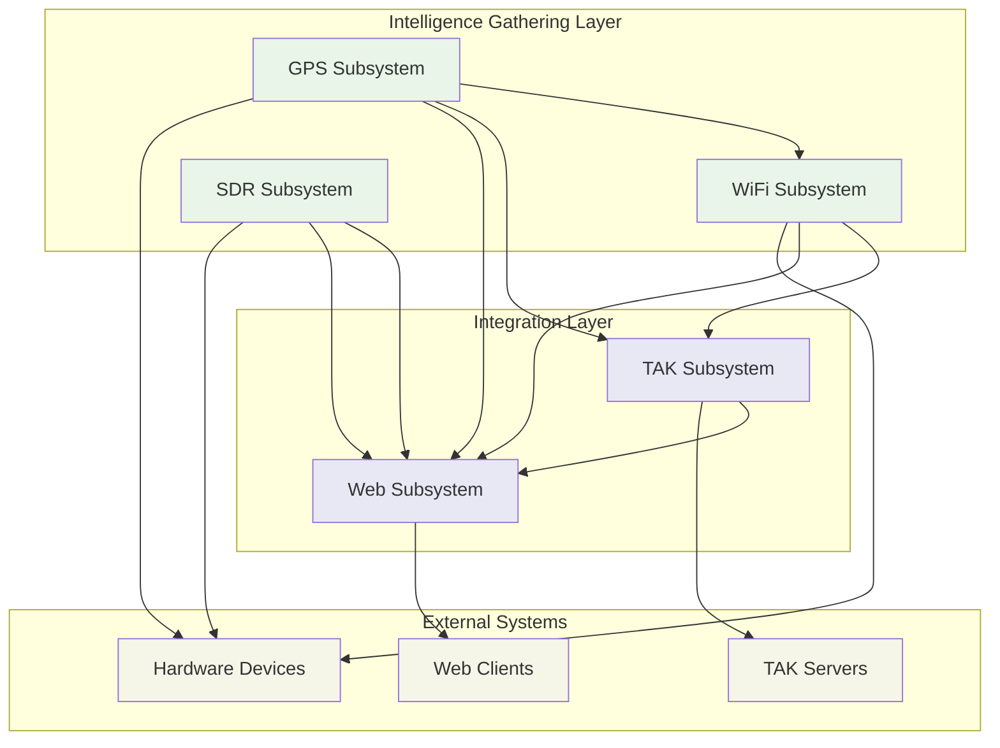
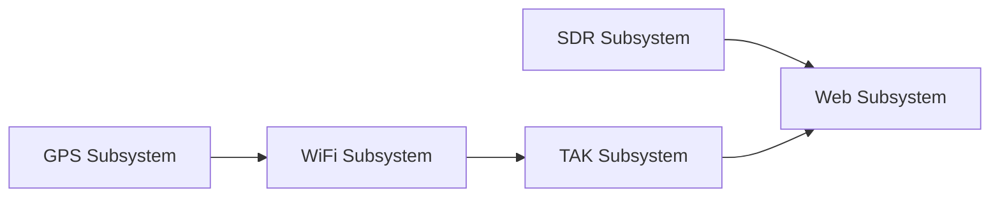

# Level 2: Subsystem Architecture

## Navigation
- [← Back to Architecture Overview](../README.md)
- [Level 1: System Overview](../system-overview.md)
- [Level 3: Components](../components/README.md)

## Overview

Level 2 subsystem diagrams provide detailed architectural views of the major functional areas within the Stinkster platform. Each subsystem represents a cohesive set of capabilities that work together to deliver specific functionality while maintaining clear interfaces with other subsystems.

## Subsystem Catalog

### Core Intelligence Gathering Subsystems

#### [GPS Subsystem](./gps-subsystem.md)
**Purpose**: Location services and geospatial data management
- MAVLink to GPSD bridge functionality
- Real-time position acquisition and distribution
- Coordinate system management and validation
- Integration with tactical mapping systems

**Key Components**: 
- GPS hardware interface
- MAVLink protocol handler
- GPSD daemon integration
- Position data validation and filtering

**External Interfaces**: 
- GPS hardware devices
- Kismet for location-aware scanning
- TAK systems for position reporting
- Web interfaces for status monitoring

---

#### [WiFi Subsystem](./wifi-subsystem.md)  
**Purpose**: Wireless network intelligence gathering and analysis
- Real-time 802.11 monitoring and analysis
- Device detection and fingerprinting
- Network topology mapping
- Geographic correlation of wireless assets

**Key Components**:
- Kismet wireless scanner
- Monitor mode interface management
- Device database and tracking
- Geographic correlation engine

**External Interfaces**:
- WiFi adapters and antennas
- GPS subsystem for location data
- TAK subsystem for intelligence dissemination
- Web interfaces for monitoring and analysis

---

#### [SDR Subsystem](./sdr-subsystem.md)
**Purpose**: Software-defined radio operations and spectrum analysis
- Real-time spectrum monitoring and analysis
- Signal detection and classification
- Web-based SDR receiver capabilities
- RF environment characterization

**Key Components**:
- HackRF One interface and control
- Spectrum analyzer with FFT processing
- OpenWebRX web-based receiver
- Signal detection and analysis tools

**External Interfaces**:
- HackRF SDR hardware
- RF antennas and front-end equipment
- Web browsers for spectrum visualization
- Docker containers for service isolation

---

### Integration and Output Subsystems

#### [TAK Subsystem](./tak-subsystem.md)
**Purpose**: Team Awareness Kit integration and tactical data conversion
- Convert civilian wireless intelligence to military TAK format
- Real-time situational awareness data transmission
- Integration with tactical command and control systems
- Multi-protocol TAK server communication

**Key Components**:
- WigleToTAK data conversion engine
- CoT (Cursor-on-Target) message generation
- TAK server client implementations
- Real-time data correlation and filtering

**External Interfaces**:
- Kismet WiFi data feeds
- GPS position data
- TAK servers and tactical networks
- Web dashboard for monitoring and control

---

#### [Web Subsystem](./web-subsystem.md)
**Purpose**: Unified web-based interfaces and user interaction
- Centralized web portal for all system functions
- Real-time data visualization and monitoring
- Configuration management interfaces
- Mobile-responsive tactical displays

**Key Components**:
- Flask-based web applications
- WebSocket real-time communication
- RESTful API endpoints
- Responsive web interfaces

**External Interfaces**:
- Web browsers and mobile devices
- All other subsystems for data and control
- External APIs and webhook services
- Authentication and security systems

---

## Subsystem Interaction Overview

## Data Flow Patterns

### Primary Data Flows
1. **Location-Enhanced WiFi Intelligence**: GPS → WiFi → TAK → Tactical Networks
2. **Spectrum Situational Awareness**: SDR → Web → Operators
3. **Unified Tactical Picture**: All Subsystems → Web → Command Centers
4. **Real-time Monitoring**: All Subsystems → Web → Field Operators

### Configuration and Control Flows
1. **Centralized Configuration**: Web → All Subsystems
2. **Status Monitoring**: All Subsystems → Web → Operators
3. **Alert and Notification**: All Subsystems → Web → External Systems

## Subsystem Dependencies

### Startup Dependencies

### Runtime Dependencies
- **GPS**: Provides location context for all other subsystems
- **WiFi**: Depends on GPS for geographic correlation
- **TAK**: Depends on WiFi and GPS for tactical intelligence
- **Web**: Aggregates data from all subsystems
- **SDR**: Operates independently but integrates via Web subsystem

### Resource Dependencies
- **Hardware**: Each subsystem requires specific hardware resources
- **Network**: Shared network infrastructure and port allocation
- **Storage**: Shared storage for logs, data, and configuration
- **Processing**: CPU and memory allocation across subsystems

## Security Architecture

### Security Boundaries
- **Network Isolation**: Each subsystem operates in defined network zones
- **Process Isolation**: Container and service-level isolation
- **Data Protection**: Encryption and access control for sensitive data
- **Authentication**: Centralized authentication through Web subsystem

### Trust Relationships
- **Internal Communication**: Authenticated and encrypted inter-subsystem communication
- **External Interfaces**: Secured external connections with proper authentication
- **Configuration Security**: Secure configuration management and validation
- **Audit and Logging**: Comprehensive security event logging

## Performance Characteristics

### Throughput Requirements
- **GPS**: 1-10 Hz position updates
- **WiFi**: 100-1000 devices/minute scanning rate
- **SDR**: 10-20 Hz spectrum updates
- **TAK**: Real-time CoT message generation
- **Web**: Sub-second response times for user interactions

### Resource Utilization
- **CPU**: Distributed processing across subsystems
- **Memory**: Optimized memory usage with shared resources where possible
- **Storage**: Efficient data storage and rotation policies
- **Network**: Bandwidth management and prioritization

## Operational Considerations

### Deployment Patterns
- **Standalone Deployment**: Each subsystem can operate independently
- **Integrated Deployment**: Full system deployment with all subsystems
- **Selective Deployment**: Deploy only required subsystems for specific missions
- **Cloud Deployment**: Hybrid cloud deployment for scalability

### Maintenance and Updates
- **Rolling Updates**: Update subsystems without complete system downtime
- **Configuration Management**: Centralized configuration with validation
- **Health Monitoring**: Comprehensive health checking and alerting
- **Backup and Recovery**: Coordinated backup and recovery procedures

## Development and Testing

### Development Environment
- **Modular Development**: Each subsystem can be developed and tested independently
- **Integration Testing**: Comprehensive testing of subsystem interactions
- **Mock Services**: Mock external dependencies for isolated testing
- **Continuous Integration**: Automated testing and deployment pipelines

### Testing Strategies
- **Unit Testing**: Component-level testing within each subsystem
- **Integration Testing**: Cross-subsystem integration validation
- **Performance Testing**: Load and stress testing for each subsystem
- **End-to-End Testing**: Complete workflow validation across all subsystems

## Documentation Navigation

### Detailed Subsystem Documentation
- [GPS Subsystem Details](./gps-subsystem.md)
- [WiFi Subsystem Details](./wifi-subsystem.md)
- [SDR Subsystem Details](./sdr-subsystem.md)
- [TAK Subsystem Details](./tak-subsystem.md)
- [Web Subsystem Details](./web-subsystem.md)

### Related Architecture Documentation
- [System Overview](../system-overview.md) - High-level system architecture
- [Component Details](../components/README.md) - Level 3 component diagrams
- [Integration Overview](../integration-overview.md) - Cross-system integration patterns

### Implementation Documentation
- [Configuration Guide](../../CONFIGURATION.md) - System configuration procedures
- [Development Guide](../../dev/DEVELOPMENT_GUIDE.md) - Development environment setup
- [Service Orchestration](../../SERVICE_ORCHESTRATION_ANALYSIS.md) - Service management

### Operational Documentation
- [Security Audit](../../SECURITY_AUDIT.md) - Security implementation details
- [Dependencies Analysis](../../DEPENDENCIES.md) - System dependencies
- [Setup Guides](../../README.md) - Installation and setup procedures

This subsystem architecture provides the foundation for understanding how each major functional area contributes to the overall Stinkster tactical intelligence platform.