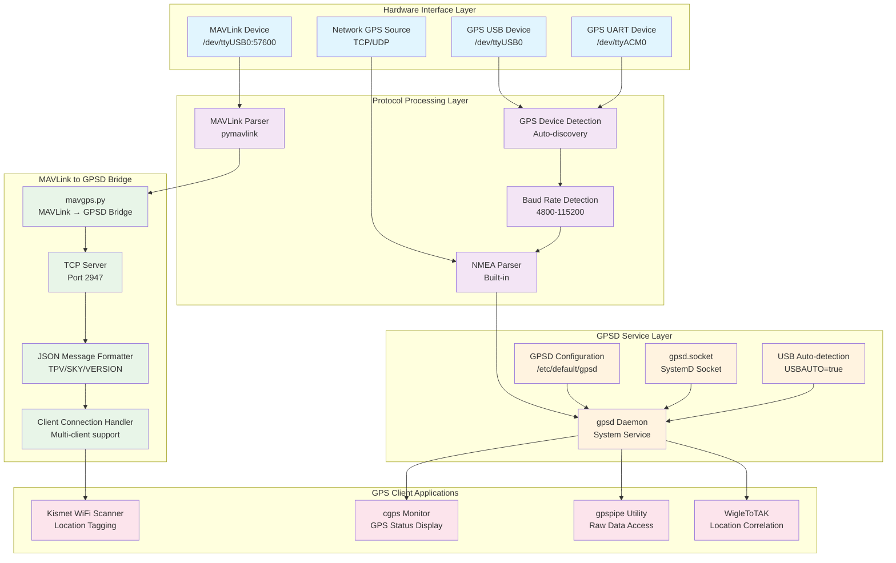

# GPS Subsystem Architecture

## Navigation
- [← Back to Architecture Overview](../README.md)
- [Level 1: System Overview](../system-overview.md)
- [Level 2: Subsystems](./README.md)
- [Level 3: Components](../components/README.md)

## Overview

The GPS subsystem provides comprehensive location services to the Stinkster platform through a multi-layered architecture that handles various GPS sources, protocol conversions, and coordinates location data distribution to client applications.

```
[GPS Hardware] → [Protocol Bridge] → [GPSD Service] → [Client Applications]
```

## Component Diagram



## Hardware Interface Layer

### GPS Device Detection

The system automatically detects GPS devices through multiple strategies:

1. **USB Device Enumeration**
   - Scans `/dev/ttyUSB*` and `/dev/ttyACM*` devices
   - Tests each device for NMEA data at multiple baud rates
   - Validates GPS presence with NMEA sentence pattern matching

2. **Serial Interface Configuration**
   - Supports baud rates: 4800, 9600, 38400, 57600, 115200
   - Auto-detects optimal baud rate for each device
   - Configures serial port parameters (8N1)

3. **Network GPS Sources**
   - TCP/UDP network connections to remote GPS sources
   - MAVLink over TCP (default: localhost:14550)
   - NMEA over network protocols

### Device Types Supported

| Device Type | Interface | Protocol | Configuration |
|-------------|-----------|----------|---------------|
| Standard GPS | USB/Serial | NMEA 0183 | Auto-detect baud |
| MAVLink GPS | USB/Serial/TCP | MAVLink | 57600 baud default |
| Network GPS | TCP/UDP | NMEA/MAVLink | IP:Port config |
| Virtual GPS | Simulation | NMEA | Test/development |

## Protocol Processing Layer

### MAVLink Protocol Handling

```python
# MAVLink Message Processing
GLOBAL_POSITION_INT:
  - lat: int32 (1e-7 degrees)
  - lon: int32 (1e-7 degrees) 
  - alt: int32 (millimeters)
  - vx/vy/vz: int16 (cm/s)
  - hdg: uint16 (0.01 degrees)

GPS_RAW_INT:
  - fix_type: uint8 (0=no fix, 2=2D, 3=3D)
  - satellites_visible: uint8
  - eph: uint16 (horizontal accuracy)
  - epv: uint16 (vertical accuracy)
```

### NMEA Data Processing

```
Supported NMEA Sentences:
- $GPGGA: GPS Fix Data
- $GPRMC: Recommended Minimum
- $GPGSV: Satellites in View
- $GPGSA: GPS DOP and Active Satellites
```

## MAVLink to GPSD Bridge

### Bridge Implementation (mavgps.py)

The bridge converts MAVLink GPS data to GPSD JSON protocol:

```python
class MavlinkGPSD:
    def __init__(self, mavlink_connection, gpsd_port=2947):
        # TCP server for GPSD clients
        # MAVLink connection management
        # Signal handling for clean shutdown
    
    def convert_mavlink_to_gpsd(self, pos_msg, gps_msg):
        return {
            "class": "TPV",  # Time-Position-Velocity
            "device": "mavlink",
            "mode": gps_msg.fix_type,
            "lat": pos_msg.lat / 1e7,
            "lon": pos_msg.lon / 1e7,
            "alt": pos_msg.alt / 1000.0,
            "speed": calculated_speed,
            "track": pos_msg.hdg / 100.0
        }
```

### GPSD Protocol Messages

1. **VERSION Message**
   ```json
   {
     "class": "VERSION",
     "release": "3.17",
     "proto_major": 3,
     "proto_minor": 11
   }
   ```

2. **TPV (Time-Position-Velocity) Message**
   ```json
   {
     "class": "TPV",
     "device": "mavlink",
     "mode": 3,
     "time": "2025-06-15T10:30:00.000Z",
     "lat": 40.7128,
     "lon": -74.0060,
     "alt": 10.5,
     "speed": 2.5,
     "track": 45.0
   }
   ```

3. **SKY (Satellite) Message**
   ```json
   {
     "class": "SKY",
     "device": "mavlink",
     "satellites": [{"used": true}],
     "hdop": 1.2,
     "vdop": 1.8
   }
   ```

## GPSD Service Configuration

### Service Management

```bash
# GPSD Service Control
sudo systemctl start gpsd.socket
sudo systemctl start gpsd
sudo systemctl enable gpsd.socket

# Configuration File: /etc/default/gpsd
DEVICES="/dev/ttyUSB0"
GPSD_OPTIONS="-n"
START_DAEMON="true"
USBAUTO="true"
```

### Device Configuration

The system automatically configures GPSD based on detected GPS devices:

```bash
# Dynamic Device Detection
for device in /dev/ttyUSB0 /dev/ttyACM0 /dev/ttyAMA0; do
    if test_gps_device "$device"; then
        configure_gpsd_device "$device"
        break
    fi
done
```

## GPS Data Formats and Transformations

### Coordinate System Conversions

1. **MAVLink → GPSD Conversion**
   - Latitude: `mavlink_lat / 1e7` (degrees)
   - Longitude: `mavlink_lon / 1e7` (degrees)
   - Altitude: `mavlink_alt / 1000.0` (meters MSL)

2. **Speed Calculations**
   - Ground speed: `√(vx² + vy²) / 100.0` (m/s)
   - Track/heading: `mavlink_hdg / 100.0` (degrees)

3. **Time Synchronization**
   - UTC time from GPS or system time
   - ISO 8601 format: `2025-06-15T10:30:00.000Z`

### Data Quality Metrics

| Metric | Source | Range | Quality |
|--------|---------|--------|---------|
| Fix Type | GPS_RAW_INT.fix_type | 0-3 | 0=None, 2=2D, 3=3D |
| HDOP | GPS_RAW_INT.eph/100 | 0.5-50 | <2=Excellent, >10=Poor |
| VDOP | GPS_RAW_INT.epv/100 | 0.5-50 | <3=Good, >6=Poor |
| Satellites | GPS_RAW_INT.satellites_visible | 0-32 | >4=Usable, >8=Good |

## Error Handling and Recovery

### GPS Lock Failure Handling

```bash
# GPS Lock Recovery Strategy
check_gps_lock() {
    local timeout=30
    local count=0
    
    while [ $count -lt $timeout ]; do
        if gpspipe -w -n 1 | grep -q '"mode":[23]'; then
            return 0  # GPS lock acquired
        fi
        sleep 1
        count=$((count + 1))
    done
    return 1  # GPS lock timeout
}
```

### Service Recovery Procedures

1. **GPSD Service Recovery**
   ```bash
   # Graceful restart
   sudo systemctl restart gpsd.socket
   sudo systemctl restart gpsd
   
   # Force restart if needed
   sudo killall -9 gpsd gpsdctl
   sudo rm -f /var/run/gpsd.sock
   ```

2. **MAVLink Bridge Recovery**
   ```python
   def reconnect_mavlink(self):
       try:
           self.mav.close()
           self.mav = mavutil.mavlink_connection(self.connection)
           self.mav.wait_heartbeat(timeout=10)
           return True
       except Exception as e:
           log.error(f"MAVLink reconnection failed: {e}")
           return False
   ```

### Common Error Scenarios

| Error | Cause | Resolution |
|-------|-------|------------|
| Device not found | USB disconnection | Auto-detect new device |
| Permission denied | /dev/tty* permissions | Add user to dialout group |
| No GPS lock | Poor signal/indoors | Wait for satellite acquisition |
| GPSD not responding | Service failure | Restart GPSD service |
| MAVLink timeout | Connection lost | Reconnect MAVLink bridge |

## Multiple GPS Source Management

### Source Priority System

1. **Primary Sources** (Highest Priority)
   - Dedicated GPS receivers with high accuracy
   - MAVLink sources with 3D fix

2. **Secondary Sources** (Medium Priority)
   - Network GPS feeds
   - Smartphone GPS via network

3. **Fallback Sources** (Lowest Priority)
   - Last known position with timestamp
   - Simulated GPS for testing

### Source Selection Algorithm

```python
def select_best_gps_source(sources):
    for source in sorted(sources, key=lambda s: s.priority):
        if source.has_3d_fix() and source.hdop < 2.0:
            return source
        elif source.has_2d_fix() and source.hdop < 5.0:
            return source
    return sources[0]  # Fallback to first available
```

## Integration with Kismet

### Kismet GPS Configuration

```
# kismet_site.conf GPS settings
gps=gpsd:host=localhost,port=2947,reconnect=true,reconnect_wait=5
gps_quit_on_error=false
gps_retry=true
gps_retry_time=30
```

### Location Tagging Process

1. **Real-time Location Updates**
   - Kismet polls GPSD every second
   - GPS coordinates are attached to WiFi scan results
   - Location uncertainty is calculated from HDOP

2. **WiFi Access Point Location**
   - Each detected AP gets GPS coordinates
   - Location accuracy is preserved in metadata
   - Historical location tracking for mobile APs

## Performance Considerations

### GPS Update Rates

| Application | Update Rate | Precision Required |
|-------------|-------------|-------------------|
| Kismet WiFi | 1 Hz | ~10 meter accuracy |
| Vehicle tracking | 5 Hz | ~3 meter accuracy |
| Walking/hiking | 0.2 Hz | ~5 meter accuracy |
| Static monitoring | 0.1 Hz | ~1 meter accuracy |

### Resource Optimization

1. **CPU Usage**
   - MAVLink bridge: ~1% CPU
   - GPSD daemon: ~0.5% CPU
   - Total GPS overhead: <2% CPU

2. **Memory Usage**
   - Bridge process: ~20MB RAM
   - GPSD daemon: ~10MB RAM
   - GPS data buffers: ~5MB RAM

3. **Network Bandwidth**
   - Local TCP: Negligible
   - Remote GPS: ~100 bytes/second
   - MAVLink stream: ~1KB/second

## Security Considerations

### GPS Data Protection

1. **Local Network Only**
   - GPSD binds to localhost by default
   - No external GPS data exposure

2. **Access Control**
   - Unix socket permissions
   - User group restrictions (dialout)

3. **Data Validation**
   - NMEA sentence validation
   - Coordinate range checking
   - Time synchronization verification

### Privacy Protection

- GPS coordinates are not logged to external systems
- Location data remains on local device
- Option to disable GPS completely via configuration

## Monitoring and Diagnostics

### GPS Status Commands

```bash
# Test GPS connectivity
gpspipe -w -n 1

# Monitor GPS status
cgps

# Check satellite count
gpspipe -w -n 10 | grep satellites

# Test MAVLink bridge
telnet localhost 2947
```

### Log Analysis

```bash
# GPSD logs
journalctl -u gpsd -f

# MAVLink bridge logs
tail -f /home/pi/projects/stinkster/logs/gpsmav.log

# GPS quality monitoring
gpspipe -w | grep -E '"mode":|"satellites":|"hdop":'
```

## Configuration Files

### Key Configuration Files

| File | Purpose | Location |
|------|---------|----------|
| gpsmav-config.json | MAVLink bridge settings | /home/pi/projects/stinkster/ |
| /etc/default/gpsd | GPSD service config | System level |
| kismet_site.conf | Kismet GPS settings | ~/.kismet/ |
| gps_kismet_wigle.sh | Service orchestration | /home/pi/projects/stinkster/src/orchestration/ |

### Sample Configuration

```json
{
  "mavlink": {
    "device": "/dev/ttyUSB0",
    "baudrate": 57600,
    "source_system": 1,
    "source_component": 1
  },
  "gpsd": {
    "host": "localhost",
    "port": 2947,
    "mode": 3
  },
  "logging": {
    "level": "INFO",
    "file": "/home/pi/projects/stinkster/logs/gpsmav.log"
  },
  "retry": {
    "max_attempts": 5,
    "delay_seconds": 2
  }
}
```

## Future Enhancements

### Planned Improvements

1. **Multi-GNSS Support**
   - GPS, GLONASS, Galileo, BeiDou
   - Constellation-specific accuracy metrics

2. **RTK Correction Support**
   - Real-Time Kinematic positioning
   - Centimeter-level accuracy

3. **Sensor Fusion**
   - IMU integration for dead reckoning
   - Kalman filtering for smooth positioning

4. **Cloud Integration**
   - NTRIP correction services
   - Remote GPS augmentation

This GPS subsystem provides robust, accurate positioning services that enable all location-dependent features of the Stinkster platform while maintaining flexibility for various GPS hardware configurations and use cases.