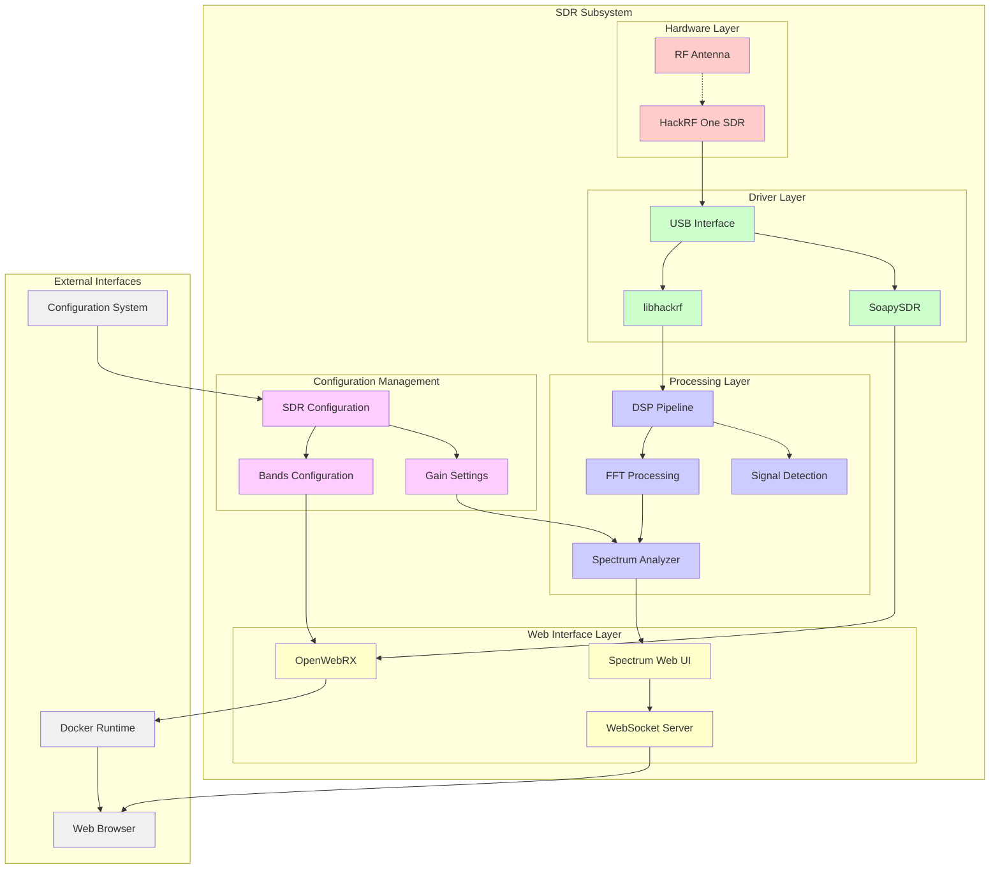
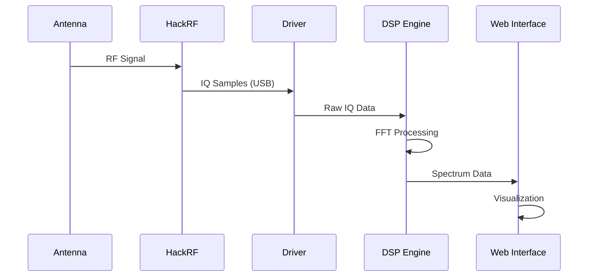
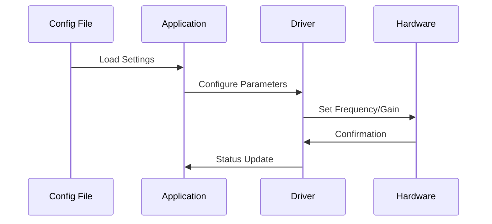
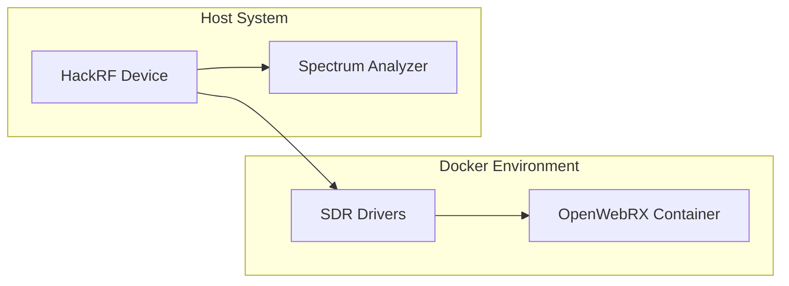

# SDR Subsystem Architecture

## Navigation
- [← Back to Architecture Overview](../README.md)
- [Level 1: System Overview](../system-overview.md)
- [Level 2: Subsystems](./README.md)
- [Level 3: Components](../components/README.md)

## Overview

The Software Defined Radio (SDR) subsystem provides radio frequency spectrum analysis, signal detection, and web-based SDR receiver capabilities using HackRF One hardware. This subsystem forms the core RF intelligence gathering capability of the Stinkster platform.

## Subsystem Architecture



## Component Details

### Hardware Layer

#### HackRF One SDR
- **Purpose**: Primary SDR hardware for RF signal acquisition
- **Frequency Range**: 1 MHz to 6 GHz
- **Sample Rate**: Up to 20 MSPS
- **Interface**: USB 2.0
- **Location**: `/dev/hackrf` device

#### RF Antenna
- **Purpose**: RF signal reception and transmission
- **Configuration**: Configurable based on target frequencies
- **Connection**: SMA connector to HackRF

### Driver Layer

#### libhackrf
- **Purpose**: Native HackRF hardware driver
- **Implementation**: C library with Python bindings
- **Location**: System-installed library
- **Configuration**: Direct hardware access

#### SoapySDR
- **Purpose**: Standardized SDR abstraction layer
- **Implementation**: Plugin-based architecture
- **Location**: Docker container for OpenWebRX
- **Configuration**: SDR device abstraction

#### USB Interface
- **Purpose**: Hardware communication layer
- **Implementation**: USB 2.0 protocol
- **Security**: Device permissions and access control

### Processing Layer

#### Spectrum Analyzer
- **File**: `/home/pi/projects/stinkster/src/hackrf/spectrum_analyzer.py`
- **Purpose**: Real-time spectrum analysis and visualization
- **Technology**: Python with Flask and SocketIO
- **Features**:
  - Real-time FFT processing
  - Configurable frequency ranges
  - Gain control and calibration
  - Waterfall display generation

#### Signal Detection
- **File**: `/home/pi/projects/stinkster/src/hackrf/detect.py`
- **Purpose**: Automated signal detection and classification
- **Features**:
  - Threshold-based detection
  - Signal characterization
  - Logging and alerts

#### FFT Processing
- **Purpose**: Fast Fourier Transform for spectrum analysis
- **Implementation**: NumPy/SciPy based processing
- **Configuration**: Configurable window sizes and overlap

#### DSP Pipeline
- **Purpose**: Digital signal processing chain
- **Features**:
  - Sample rate conversion
  - Filtering and decimation
  - IQ data processing

### Web Interface Layer

#### OpenWebRX
- **Purpose**: Web-based SDR receiver interface
- **Technology**: Docker containerized application
- **Port**: 8073
- **Features**:
  - Multi-user web interface
  - Multiple demodulation modes
  - Waterfall display
  - Band plan integration

#### Spectrum Web UI
- **Purpose**: Custom spectrum analyzer web interface
- **Technology**: Flask with real-time updates
- **Port**: 5000 (configurable)
- **Features**:
  - Real-time spectrum display
  - Configuration interface
  - Historical data export

#### WebSocket Server
- **Purpose**: Real-time data streaming to web clients
- **Implementation**: SocketIO based
- **Protocol**: WebSocket with fallback to polling

### Configuration Management

#### SDR Configuration
- **File**: `/home/pi/projects/stinkster/src/hackrf/config.json`
- **Purpose**: Primary SDR settings
- **Contents**:
  - Center frequency
  - Sample rate
  - Gain settings
  - Processing parameters

#### Bands Configuration
- **File**: `/home/pi/projects/stinkster/openwebrx-sdrs.json`
- **Purpose**: Frequency band definitions
- **Contents**:
  - Band allocations
  - Profile definitions
  - Frequency ranges

#### Gain Settings
- **Purpose**: RF gain and amplification control
- **Parameters**:
  - LNA gain (0-40 dB)
  - VGA gain (0-62 dB)
  - AMP enable/disable

## Data Flow Architecture

### Signal Acquisition Flow


### Configuration Flow


## Integration Interfaces

### Input Interfaces
- **Configuration System**: Receives configuration updates
- **Orchestration Layer**: Service lifecycle management
- **Hardware Layer**: Direct device access

### Output Interfaces
- **Web Clients**: Real-time spectrum data via WebSocket
- **Logging System**: Operational data and alerts
- **File System**: Spectrum captures and recordings

## Configuration Touchpoints

### Primary Configuration Files
1. **`/home/pi/projects/stinkster/src/hackrf/config.json`**
   - Spectrum analyzer settings
   - Processing parameters
   - Display configuration

2. **`/home/pi/projects/stinkster/openwebrx-sdrs.json`**
   - OpenWebRX SDR definitions
   - Band profiles
   - Hardware parameters

3. **`/home/pi/projects/stinkster/spectrum-analyzer-config.json`**
   - Spectrum analyzer specific settings
   - Visualization parameters

### Configuration Management
- **Template System**: `.template` files for default configurations
- **Validation**: Configuration validation on startup
- **Hot Reload**: Runtime configuration updates where supported

## Error Handling and Monitoring

### Hardware Error Handling
- **Device Detection**: Automatic HackRF presence detection
- **USB Recovery**: Automatic device reset on USB errors
- **Calibration**: Periodic calibration checks

### Software Error Handling
- **Process Monitoring**: Health checks for all components
- **Resource Management**: Memory and CPU usage monitoring
- **Graceful Degradation**: Fallback modes on component failure

### Monitoring Points
- **Device Status**: HackRF connectivity and health
- **Processing Load**: DSP pipeline performance
- **Web Interface**: User connection status
- **Data Quality**: Signal quality metrics

## Performance Considerations

### Hardware Performance
- **Sample Rate**: Optimized for real-time processing
- **USB Bandwidth**: 20 MSPS maximum throughput
- **Thermal Management**: Passive cooling considerations

### Software Performance
- **Memory Usage**: Circular buffers for streaming data
- **CPU Load**: Multi-threaded processing where possible
- **Network**: WebSocket optimization for real-time updates

### Optimization Strategies
- **Buffer Management**: Configurable buffer sizes
- **Processing Threads**: Separate threads for acquisition and processing
- **Web Optimization**: Compressed data transmission

## Security Boundaries

### Hardware Security
- **Device Access**: USB device permissions
- **RF Safety**: Power output limitations
- **Physical Security**: Device access control

### Software Security
- **Web Interface**: Authentication and authorization
- **Network Access**: Firewall and port management
- **Configuration**: Secure configuration file handling

### Data Security
- **RF Data**: Sensitive signal information handling
- **User Sessions**: Secure web session management
- **Logging**: Secure log file access

## Deployment Architecture

### Docker Components


### Service Dependencies
- **Hardware**: HackRF device availability
- **System**: USB subsystem and drivers
- **Docker**: Container runtime for OpenWebRX
- **Network**: Web interface accessibility

## Troubleshooting Guide

### Common Issues
1. **HackRF Not Detected**
   - Check USB connection
   - Verify driver installation
   - Review device permissions

2. **Poor Signal Quality**
   - Antenna connection check
   - Gain setting optimization
   - RF interference analysis

3. **Web Interface Issues**
   - Port availability check
   - WebSocket connection status
   - Browser compatibility

### Diagnostic Commands
```bash
# Check HackRF device
lsusb | grep -i hackrf

# Test HackRF functionality
hackrf_info

# Monitor spectrum analyzer
tail -f /home/pi/projects/stinkster/logs/spectrum.log

# Check OpenWebRX status
docker ps | grep openwebrx
```

## Related Documentation
- [System Overview](../system-overview.md)
- [GPS Subsystem](./gps-subsystem.md)
- [WiFi Subsystem](./wifi-subsystem.md)
- [TAK Subsystem](./tak-subsystem.md)
- [Web Subsystem](./web-subsystem.md)
- [Component Details](../components/README.md)