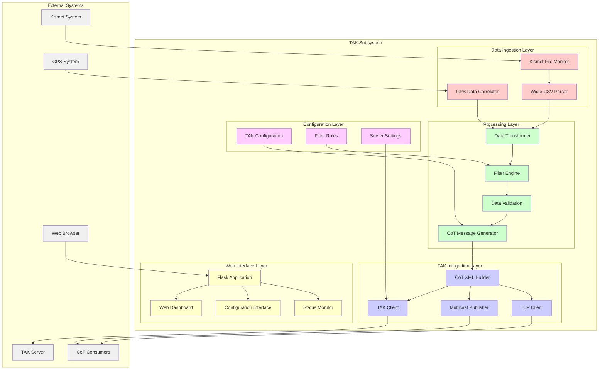
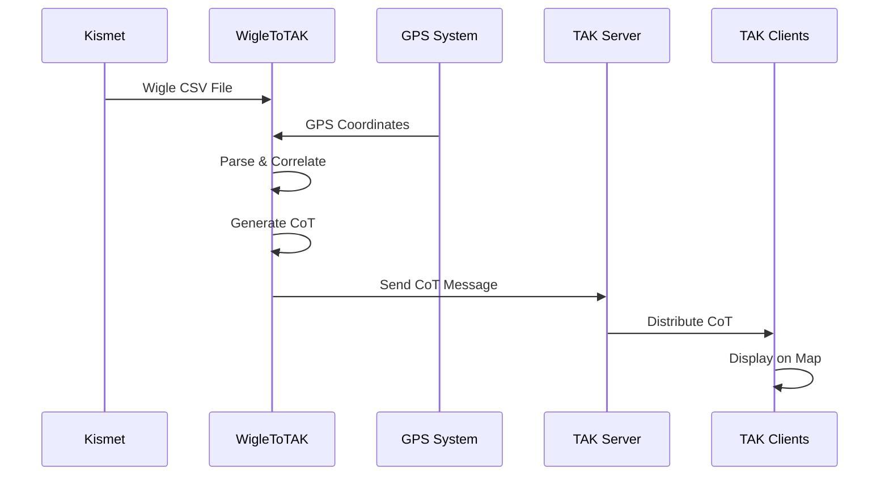
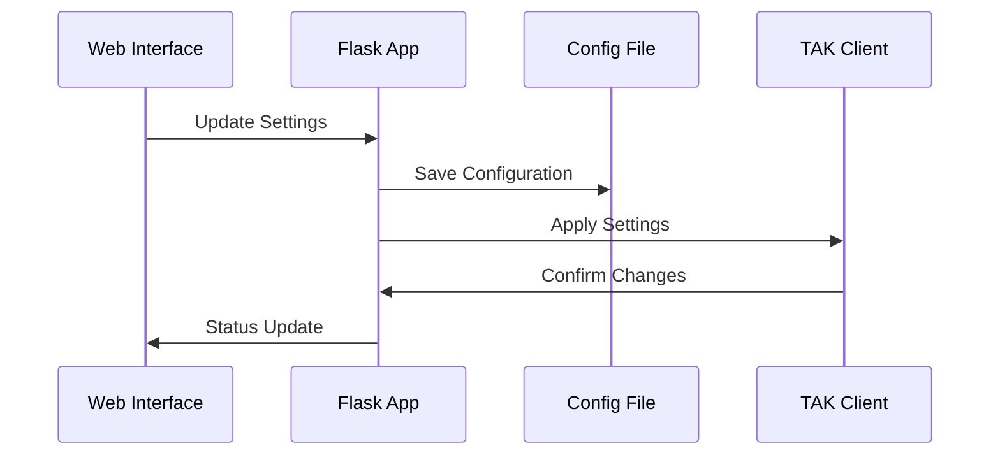
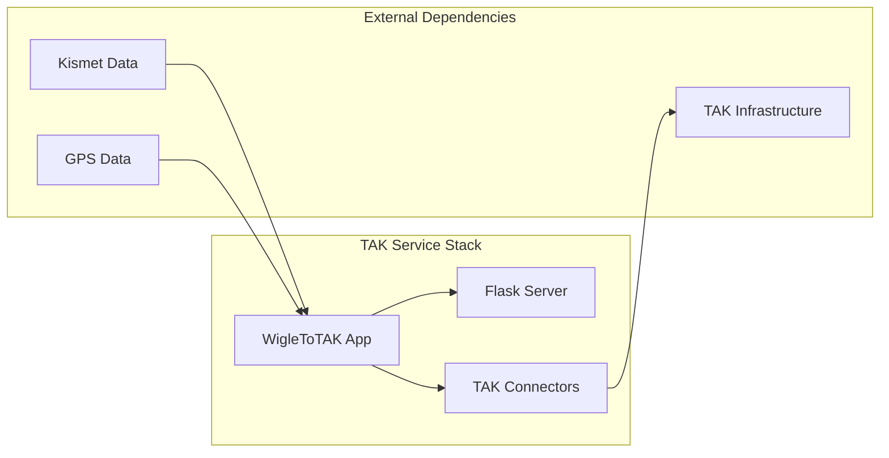

# TAK Subsystem Architecture

## Navigation
- [← Back to Architecture Overview](../README.md)
- [Level 1: System Overview](../system-overview.md)
- [Level 2: Subsystems](./README.md)
- [Level 3: Components](../components/README.md)

## Overview

The Team Awareness Kit (TAK) subsystem provides real-time tactical data conversion and transmission capabilities, transforming WiFi scan data from Kismet into TAK-compatible formats for military and emergency response applications. This subsystem bridges civilian wireless intelligence with tactical command and control systems.

## Subsystem Architecture



## Component Details

### Data Ingestion Layer

#### Wigle CSV Parser
- **File**: `/home/pi/projects/stinkster/src/wigletotak/WigleToTAK/TheStinkToTAK/WigleToTak2.py`
- **Purpose**: Parse Kismet-generated Wigle CSV files
- **Features**:
  - Real-time file monitoring
  - Incremental parsing for large files
  - Error handling for malformed data
  - Duplicate detection and filtering

#### Kismet File Monitor
- **Purpose**: Monitor Kismet output directory for new CSV files
- **Implementation**: File system watcher with inotify
- **Features**:
  - Automatic new file detection
  - File completion detection
  - Retry mechanisms for locked files

#### GPS Data Correlator
- **Purpose**: Correlate WiFi detections with GPS coordinates
- **Data Sources**:
  - GPSD daemon (port 2947)
  - Embedded GPS data in Wigle CSV
  - Manual coordinate override
- **Features**:
  - Timestamp-based correlation
  - Coordinate validation
  - Fallback positioning strategies

### Processing Layer

#### Data Transformer
- **Purpose**: Convert Wigle CSV data to internal TAK format
- **Features**:
  - Field mapping and normalization
  - Data type conversion
  - Coordinate system transformation
  - Timestamp standardization

#### CoT Message Generator
- **Purpose**: Generate Cursor-on-Target (CoT) messages
- **Message Types**:
  - Device position markers
  - Network detection events
  - Status updates
  - Alert messages
- **Features**:
  - UUID generation for unique identifiers
  - Message versioning
  - Expiration time calculation

#### Filter Engine
- **Purpose**: Apply business rules and filters to data
- **Filter Types**:
  - Geographic boundaries
  - Signal strength thresholds
  - Device type filtering
  - Time-based filtering
- **Configuration**: JSON-based rule definitions

#### Data Validation
- **Purpose**: Ensure data quality and completeness
- **Validation Rules**:
  - Required field presence
  - Coordinate range validation
  - Timestamp reasonableness
  - Data consistency checks

### TAK Integration Layer

#### CoT XML Builder
- **Purpose**: Build standard CoT XML messages
- **Standards Compliance**: TAK CoT schema v2.0
- **Features**:
  - XML namespace handling
  - Schema validation
  - Compression support
  - Digital signatures (when configured)

#### TAK Client
- **Purpose**: Connect to TAK servers using standard protocols
- **Protocols**:
  - TCP with SSL/TLS
  - UDP multicast
  - Web services (REST/SOAP)
- **Authentication**: Certificate-based authentication

#### Multicast Publisher
- **Purpose**: Broadcast CoT messages via UDP multicast
- **Configuration**:
  - Multicast group: 239.2.3.1:6969 (default)
  - TTL configuration
  - Network interface binding

#### TCP Client
- **Purpose**: Direct TCP connections to TAK endpoints
- **Features**:
  - Connection pooling
  - Automatic reconnection
  - Message queuing during disconnection
  - SSL/TLS encryption

### Web Interface Layer

#### Flask Application
- **File**: `/home/pi/projects/stinkster/src/wigletotak/WigleToTAK/TheStinkToTAK/WigleToTak2.py`
- **Port**: 6969 (default)
- **Features**:
  - RESTful API endpoints
  - Real-time status updates
  - Configuration management
  - Session handling

#### Web Dashboard
- **Purpose**: Real-time operational dashboard
- **Features**:
  - Live data feed display
  - Geographic visualization
  - Performance metrics
  - System status indicators

#### Configuration Interface
- **Purpose**: Web-based configuration management
- **Features**:
  - TAK server settings
  - Filter rule configuration
  - Credential management
  - Validation and testing tools

#### Status Monitor
- **Purpose**: System health and performance monitoring
- **Metrics**:
  - Message throughput
  - Connection status
  - Error rates
  - System resource usage

### Configuration Layer

#### TAK Configuration
- **File**: `/home/pi/projects/stinkster/wigletotak-config.json`
- **Contents**:
  - TAK server endpoints
  - Authentication credentials
  - Message formatting options
  - Protocol preferences

#### Filter Configuration
- **Purpose**: Define data filtering and processing rules
- **Rule Types**:
  - Geographic filters
  - Device type filters
  - Signal quality filters
  - Time-based filters

#### Server Configuration
- **Purpose**: Network and service configuration
- **Settings**:
  - Port bindings
  - SSL/TLS configuration
  - Timeouts and retries
  - Logging levels

## Data Flow Architecture

### WiFi to TAK Flow


### Configuration Flow


## Integration Interfaces

### Input Interfaces
- **Kismet System**: Wigle CSV file monitoring
- **GPS System**: Real-time coordinate data
- **Configuration System**: Settings and rule updates
- **Web Interface**: User interactions and commands

### Output Interfaces
- **TAK Servers**: CoT message transmission
- **Multicast Groups**: Broadcast message distribution
- **Web Clients**: Status and data visualization
- **Logging System**: Operational logs and alerts

## Configuration Touchpoints

### Primary Configuration Files
1. **`/home/pi/projects/stinkster/wigletotak-config.json`**
   - TAK server settings
   - Authentication configuration
   - Message formatting options

2. **Filter rule configurations** (embedded in application)
   - Geographic boundaries
   - Device type filters
   - Quality thresholds

3. **Web interface settings** (runtime configuration)
   - Port and binding settings
   - Session configuration
   - UI preferences

### Configuration Management
- **Runtime Updates**: Configuration changes without restart
- **Validation**: Settings validation before application
- **Backup**: Automatic configuration backup
- **Templating**: Default configuration templates

## Error Handling and Monitoring

### Data Processing Errors
- **Malformed CSV**: Graceful handling of corrupted data
- **Missing GPS**: Fallback positioning strategies
- **Invalid Coordinates**: Coordinate validation and correction
- **Parsing Failures**: Error logging and recovery

### Network Error Handling
- **Connection Failures**: Automatic retry with backoff
- **Authentication Errors**: Credential validation and renewal
- **Message Delivery**: Confirmation and retry mechanisms
- **Timeout Handling**: Configurable timeout strategies

### Monitoring Points
- **Message Throughput**: Messages processed per second
- **Connection Status**: TAK server connectivity
- **Queue Depths**: Message queuing status
- **Error Rates**: Processing and transmission errors

## Performance Considerations

### Data Processing Performance
- **Streaming Processing**: Real-time data handling
- **Memory Management**: Efficient data structures
- **File I/O**: Optimized file reading and monitoring
- **CPU Usage**: Multi-threaded processing where beneficial

### Network Performance
- **Connection Pooling**: Efficient connection reuse
- **Message Batching**: Bulk message transmission
- **Compression**: Data compression for network efficiency
- **Bandwidth Management**: Throttling and flow control

### Scalability Factors
- **Concurrent Connections**: Multiple TAK server support
- **Message Volume**: High-throughput message handling
- **Geographic Scale**: Large area coverage support
- **Time Series Data**: Historical data management

## Security Boundaries

### Data Security
- **Credential Management**: Secure storage of TAK credentials
- **Message Encryption**: SSL/TLS for all communications
- **Data Sanitization**: Removal of sensitive information
- **Access Control**: Role-based access to configuration

### Network Security
- **Certificate Validation**: TAK server certificate verification
- **Encrypted Channels**: All network communications encrypted
- **Authentication**: Mutual authentication with TAK servers
- **Firewall Integration**: Proper port and protocol management

### Operational Security
- **Audit Logging**: Comprehensive operation logging
- **Configuration Security**: Secure configuration file handling
- **Session Management**: Secure web session handling
- **Error Information**: Careful error message handling

## Deployment Architecture

### Service Components


### Service Dependencies
- **Kismet System**: WiFi scanning data source
- **GPS System**: Location data provider
- **Network Infrastructure**: TAK server connectivity
- **File System**: CSV file monitoring and processing

## Troubleshooting Guide

### Common Issues
1. **No Data Processing**
   - Check Kismet CSV output
   - Verify file permissions
   - Review GPS data availability

2. **TAK Connection Failures**
   - Verify server connectivity
   - Check authentication credentials
   - Review firewall rules

3. **Web Interface Issues**
   - Check port availability (6969)
   - Verify Flask application status
   - Review browser compatibility

### Diagnostic Commands
```bash
# Check WigleToTAK service
pgrep -f "WigleToTak2"

# Monitor application logs
tail -f /home/pi/projects/stinkster/logs/wigletotak.log

# Test TAK connectivity
telnet <tak_server> <tak_port>

# Check CSV file processing
ls -la /home/pi/projects/stinkster/data/kismet/*.wiglecsv
```

### Performance Monitoring
```bash
# Monitor message throughput
curl http://localhost:6969/api/status

# Check system resources
top -p $(pgrep -f WigleToTak2)

# Network connection status
netstat -an | grep 6969
```

## Related Documentation
- [System Overview](../system-overview.md)
- [WiFi Subsystem](./wifi-subsystem.md)
- [GPS Subsystem](./gps-subsystem.md)
- [Web Subsystem](./web-subsystem.md)
- [Component Details](../components/README.md)
- [Configuration Guide](../../CONFIGURATION.md)