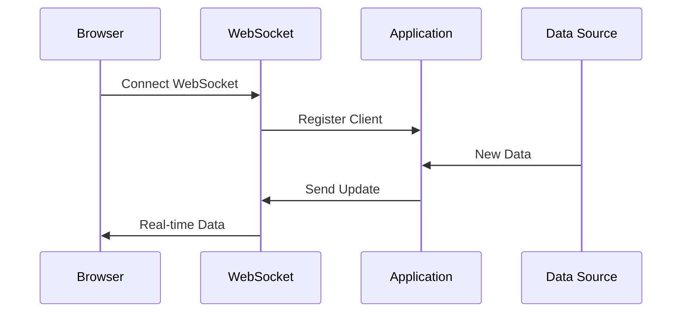
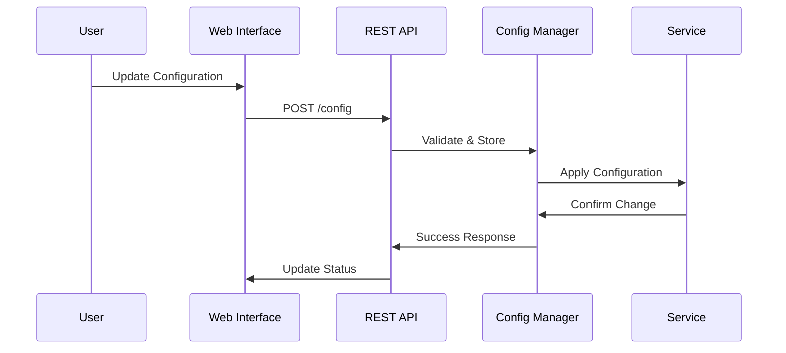
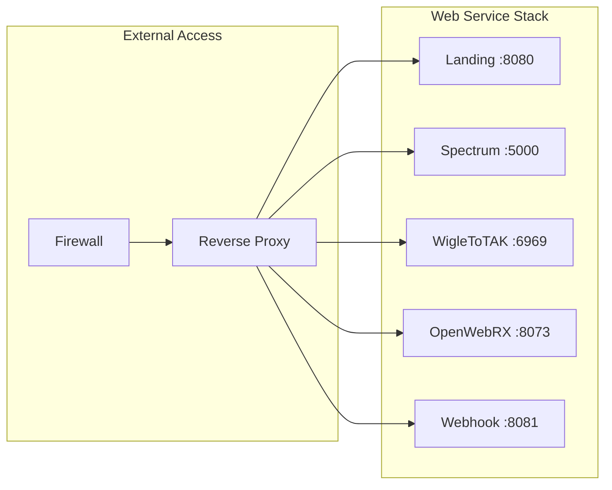

# Web Subsystem Architecture

## Navigation
- [← Back to Architecture Overview](../README.md)
- [Level 1: System Overview](../system-overview.md)
- [Level 2: Subsystems](./README.md)
- [Level 3: Components](../components/README.md)

## Overview

The Web subsystem provides unified web-based interfaces for monitoring, controlling, and visualizing all Stinkster platform capabilities. This subsystem aggregates multiple specialized web applications into a cohesive user experience while maintaining security and performance across all interfaces.

## Subsystem Architecture

```mermaid
graph TB
    subgraph "Web Subsystem"
        subgraph "Frontend Layer"
            LANDING[Landing Page]
            OPENWEBRX_UI[OpenWebRX Interface]
            SPECTRUM_UI[Spectrum Analyzer UI]
            WIGLETOTAK_UI[WigleToTAK Dashboard]
            CONFIG_UI[Configuration Interface]
        end
        
        subgraph "Application Layer"
            LANDING_SRV[Landing Server]
            FLASK_SPECTRUM[Flask Spectrum App]
            FLASK_WIGLE[Flask WigleToTAK App]
            WEBHOOK_SRV[Webhook Server]
            CONFIG_SRV[Configuration Service]
        end
        
        subgraph "Communication Layer"
            WEBSOCKET[WebSocket Handlers]
            REST_API[REST API Endpoints]
            SSE[Server-Sent Events]
            HTTP_PROXY[HTTP Proxy/Router]
        end
        
        subgraph "Data Integration Layer"
            REAL_TIME[Real-time Data Feeds]
            STATUS_AGG[Status Aggregator]
            CONFIG_MGR[Configuration Manager]
            LOG_VIEWER[Log Viewer]
        end
        
        subgraph "Security Layer"
            AUTH[Authentication]
            SESSION_MGR[Session Manager]
            CSRF[CSRF Protection]
            RATE_LIMIT[Rate Limiting]
        end
    end
    
    subgraph "External Systems"
        WEB_BROWSER[Web Browser]
        MOBILE_CLIENT[Mobile Client]
        API_CLIENT[API Client]
        REVERSE_PROXY[Reverse Proxy]
    end
    
    subgraph "Backend Services"
        HACKRF_SVC[HackRF Service]
        KISMET_SVC[Kismet Service]
        GPS_SVC[GPS Service]
        TAK_SVC[TAK Service]
        DOCKER_SVC[Docker Services]
    end
    
    %% Frontend connections
    WEB_BROWSER --> LANDING
    WEB_BROWSER --> OPENWEBRX_UI
    WEB_BROWSER --> SPECTRUM_UI
    WEB_BROWSER --> WIGLETOTAK_UI
    WEB_BROWSER --> CONFIG_UI
    
    %% Application layer
    LANDING --> LANDING_SRV
    SPECTRUM_UI --> FLASK_SPECTRUM
    WIGLETOTAK_UI --> FLASK_WIGLE
    CONFIG_UI --> CONFIG_SRV
    
    %% Communication layer
    FLASK_SPECTRUM --> WEBSOCKET
    FLASK_WIGLE --> REST_API
    CONFIG_SRV --> REST_API
    LANDING_SRV --> HTTP_PROXY
    
    %% Data integration
    WEBSOCKET --> REAL_TIME
    REST_API --> STATUS_AGG
    CONFIG_SRV --> CONFIG_MGR
    
    %% Backend connections
    REAL_TIME --> HACKRF_SVC
    STATUS_AGG --> KISMET_SVC
    STATUS_AGG --> GPS_SVC
    STATUS_AGG --> TAK_SVC
    HTTP_PROXY --> DOCKER_SVC
    
    %% Security layer
    AUTH --> SESSION_MGR
    SESSION_MGR --> CSRF
    CSRF --> RATE_LIMIT
    
    %% External access
    MOBILE_CLIENT --> REVERSE_PROXY
    API_CLIENT --> REST_API
    REVERSE_PROXY --> HTTP_PROXY
    
    %% Styling
    classDef frontend fill:#ffcccc
    classDef application fill:#ccffcc
    classDef communication fill:#ccccff
    classDef data fill:#ffffcc
    classDef security fill:#ffccff
    classDef external fill:#f0f0f0
    classDef backend fill:#e0e0e0
    
    class LANDING,OPENWEBRX_UI,SPECTRUM_UI,WIGLETOTAK_UI,CONFIG_UI frontend
    class LANDING_SRV,FLASK_SPECTRUM,FLASK_WIGLE,WEBHOOK_SRV,CONFIG_SRV application
    class WEBSOCKET,REST_API,SSE,HTTP_PROXY communication
    class REAL_TIME,STATUS_AGG,CONFIG_MGR,LOG_VIEWER data
    class AUTH,SESSION_MGR,CSRF,RATE_LIMIT security
    class WEB_BROWSER,MOBILE_CLIENT,API_CLIENT,REVERSE_PROXY external
    class HACKRF_SVC,KISMET_SVC,GPS_SVC,TAK_SVC,DOCKER_SVC backend
```



## Component Details

### Frontend Layer

#### Landing Page
- **File**: `/home/pi/projects/stinkster/web/landing-server.py`
- **Port**: 8080 (default)
- **Purpose**: Central navigation hub for all web interfaces
- **Features**:
  - Service status overview
  - Quick navigation to all subsystems
  - System health indicators
  - Mobile-responsive design

#### OpenWebRX Interface
- **Container**: Docker-based OpenWebRX (automated deployment)
- **Port**: 8073
- **Access**: http://localhost:8073 with admin/hackrf credentials
- **Deployment**: Automated via `./build-openwebrx.sh deploy`
- **Purpose**: Web-based SDR receiver interface
- **Features**:
  - Real-time spectrum waterfall
  - Multiple demodulation modes
  - Band plan integration
  - Multi-user support
  - Native HackRF driver integration
  - Pre-configured frequency profiles

#### Spectrum Analyzer UI
- **File**: `/home/pi/projects/stinkster/src/hackrf/templates/spectrum.html`
- **Backend**: Flask Spectrum App
- **Purpose**: Real-time spectrum analysis visualization
- **Features**:
  - Live spectrum display
  - Configurable frequency ranges
  - Waterfall plots
  - Signal detection overlays

#### WigleToTAK Dashboard
- **File**: `/home/pi/projects/stinkster/src/wigletotak/WigleToTAK/TheStinkToTAK/templates/WigleToTAK.html`
- **Backend**: Flask WigleToTAK App
- **Port**: 6969
- **Purpose**: WiFi-to-TAK conversion monitoring
- **Features**:
  - Real-time data feed display
  - Geographic visualization
  - TAK server status
  - Configuration interface

#### Configuration Interface
- **Purpose**: Unified configuration management
- **Features**:
  - Service configuration
  - Template management
  - Validation and testing
  - Backup and restore

### Application Layer

#### Landing Server
- **File**: `/home/pi/projects/stinkster/web/landing-server.py`
- **Technology**: Python HTTP server
- **Purpose**: Serve landing page and provide service discovery
- **Features**:
  - Static file serving
  - Service health checks
  - Port scanning and discovery
  - Mobile detection and optimization

#### Flask Spectrum App
- **File**: `/home/pi/projects/stinkster/src/hackrf/spectrum_analyzer.py`
- **Technology**: Flask with SocketIO
- **Purpose**: Real-time spectrum analysis web interface
- **Features**:
  - WebSocket real-time updates
  - REST API endpoints
  - Configuration management
  - Historical data export

#### Flask WigleToTAK App
- **File**: `/home/pi/projects/stinkster/src/wigletotak/WigleToTAK/TheStinkToTAK/WigleToTak2.py`
- **Technology**: Flask web framework
- **Purpose**: WiFi-to-TAK conversion web interface
- **Features**:
  - Real-time status dashboard
  - Configuration management
  - Data visualization
  - API endpoints

#### Webhook Server
- **File**: `/home/pi/projects/stinkster/web/webhook.py`
- **Technology**: Flask with webhook handlers
- **Purpose**: External integration and notifications
- **Features**:
  - Event-driven notifications
  - External system integration
  - Payload validation
  - Rate limiting

#### Configuration Service
- **Purpose**: Centralized configuration management
- **Features**:
  - Template-based configuration
  - Validation and testing
  - Version control
  - Rollback capabilities

### Communication Layer

#### WebSocket Handlers
- **Implementation**: SocketIO for real-time communication
- **Purpose**: Real-time data streaming to web clients
- **Features**:
  - Bi-directional communication
  - Automatic reconnection
  - Compression support
  - Event-based messaging

#### REST API Endpoints
- **Implementation**: Flask-based REST APIs
- **Purpose**: Standard HTTP API access
- **Features**:
  - RESTful resource access
  - JSON data format
  - Standard HTTP methods
  - Error handling and status codes

#### Server-Sent Events
- **Purpose**: One-way server-to-client streaming
- **Features**:
  - Low-latency updates
  - Automatic reconnection
  - Event stream format
  - Browser compatibility

#### HTTP Proxy/Router
- **Purpose**: Route requests to appropriate services
- **Features**:
  - Path-based routing
  - Load balancing
  - SSL termination
  - Request logging

### Data Integration Layer

#### Real-time Data Feeds
- **Purpose**: Aggregate real-time data from all subsystems
- **Data Sources**:
  - HackRF spectrum data
  - Kismet WiFi detections
  - GPS coordinates
  - TAK message flow
- **Features**:
  - Data normalization
  - Timestamp synchronization
  - Quality filtering
  - Rate control

#### Status Aggregator
- **Purpose**: Collect and aggregate system status information
- **Metrics**:
  - Service health status
  - Resource utilization
  - Error rates
  - Performance indicators
- **Features**:
  - Multi-source data collection
  - Status correlation
  - Alert generation
  - Historical trending

#### Configuration Manager
- **Purpose**: Manage configuration across all subsystems
- **Features**:
  - Centralized configuration storage
  - Template-based management
  - Validation and testing
  - Change tracking

#### Log Viewer
- **Purpose**: Provide web-based log access and analysis
- **Features**:
  - Real-time log streaming
  - Multi-source log aggregation
  - Search and filtering
  - Log rotation management

### Security Layer

#### Authentication
- **Implementation**: Session-based authentication
- **Features**:
  - User credential validation
  - Role-based access control
  - Password policy enforcement
  - Account lockout protection

#### Session Manager
- **Purpose**: Manage user sessions across all web interfaces
- **Features**:
  - Secure session storage
  - Session timeout management
  - Cross-application session sharing
  - Session invalidation

#### CSRF Protection
- **Purpose**: Prevent cross-site request forgery attacks
- **Implementation**: Token-based CSRF protection
- **Features**:
  - Request validation
  - Token generation and verification
  - Form protection
  - AJAX request protection

#### Rate Limiting
- **Purpose**: Prevent abuse and ensure service availability
- **Features**:
  - Per-IP rate limiting
  - Per-user rate limiting
  - Adaptive rate limiting
  - DDoS protection

## Data Flow Architecture

### Real-time Data Flow


### Configuration Flow


## Integration Interfaces

### Input Interfaces
- **User Interactions**: Web browser and mobile client access
- **API Clients**: External system integration
- **Backend Services**: Data and status feeds
- **Configuration System**: Settings and template updates

### Output Interfaces
- **Web Browsers**: HTML, CSS, JavaScript delivery
- **Mobile Clients**: Responsive web interfaces
- **API Responses**: JSON data and status information
- **Webhook Notifications**: External system notifications

## Configuration Touchpoints

### Primary Configuration Files
1. **`/home/pi/projects/stinkster/webhook-config.json`**
   - Webhook endpoint configuration
   - External integration settings
   - Notification preferences

2. **Web server configurations** (embedded in applications)
   - Port and binding settings
   - SSL/TLS configuration
   - Security settings

3. **Frontend configurations** (JavaScript/HTML)
   - UI preferences
   - API endpoint URLs
   - Feature toggles

### Configuration Management
- **Template System**: Configuration templates for easy deployment
- **Runtime Updates**: Dynamic configuration without restart
- **Validation**: Pre-deployment configuration validation
- **Version Control**: Configuration change tracking

## Error Handling and Monitoring

### Web Application Errors
- **HTTP Error Pages**: Custom error pages for common HTTP errors
- **JavaScript Errors**: Client-side error handling and reporting
- **API Errors**: Structured error responses with appropriate status codes
- **Session Errors**: Session timeout and authentication failure handling

### Network Error Handling
- **Connection Failures**: Automatic retry mechanisms for WebSocket connections
- **Timeout Handling**: Configurable timeouts for all network operations
- **Load Balancing**: Failover to backup servers when available
- **Graceful Degradation**: Reduced functionality when services unavailable

### Monitoring Points
- **Response Times**: Web page and API response time monitoring
- **Error Rates**: HTTP error rate tracking and alerting
- **User Sessions**: Active session monitoring and management
- **Resource Usage**: Memory and CPU usage for web applications

## Performance Considerations

### Frontend Performance
- **Static Asset Optimization**: Minification and compression of CSS/JS
- **Caching Strategy**: Browser caching and CDN integration
- **Lazy Loading**: On-demand loading of non-critical resources
- **Mobile Optimization**: Responsive design and mobile-specific optimizations

### Backend Performance
- **Connection Pooling**: Efficient database and service connections
- **Caching Layer**: Redis or in-memory caching for frequently accessed data
- **Asynchronous Processing**: Non-blocking I/O for improved concurrency
- **Load Balancing**: Distribution of load across multiple instances

### Real-time Performance
- **WebSocket Optimization**: Efficient WebSocket connection management
- **Data Compression**: Compression of real-time data streams
- **Update Throttling**: Intelligent update frequency control
- **Client-side Buffering**: Smart buffering for smooth data display

## Security Boundaries

### Web Application Security
- **Input Validation**: Comprehensive validation of all user inputs
- **Output Encoding**: Proper encoding to prevent XSS attacks
- **SQL Injection Prevention**: Parameterized queries and ORM usage
- **File Upload Security**: Secure handling of file uploads

### Network Security
- **HTTPS Enforcement**: SSL/TLS encryption for all communications
- **Security Headers**: Implementation of security-focused HTTP headers
- **CORS Configuration**: Proper cross-origin resource sharing settings
- **API Authentication**: Token-based authentication for API access

### Infrastructure Security
- **Port Management**: Minimal exposed ports with proper firewall rules
- **Service Isolation**: Container-based isolation for web services
- **Log Security**: Secure logging without sensitive information exposure
- **Backup Security**: Encrypted backups of configuration and data

## Deployment Architecture

### Service Distribution


### Port Allocation
- **8080**: Landing page and main navigation
- **8073**: OpenWebRX SDR interface (automated Docker deployment, admin/hackrf)
- **6969**: WigleToTAK dashboard
- **5000**: Spectrum analyzer interface
- **8081**: Webhook services
- **80/443**: Reverse proxy (if configured)

## Troubleshooting Guide

### Common Issues
1. **Web Interface Not Loading**
   - Check service status and port availability
   - Verify firewall rules and network connectivity
   - Review application logs for errors

2. **Real-time Data Not Updating**
   - Check WebSocket connection status
   - Verify backend service availability
   - Review network connectivity

3. **Configuration Changes Not Applied**
   - Check configuration file permissions
   - Verify service restart after changes
   - Review configuration validation errors

### Diagnostic Commands
```bash
# Check web service status
sudo netstat -tlnp | grep -E ':(8080|8073|6969|5000|8081)'

# Test web connectivity
curl -I http://localhost:8080

# Test OpenWebRX automated deployment
./build-openwebrx.sh status
./build-openwebrx.sh logs

# Monitor web application logs
tail -f /home/pi/projects/stinkster/logs/web.log

# Check WebSocket connections
sudo netstat -an | grep ESTABLISHED | grep -E ':(8080|6969|5000)'
```

### Performance Monitoring
```bash
# Monitor web server performance
top -p $(pgrep -f "python.*server")

# Check memory usage for web applications
ps aux | grep -E "(flask|python.*server)" | awk '{print $6, $11}'

# Network connection monitoring
watch 'netstat -an | grep -E ":(8080|8073|6969|5000|8081)" | wc -l'
```

## Related Documentation
- [System Overview](../system-overview.md)
- [SDR Subsystem](./sdr-subsystem.md)
- [WiFi Subsystem](./wifi-subsystem.md)
- [TAK Subsystem](./tak-subsystem.md)
- [GPS Subsystem](./gps-subsystem.md)
- [Component Details](../components/README.md)
- [Configuration Guide](../../CONFIGURATION.md)