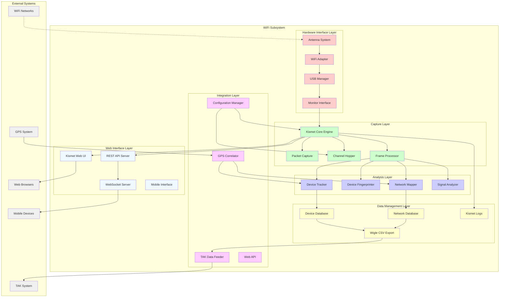
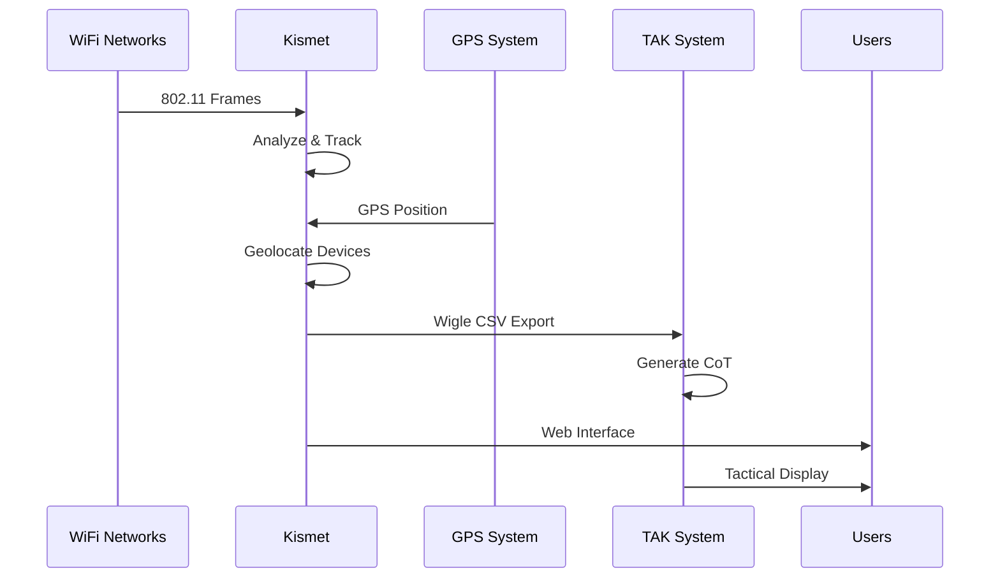
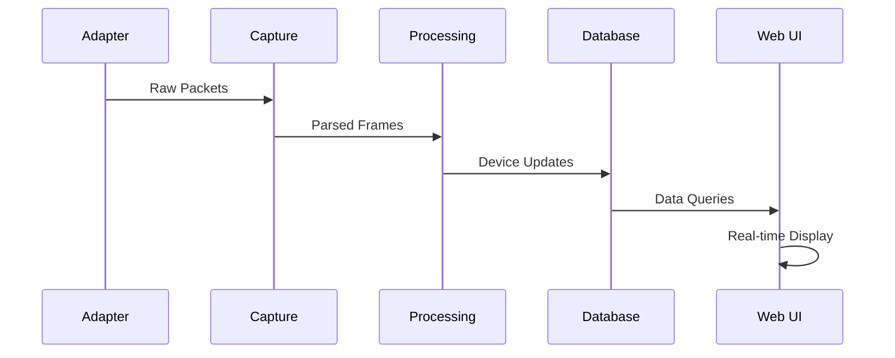
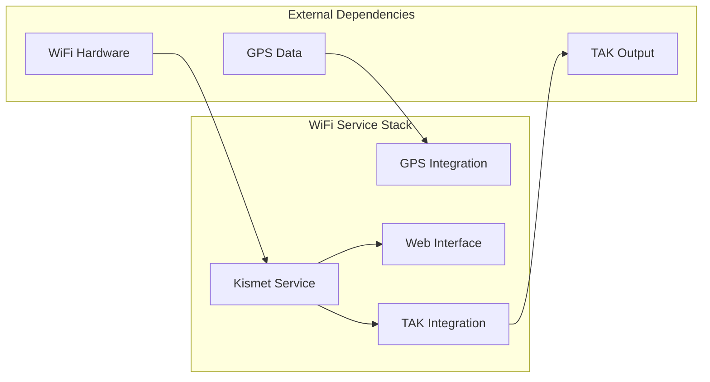

# WiFi Subsystem Architecture

## Navigation
- [← Back to Architecture Overview](../README.md)
- [Level 1: System Overview](../system-overview.md)
- [Level 2: Subsystems](./README.md)
- [Level 3: Components](../components/README.md)

## Overview

The WiFi subsystem provides comprehensive wireless network intelligence gathering capabilities using Kismet as the primary scanning engine. This subsystem performs real-time 802.11 monitoring, device detection and fingerprinting, network topology mapping, and geographic correlation of wireless assets to support tactical intelligence operations.

## Subsystem Architecture



## Component Details

### Hardware Interface Layer

#### WiFi Adapter
- **Hardware**: USB WiFi adapters with monitor mode support
- **Supported Chipsets**: 
  - Atheros (ath9k_htc)
  - Realtek (rtl8812au, rtl8814au)
  - Ralink/MediaTek (rt2800usb)
- **Capabilities**:
  - Monitor mode operation
  - Channel switching support
  - Packet injection (where supported)
  - High-gain antenna support

#### Monitor Interface
- **Purpose**: Configure WiFi adapter for passive monitoring
- **Features**:
  - Automatic monitor mode configuration
  - Interface management and recovery
  - Channel bandwidth configuration
  - Frequency range optimization

#### Antenna System
- **Types**: 
  - Omnidirectional for wide-area coverage
  - Directional for focused scanning
  - High-gain for extended range
- **Configuration**: Antenna diversity and switching support

#### USB Manager
- **Purpose**: Manage USB WiFi device lifecycle
- **Features**:
  - Hot-plug detection and configuration
  - Device reset and recovery
  - Multiple adapter support
  - Power management

### Capture Layer

#### Kismet Core Engine
- **File**: `/usr/bin/kismet` or `/home/pi/projects/stinkster/kismet_ops/kismet`
- **Purpose**: Primary 802.11 monitoring and analysis engine
- **Features**:
  - Real-time packet capture and analysis
  - Multi-source data fusion
  - Plugin architecture for extensibility
  - Remote sensor support

#### Packet Capture
- **Technology**: libpcap-based high-performance capture
- **Features**:
  - Zero-copy packet processing
  - Timestamp precision
  - Filter optimization
  - Buffer management

#### Channel Hopper
- **Purpose**: Systematically scan across WiFi channels
- **Features**:
  - Configurable hopping patterns
  - Dwell time optimization
  - Band-specific scanning (2.4GHz, 5GHz, 6GHz)
  - Adaptive hopping based on activity

#### Frame Processor
- **Purpose**: Decode and analyze 802.11 frames
- **Frame Types**:
  - Management frames (beacon, probe, association)
  - Control frames (RTS, CTS, ACK)
  - Data frames (with privacy protection)
- **Analysis**:
  - Frame validation and error detection
  - Timing analysis
  - Encryption detection

### Analysis Layer

#### Device Tracker
- **Purpose**: Track and maintain state of WiFi devices
- **Tracking Methods**:
  - MAC address tracking (with randomization detection)
  - Device fingerprinting
  - Behavior pattern analysis
  - Location correlation

#### Device Fingerprinter
- **Purpose**: Identify device types and manufacturers
- **Fingerprinting Techniques**:
  - OUI (Organizationally Unique Identifier) lookup
  - Probe request pattern analysis
  - Supported rate analysis
  - Vendor-specific information elements

#### Network Mapper
- **Purpose**: Map network topology and relationships
- **Mapping Features**:
  - Access point detection and characterization
  - Client-AP association tracking
  - Network infrastructure discovery
  - Hidden SSID detection

#### Signal Analyzer
- **Purpose**: Analyze signal characteristics and quality
- **Metrics**:
  - Received Signal Strength Indicator (RSSI)
  - Signal-to-noise ratio
  - Channel utilization
  - Interference detection

### Data Management Layer

#### Device Database
- **Technology**: SQLite database with real-time updates
- **Schema**:
  - Device records with timestamps
  - Location history
  - Capability information
  - Relationship mapping

#### Network Database
- **Purpose**: Store network infrastructure information
- **Contents**:
  - Access point details
  - Network configurations
  - Security parameters
  - Geographic coverage

#### Kismet Logs
- **File Locations**: `/home/pi/projects/stinkster/data/kismet/`
- **Log Types**:
  - `.kismet` - Native Kismet format
  - `.pcapng` - Standard packet capture
  - `.wiglecsv` - WigleWiFi format
  - `.json` - Structured data export

#### Wigle CSV Export
- **Purpose**: Export data in WigleWiFi format for TAK integration
- **Fields**:
  - MAC address, SSID, capabilities
  - GPS coordinates and timestamps
  - Signal strength and encryption
  - Device manufacturer and type

### Integration Layer

#### GPS Correlator
- **Purpose**: Associate WiFi detections with geographic locations
- **Data Sources**:
  - Real-time GPS position from GPS subsystem
  - Kismet internal GPS support
  - Manual coordinate specification

#### TAK Data Feeder
- **Purpose**: Provide WiFi intelligence data to TAK subsystem
- **Data Flow**: Wigle CSV → WigleToTAK → CoT messages → TAK servers
- **Real-time Updates**: Continuous data feed for tactical awareness

#### Web API
- **Purpose**: Provide programmatic access to WiFi intelligence
- **Endpoints**:
  - Device queries and statistics
  - Network information
  - Real-time status
  - Configuration management

#### Configuration Manager
- **File**: `/home/pi/projects/stinkster/kismet_site.conf`
- **Purpose**: Manage Kismet configuration and settings
- **Configuration Areas**:
  - Data source configuration
  - Logging and export settings
  - GPS integration
  - Web interface settings

### Web Interface Layer

#### Kismet Web UI
- **Port**: 2501 (default)
- **Features**:
  - Real-time device and network display
  - Interactive maps with device locations
  - Signal strength visualization
  - Packet capture download

#### REST API Server
- **Technology**: Built into Kismet core
- **API Features**:
  - RESTful resource access
  - JSON data format
  - Authentication support
  - Rate limiting

#### WebSocket Server
- **Purpose**: Real-time data streaming to web clients
- **Data Streams**:
  - Device discovery events
  - Network status updates
  - Signal strength changes
  - Alert notifications

#### Mobile Interface
- **Purpose**: Mobile-optimized interface for field operations
- **Features**:
  - Touch-friendly interface
  - Offline capability
  - GPS integration
  - Simplified tactical view

## Data Flow Architecture

### WiFi Intelligence Pipeline


### Real-time Monitoring Flow


## Integration Interfaces

### Input Interfaces
- **WiFi Networks**: Passive monitoring of 802.11 traffic
- **GPS System**: Real-time position data for geolocation
- **Configuration System**: Settings and operational parameters
- **User Commands**: Web interface control and configuration

### Output Interfaces
- **TAK System**: WiFi intelligence via Wigle CSV format
- **Web Interfaces**: Real-time monitoring and control
- **File System**: Logs, captures, and exported data
- **API Clients**: Programmatic access to WiFi intelligence

## Configuration Touchpoints

### Primary Configuration Files
1. **`/home/pi/projects/stinkster/kismet_site.conf`**
   - Kismet operational configuration
   - Data source definitions
   - GPS integration settings
   - Web interface configuration

2. **`/home/pi/projects/stinkster/kismet-config.template.conf`**
   - Template configuration
   - Default settings
   - Documentation and examples

### Configuration Parameters
- **Data Sources**: WiFi adapter configuration
- **Channel Configuration**: Scanning patterns and timing
- **GPS Integration**: Location correlation settings
- **Logging**: Output formats and destinations
- **Web Interface**: Port, authentication, and access control

## Error Handling and Monitoring

### Hardware Error Handling
- **Adapter Failures**: Automatic detection and recovery
- **Monitor Mode Issues**: Fallback to managed mode scanning
- **USB Disconnection**: Hot-plug recovery procedures
- **Channel Access**: Graceful handling of regulatory restrictions

### Software Error Handling
- **Kismet Crashes**: Automatic restart and state recovery
- **Database Corruption**: Database repair and backup restoration
- **Memory Leaks**: Periodic restart and cleanup procedures
- **Performance Degradation**: Resource monitoring and throttling

### Monitoring Points
- **Packet Capture Rate**: Packets per second metrics
- **Device Discovery Rate**: New device detection frequency
- **Database Size**: Storage usage monitoring
- **System Resources**: CPU, memory, and disk usage

## Performance Considerations

### Capture Performance
- **Packet Rate**: Up to 10,000 packets/second sustainable
- **Channel Hopping**: Optimized for coverage vs. detail
- **Memory Usage**: Efficient buffer management
- **CPU Usage**: Multi-threaded processing optimization

### Analysis Performance
- **Device Tracking**: Thousands of concurrent devices
- **Database Operations**: Optimized queries and indexing
- **Real-time Updates**: Sub-second web interface updates
- **Geographic Correlation**: Efficient spatial indexing

### Scalability Factors
- **Coverage Area**: Limited by RF propagation
- **Device Density**: Optimized for high-density environments
- **Time Retention**: Configurable data retention policies
- **Concurrent Users**: Multiple web interface users

## Security Boundaries

### Data Security
- **Device Privacy**: MAC address anonymization options
- **Packet Privacy**: No decryption of protected traffic
- **Location Privacy**: Secure storage of location data
- **Access Control**: Authentication for sensitive operations

### Network Security
- **Passive Operation**: No active network interference
- **Web Interface**: Secure authentication and session management
- **API Security**: Rate limiting and access control
- **Data Export**: Secure file handling and transmission

### Operational Security
- **Stealth Operation**: Minimal RF footprint
- **Error Logging**: Secure log handling
- **Configuration Security**: Protected configuration files
- **Audit Trail**: Comprehensive operation logging

## Deployment Architecture

### Service Components


### Service Dependencies
- **Hardware**: WiFi adapter with monitor mode support
- **GPS System**: Location data for geographic correlation
- **File System**: Storage for logs and database
- **Network**: Web interface accessibility

## Troubleshooting Guide

### Common Issues
1. **WiFi Adapter Not Detected**
   - Check USB connection and power
   - Verify driver installation
   - Review kernel module loading

2. **Monitor Mode Failures**
   - Check adapter monitor mode support
   - Verify regulatory domain settings
   - Review interface configuration

3. **No Device Detection**
   - Verify antenna connections
   - Check channel configuration
   - Review RF environment

### Diagnostic Commands
```bash
# Check WiFi adapter status
iwconfig

# List detected WiFi interfaces
iw dev

# Check monitor mode capability
iw list

# Monitor Kismet logs
tail -f /home/pi/projects/stinkster/logs/kismet.log

# Check Kismet process
pgrep -f kismet

# Test packet capture
tcpdump -i wlan1mon -c 10
```

### Performance Monitoring
```bash
# Monitor packet capture rate
kismet_client -t localhost -p 2501

# Check database size
du -sh /home/pi/projects/stinkster/data/kismet/

# Monitor system resources
top -p $(pgrep kismet)

# Check USB device status
lsusb | grep -i wireless
```

## Related Documentation
- [System Overview](../system-overview.md)
- [GPS Subsystem](./gps-subsystem.md)
- [TAK Subsystem](./tak-subsystem.md)
- [Web Subsystem](./web-subsystem.md)
- [Component Details](../components/README.md)
- [Configuration Guide](../../CONFIGURATION.md)