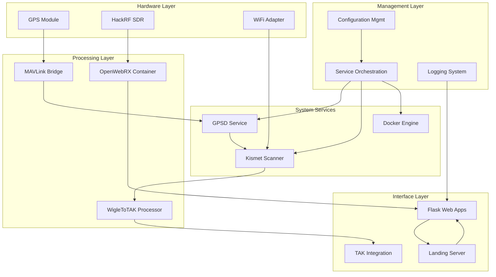

# Component Details

This directory contains detailed wire diagrams and technical documentation for each major component in the Stinkster system. Each component document provides comprehensive information about interfaces, connections, and integration points.

## System Components

### 📡 RF and SDR Components
- **[HackRF SDR](hackrf-sdr.md)**: Software Defined Radio hardware interface and signal processing
- **[OpenWebRX](openwebrx.md)**: Docker-based web SDR interface and spectrum analyzer
- **[Spectrum Analyzer](spectrum-analyzer.md)**: Real-time spectrum analysis and visualization

### 📶 Network Scanning Components
- **[Kismet WiFi Scanner](kismet-wifi.md)**: WiFi network detection, monitoring, and packet capture
- **[Network Interface Management](network-interfaces.md)**: WiFi adapter configuration and monitor mode setup

### 🛰️ GPS and Location Components
- **[GPS Integration](gps-integration.md)**: GPS hardware interface and data processing
- **[MAVLink Bridge](mavlink-bridge.md)**: MAVLink to GPSD protocol conversion
- **[GPSD Service](gpsd-service.md)**: GPS daemon and location data distribution

### 🎯 TAK Integration Components
- **[WigleToTAK](wigletotak.md)**: WiFi scan data to TAK format conversion
- **[TAK Server Integration](tak-integration.md)**: Team Awareness Kit connectivity and data sharing

### 🌐 Web Interface Components
- **[Landing Page Server](landing-server.md)**: Main system web interface and navigation
- **[Flask Applications](flask-apps.md)**: Web-based component interfaces and APIs
- **[WebSocket Services](websocket-services.md)**: Real-time data streaming to web clients

### 🔧 System Management Components
- **[Service Orchestration](service-orchestration.md)**: Process management and coordination
- **[Configuration Management](config-management.md)**: System configuration and environment setup
- **[Logging System](logging-system.md)**: Centralized logging and monitoring
- **[Docker Integration](docker-integration.md)**: Container management and networking

## Component Relationship Overview



## Component Categories

### By Function
- **Data Acquisition**: GPS, HackRF, WiFi scanning components
- **Data Processing**: MAVLink bridge, spectrum analyzer, WigleToTAK
- **Data Presentation**: Web interfaces, TAK integration
- **System Management**: Orchestration, configuration, logging

### By Technology Stack
- **Hardware Interfaces**: GPS modules, SDR hardware, network adapters
- **Native Services**: GPSD, Kismet, system services
- **Python Applications**: MAVLink bridge, WigleToTAK, web apps
- **Docker Containers**: OpenWebRX, containerized services
- **Shell Scripts**: Orchestration, configuration management

### By Data Flow Role
- **Data Sources**: GPS, HackRF, WiFi adapters
- **Data Processors**: GPSD, Kismet, spectrum analyzer
- **Data Transformers**: MAVLink bridge, WigleToTAK
- **Data Consumers**: Web interfaces, TAK server, logging

## Interface Standards

### Network Interfaces
All components follow standardized network interface patterns:
- **Service Ports**: Documented in each component's port mapping table
- **Protocol Standards**: TCP for reliable data, UDP for streaming
- **Authentication**: Where applicable, standard methods documented
- **Encryption**: TLS/SSL requirements clearly specified

### File System Interfaces
Standardized file system usage:
- **Configuration**: `/etc/stinkster/[component]/`
- **Data Files**: `/var/lib/stinkster/[component]/`
- **Log Files**: `/var/log/stinkster/[component]/`
- **Runtime Files**: `/run/stinkster/[component]/`

### Process Communication
Inter-process communication standards:
- **Signal Handling**: Standard POSIX signals for control
- **Shared Files**: Lock files, PID files, status files
- **Message Queues**: Where used, standard message formats
- **Shared Memory**: Reserved for high-performance data sharing

## Documentation Standards

### Component Document Structure
Each component document includes:
1. **Component Overview**: Purpose, role, dependencies
2. **Wire Diagram**: Visual interface representation
3. **Interface Details**: Ports, protocols, file paths
4. **Configuration**: Settings, environment variables
5. **Operation**: Startup, monitoring, shutdown procedures
6. **Integration**: How it connects to other components
7. **Troubleshooting**: Common issues and solutions

### Diagram Conventions
- **Input Interfaces**: Left side or top of component box
- **Output Interfaces**: Right side or bottom of component box
- **Bidirectional**: Double-headed arrows
- **Control Interfaces**: Dashed lines
- **Data Interfaces**: Solid lines
- **High-Volume Data**: Thick lines

### Cross-Reference System
Each component document links to:
- **Related Flows**: Core flows that involve this component
- **Integration Patterns**: Patterns this component implements
- **Dependent Components**: Components this one requires
- **Consumer Components**: Components that use this one's output

## Quick Reference

### Component Status Commands
```bash
# Check all component health
./dev/tools/health-check.sh

# Individual component status
systemctl status gpsd
systemctl status kismet
docker ps
pgrep -f "wigletotak"

# Component logs
journalctl -u gpsd -f
tail -f /var/log/kismet/kismet.log
docker logs openwebrx
tail -f /var/log/stinkster/wigletotak.log
```

### Common Configuration Paths
```bash
# Component configurations
/etc/stinkster/gps/gps-config.json
/etc/stinkster/kismet/kismet.conf
/etc/stinkster/openwebrx/settings.json
/etc/stinkster/wigletotak/config.json

# Docker configurations
/home/pi/projects/stinkster/docker-compose.yml
/home/pi/projects/stinkster/Dockerfile

# Service configurations
/etc/systemd/system/stinkster-*.service
```

### Port Quick Reference
| Component | Port | Protocol | Purpose |
|-----------|------|----------|---------|
| GPSD | 2947 | TCP | GPS data distribution |
| Kismet | 2501 | TCP | Web interface |
| OpenWebRX | 8073 | TCP | Web SDR interface |
| WigleToTAK | 6969 | TCP | Web dashboard |
| Landing Server | 8080 | TCP | Main web interface |
| Spectrum Analyzer | 5000 | TCP | Spectrum web interface |

## Maintenance and Updates

### Component Versioning
Each component document tracks:
- **Software Version**: Current version of the component software
- **Configuration Version**: Version of configuration schema
- **Integration Version**: Version of integration interfaces
- **Document Version**: Version of the documentation itself

### Update Procedures
Standard procedures for component updates:
1. **Backup Configuration**: Save current working configuration
2. **Test in Development**: Verify updates in dev environment
3. **Rolling Update**: Update components in dependency order
4. **Verification**: Confirm all interfaces still work
5. **Documentation Update**: Update component docs as needed

### Dependency Management
Component dependencies are tracked at multiple levels:
- **System Dependencies**: OS packages, libraries
- **Service Dependencies**: Required system services
- **Component Dependencies**: Other Stinkster components
- **Hardware Dependencies**: Required hardware interfaces

For detailed information about any specific component, see its individual documentation file in this directory.