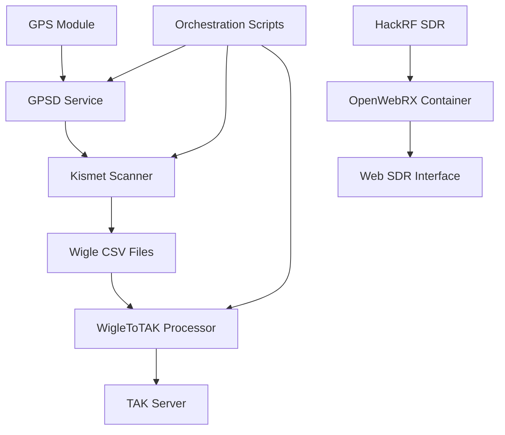

# Core System Flows

This directory contains documentation for the primary data and operational flows through the Stinkster system. These flows represent the main pathways that data takes as it moves between components.

## Flow Categories

### 🔄 Primary Operational Flows
- **[GPS → Kismet → TAK Pipeline](gps-kismet-tak-flow.md)**: Main operational sequence for location-aware network scanning
- **[Service Orchestration](service-orchestration.md)**: How services start, coordinate, and manage their lifecycle

### 📡 Signal Processing Flows
- **[SDR Signal Processing](sdr-signal-flow.md)**: RF signal capture, processing, and web presentation
- **[HackRF Integration](hackrf-integration-flow.md)**: Specific HackRF SDR signal processing pipeline

### 📊 Data Collection Flows
- **[Data Collection Pipeline](data-collection-flow.md)**: How various data types are collected, processed, and stored
- **[Log Aggregation](log-aggregation-flow.md)**: System logging and monitoring data flows

### 🌐 Web Interface Flows
- **[Web Dashboard Flow](web-dashboard-flow.md)**: How web interfaces receive and display real-time data
- **[API Request Flow](api-request-flow.md)**: RESTful API data exchange patterns

## Flow Characteristics

### High-Level System Flow


## Flow Documentation Standards

Each flow document follows a standardized format:

### Required Sections
1. **Flow Overview**: Purpose, participants, trigger conditions
2. **Wire Diagram**: Visual representation using Mermaid
3. **Detailed Steps**: Phase-by-phase breakdown
4. **Data Specifications**: Input/output formats and transformations
5. **Timing and Performance**: Duration, throughput, bottlenecks
6. **Error Handling**: Failure points and recovery mechanisms
7. **Monitoring**: Metrics, logging, alerting
8. **Testing**: Validation and verification procedures

### Diagram Standards
- Use standardized colors from [legend.md](../legend.md)
- Include timing information where relevant
- Show error paths and recovery flows
- Label all interfaces with ports/protocols
- Reference related components and integration patterns

## Quick Navigation

### By Data Type
- **GPS Data Flows**: [GPS-Kismet-TAK](gps-kismet-tak-flow.md), [Service Orchestration](service-orchestration.md)
- **WiFi Data Flows**: [GPS-Kismet-TAK](gps-kismet-tak-flow.md), [Data Collection](data-collection-flow.md)
- **RF Data Flows**: [SDR Signal Processing](sdr-signal-flow.md), [HackRF Integration](hackrf-integration-flow.md)
- **Web Data Flows**: [Web Dashboard](web-dashboard-flow.md), [API Requests](api-request-flow.md)

### By Complexity
- **Basic**: [Service Orchestration](service-orchestration.md), [Log Aggregation](log-aggregation-flow.md)
- **Intermediate**: [Data Collection Pipeline](data-collection-flow.md), [Web Dashboard](web-dashboard-flow.md)
- **Advanced**: [GPS-Kismet-TAK](gps-kismet-tak-flow.md), [SDR Signal Processing](sdr-signal-flow.md)

### By Performance Requirements
- **Real-time**: [SDR Signal Processing](sdr-signal-flow.md), [Web Dashboard](web-dashboard-flow.md)
- **Near Real-time**: [GPS-Kismet-TAK](gps-kismet-tak-flow.md), [API Requests](api-request-flow.md)
- **Batch Processing**: [Data Collection Pipeline](data-collection-flow.md), [Log Aggregation](log-aggregation-flow.md)

## Common Integration Points

### Service Coordination
All flows interact with the service orchestration system:
- **Startup Dependencies**: Services must start in proper order
- **Health Monitoring**: All flows participate in system health checks
- **Graceful Shutdown**: Coordinated shutdown preserves data integrity

### Data Handoffs
Key data handoff points between flows:
- **GPSD → Kismet**: Location data for geo-tagged network scans
- **Kismet → WigleToTAK**: WiFi scan results for tactical processing
- **HackRF → OpenWebRX**: RF data for web-based spectrum analysis
- **All → Log System**: Operational data for monitoring and debugging

### Error Propagation
How errors propagate between flows:
- **Upstream Failures**: How downstream flows handle missing input
- **Downstream Backpressure**: How upstream flows handle output blocking
- **Recovery Coordination**: System-wide recovery from flow failures

## Performance Characteristics

### Typical Flow Latencies
- **GPS Update**: 1-2 seconds (hardware dependent)
- **Kismet Scan**: 2-10 seconds (channel hop cycle)
- **TAK Processing**: 100-500ms (file processing)
- **SDR Processing**: <100ms (real-time requirement)
- **Web Updates**: 250-1000ms (user interface)

### Resource Usage Patterns
- **CPU**: Heaviest usage in SDR processing and WiFi scanning
- **Memory**: Large buffers in SDR flows, moderate elsewhere
- **Disk I/O**: Log files, CSV outputs, configuration files
- **Network**: TAK server communication, web interface serving

### Scaling Considerations
- **Horizontal Scaling**: Which flows can run on multiple instances
- **Vertical Scaling**: Which flows benefit from more resources
- **Bottleneck Identification**: Common performance limitations
- **Optimization Opportunities**: Where performance can be improved

## Troubleshooting Quick Reference

### Common Flow Issues
1. **GPS Lock Failure**: Affects entire GPS-Kismet-TAK pipeline
2. **Kismet Interface Problems**: Disrupts WiFi scanning flow
3. **Docker Container Issues**: Impacts SDR processing flow
4. **File Permission Problems**: Affects log and data flows
5. **Network Connectivity**: Impacts TAK and web flows

### Diagnostic Commands
```bash
# Check flow health
./dev/tools/health-check.sh

# Monitor active flows
tail -f /var/log/stinkster/flow-monitor.log

# Verify data flow
./dev/tools/trace-data-flow.sh

# Performance analysis
./dev/tools/flow-performance.sh
```

For detailed troubleshooting of specific flows, see individual flow documentation files.