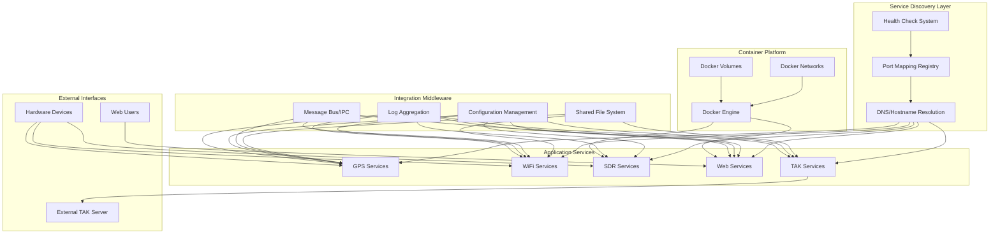

# Integration Patterns

This directory documents the standard integration patterns used throughout the Stinkster system. These patterns provide consistent, reusable approaches to connecting components and managing data flows.

## Pattern Categories

### 🔌 Connection Patterns
- **[Port Mapping](port-mapping.md)**: Network port allocation and service discovery
- **[File System Integration](filesystem-integration.md)**: Shared files, logs, and configuration management
- **[Process Communication](process-communication.md)**: Inter-process communication and coordination
- **[Signal Handling](signal-handling.md)**: Process control and graceful shutdown patterns

### 🐳 Container Integration
- **[Docker Integration](docker-integration.md)**: Container networking and volume management
- **[Docker Compose Patterns](docker-compose-patterns.md)**: Multi-container orchestration
- **[Container Health Monitoring](container-health.md)**: Health checks and restart policies

### 📊 Data Flow Patterns
- **[Message Passing](message-passing.md)**: Structured data exchange between components
- **[File-Based Data Exchange](file-data-exchange.md)**: CSV files, logs, and shared data formats
- **[Streaming Data](streaming-data.md)**: Real-time data flows and websocket patterns
- **[Batch Processing](batch-processing.md)**: Scheduled and triggered data processing

### 🔧 Service Management Patterns
- **[Service Discovery](service-discovery.md)**: How components find and connect to each other
- **[Configuration Management](configuration-management.md)**: Centralized and distributed configuration
- **[Monitoring and Alerting](monitoring-alerting.md)**: System observability patterns
- **[Error Handling](error-handling.md)**: Fault tolerance and recovery patterns

### 🌐 Web Integration Patterns
- **[API Gateway](api-gateway.md)**: Unified API access and routing
- **[WebSocket Real-time](websocket-realtime.md)**: Real-time web updates and bi-directional communication
- **[Static Asset Serving](static-asset-serving.md)**: Web asset management and caching
- **[Authentication Patterns](authentication-patterns.md)**: User authentication and authorization

## System-Wide Integration Architecture



## Integration Pattern Guidelines

### Design Principles
1. **Loose Coupling**: Components should be independently deployable and testable
2. **High Cohesion**: Related functionality should be grouped together
3. **Fault Isolation**: Failures in one component shouldn't cascade
4. **Observable**: All integrations should be monitorable and debuggable
5. **Configurable**: Integration behavior should be configurable without code changes

### Pattern Selection Criteria

#### Use Port Mapping When:
- Components need direct network communication
- Real-time or low-latency communication is required
- Standard protocols (HTTP, TCP, UDP) are sufficient
- Service discovery and load balancing are needed

#### Use File System Integration When:
- Data persistence is required between component restarts
- Batch processing of large datasets
- Human-readable configuration or log files
- Legacy systems that only support file-based interfaces

#### Use Process Communication When:
- Components run on the same host
- High-performance, low-latency communication needed
- Shared memory or message queues are appropriate
- Process lifecycle management is required

#### Use Container Integration When:
- Isolation and resource management are priorities
- Simplified deployment and scaling
- Multiple environments (dev, test, prod) need consistency
- Application has complex dependency requirements

## Standard Integration Interfaces

### Network Protocols
```yaml
# Standard port assignments
gps:
  gpsd: 2947/tcp
  mavlink_bridge: 14550/udp

wifi:
  kismet_web: 2501/tcp
  kismet_rest: 2501/tcp

sdr:
  openwebrx: 8073/tcp
  spectrum_analyzer: 5000/tcp

web:
  landing_page: 8080/tcp
  wigletotak: 6969/tcp
  
tak:
  server_connection: 8089/tcp
  multicast: 239.2.3.1:6969/udp
```

### File System Layout
```
/etc/stinkster/              # Configuration files
├── global/                  # System-wide configuration
├── gps/                     # GPS component configuration
├── wifi/                    # WiFi component configuration
├── sdr/                     # SDR component configuration
├── web/                     # Web component configuration
└── tak/                     # TAK component configuration

/var/lib/stinkster/          # Application data
├── gps/                     # GPS data files
├── wifi/                    # WiFi scan results
├── sdr/                     # SDR capture files
└── tak/                     # TAK data exports

/var/log/stinkster/          # Log files
├── system/                  # System-level logs
├── components/              # Component-specific logs
└── integration/             # Integration pattern logs

/run/stinkster/              # Runtime files
├── pids/                    # Process ID files
├── locks/                   # Lock files
└── sockets/                 # Unix domain sockets
```

### Message Formats
```json
// Standard message envelope
{
  "messageId": "uuid",
  "timestamp": "2025-06-15T10:30:00Z",
  "source": "component-name",
  "destination": "component-name",
  "messageType": "data|control|event|error",
  "version": "1.0",
  "payload": {
    // Component-specific data
  },
  "metadata": {
    "priority": "high|normal|low",
    "ttl": 300,
    "retryCount": 0
  }
}
```

## Pattern Implementation Templates

### Configuration Template
```yaml
# integration-pattern-config.yaml
pattern:
  name: "pattern-name"
  type: "port-mapping|filesystem|process-comm|container"
  version: "1.0"

interfaces:
  input:
    - type: "tcp|udp|file|pipe|shared-memory"
      address: "host:port|/path/to/file"
      format: "json|csv|binary|text"
      
  output:
    - type: "tcp|udp|file|pipe|shared-memory"
      address: "host:port|/path/to/file"
      format: "json|csv|binary|text"

settings:
  timeout: 30
  retries: 3
  buffer_size: 1024
  
monitoring:
  metrics: true
  logging: "INFO"
  health_check: "/health"
```

### Implementation Checklist
- [ ] Pattern correctly implements interface contracts
- [ ] Error handling covers all failure modes
- [ ] Monitoring and logging are comprehensive
- [ ] Configuration is externalized and documented
- [ ] Security considerations are addressed
- [ ] Performance characteristics are measured
- [ ] Integration tests validate end-to-end functionality

## Performance and Scalability

### Performance Characteristics by Pattern

| Pattern | Latency | Throughput | Resource Usage | Complexity |
|---------|---------|------------|----------------|------------|
| Port Mapping | Low-Medium | High | Medium | Low |
| File System | High | High | Low | Low |
| Process Comm | Very Low | Very High | Low | Medium |
| Container | Medium | Medium | Medium | High |
| Message Bus | Medium | High | Medium | High |

### Scalability Considerations
- **Horizontal Scaling**: Which patterns support multiple instances
- **Vertical Scaling**: Which patterns benefit from more resources
- **Bottleneck Identification**: Common performance limitations
- **Caching Strategies**: Where caching can improve performance

## Security Considerations

### Network Security
```bash
# Firewall configuration for standard ports
sudo ufw allow 2947/tcp    # GPSD
sudo ufw allow 2501/tcp    # Kismet
sudo ufw allow 8073/tcp    # OpenWebRX
sudo ufw allow 8080/tcp    # Landing page
sudo ufw allow 6969/tcp    # WigleToTAK

# Restrict access by source IP
sudo ufw allow from 192.168.1.0/24 to any port 2947
```

### File System Security
```bash
# Set appropriate permissions
chmod 644 /etc/stinkster/*/config.json
chmod 755 /var/lib/stinkster/
chmod 700 /var/log/stinkster/
chown -R stinkster:stinkster /etc/stinkster/
```

### Container Security
```yaml
# Docker security configuration
security_opt:
  - no-new-privileges:true
  - seccomp:unconfined
read_only: true
tmpfs:
  - /tmp
  - /var/tmp
user: "1000:1000"
```

## Testing Integration Patterns

### Pattern Validation Tests
```bash
# Test port accessibility
nc -z localhost 2947
curl -f http://localhost:8080/health

# Test file system integration
ls -la /var/lib/stinkster/
cat /var/log/stinkster/integration.log

# Test container integration
docker exec container-name ps aux
docker logs container-name
```

### Load Testing
```bash
# Network load testing
ab -n 1000 -c 10 http://localhost:8080/
iperf3 -c localhost -p 2947

# File system load testing
dd if=/dev/zero of=/var/lib/stinkster/test.dat bs=1M count=100

# Process communication testing
./test-ipc-performance.sh
```

## Troubleshooting Integration Issues

### Common Integration Problems
1. **Port Conflicts**: Multiple services trying to use same port
2. **Permission Denied**: File system permission issues
3. **Connection Refused**: Service not listening or firewall blocking
4. **Container Networking**: Docker network configuration problems
5. **Message Format Errors**: Incompatible data formats between components

### Diagnostic Tools
```bash
# Network diagnostics
netstat -tulpn | grep [port]
ss -tulpn | grep [port]
tcpdump -i any port [port]

# File system diagnostics
lsof /path/to/file
find /var/lib/stinkster -type f -name "*.lock"
df -h /var/lib/stinkster

# Process diagnostics
ps aux | grep [component]
pgrep -f [component]
strace -p [pid]

# Container diagnostics
docker ps
docker logs [container]
docker exec [container] netstat -tulpn
```

For detailed information about specific integration patterns, see individual pattern documentation files in this directory.