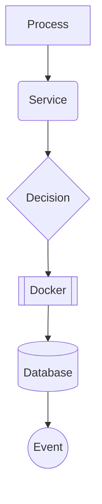

# Wire Diagram Documentation Standards

This document defines the standardized symbols, colors, and conventions used throughout all wire diagrams in the Stinkster system documentation.

## Color Scheme

### Data Type Colors
- **🔵 GPS Data**: `#0066CC` (Blue) - Location, timing, navigation data
- **🟢 WiFi/Network**: `#00AA44` (Green) - Network scanning, packet data
- **🔴 RF/SDR**: `#CC0000` (Red) - Radio frequency, spectrum data
- **🟡 Control/Config**: `#FFAA00` (Orange) - Configuration, control signals
- **🟣 TAK/Military**: `#7700BB` (Purple) - Tactical data, military protocols
- **⚫ System/Process**: `#333333` (Dark Gray) - Process control, system management

### Connection Types
- **Solid Lines**: Direct connections (USB, serial, TCP)
- **Dashed Lines**: Wireless connections (WiFi, RF)
- **Dotted Lines**: File-based communication (logs, CSV files)
- **Double Lines**: High-bandwidth data flows
- **Arrow Thickness**: Data volume (thin=control, thick=bulk data)

## Standard Symbols

### Hardware Components
```
┌─────────┐
│ HackRF  │  ◄── SDR Hardware
│   SDR   │
└─────────┘

┌─────────┐
│  GPS    │  ◄── GPS Receiver
│ Module  │
└─────────┘

┌─────────┐
│ WiFi    │  ◄── Network Interface
│ Adapter │
└─────────┘

┌─────────┐
│ Antenna │  ◄── RF Antenna
│   🔗   │
└─────────┘
```

### Software Components
```
╭─────────╮
│ Kismet  │  ◄── Software Process
│ Service │
╰─────────╯

╭─────────╮
│ Docker  │  ◄── Container
│Container│
╰─────────╯

[Flask App]  ◄── Web Application

{Database}   ◄── Data Storage
```

### Communication Ports
```
:2947   ◄── Network Port
/dev/   ◄── Device File
TCP     ◄── Protocol Type
UDP     ◄── Protocol Type
```

### Data Flow Indicators
```
──→     ◄── Unidirectional data flow
←──→    ◄── Bidirectional data flow
═══→    ◄── High-volume data flow
···→    ◄── Intermittent/event data
~~~→    ◄── Wireless transmission
```

## Mermaid Diagram Standards

### Graph Types
- **flowchart TD**: Top-down system overviews
- **flowchart LR**: Left-right process flows
- **sequenceDiagram**: Time-based interactions
- **gitgraph**: Service startup sequences

### Node Shapes


### Standard CSS Classes
```css
.gps-data { fill: #0066CC, stroke: #004499 }
.wifi-data { fill: #00AA44, stroke: #008833 }
.rf-data { fill: #CC0000, stroke: #990000 }
.control-data { fill: #FFAA00, stroke: #DD8800 }
.tak-data { fill: #7700BB, stroke: #550088 }
.system-process { fill: #333333, stroke: #111111, color: #FFFFFF }
```

## Documentation Template Structure

### File Naming Convention
- **Component Details**: `component-name.md` (lowercase with hyphens)
- **Flow Diagrams**: `flow-description.md` (descriptive names)
- **Integration Patterns**: `pattern-type.md` (pattern category)

### Standard Headers
```markdown
# Component/Flow Name

**Type**: [Hardware/Software/Integration]
**Purpose**: Brief description of function
**Dependencies**: List of required components
**Interfaces**: Ports, protocols, file paths

## Wire Diagram

[Mermaid diagram here]

## Connection Details

### Input Interfaces
- Port/path: Description
- Protocol: Details

### Output Interfaces
- Port/path: Description
- Protocol: Details

## Cross References
- Related components: [Links]
- Integration patterns: [Links]
- Troubleshooting: [Links]
```

## Cross-Reference System

### Linking Conventions
- **Component → Flow**: `[Component Name](../component-details/component.md)`
- **Flow → Integration**: `[Pattern Name](../integration-patterns/pattern.md)`
- **Internal Links**: `[Section](#section-name)` (anchor links)

### Tag System
Use consistent tags in frontmatter:
```yaml
---
tags: [gps, kismet, wifi, sdr, tak]
type: [component, flow, integration]
complexity: [basic, intermediate, advanced]
---
```

## Quality Standards

### Diagram Requirements
- [ ] Uses standard color scheme
- [ ] Includes all connection details (ports, protocols)
- [ ] Shows data flow direction clearly
- [ ] Labels all components and interfaces
- [ ] Includes legend for custom symbols

### Documentation Requirements
- [ ] Clear purpose statement
- [ ] Complete interface documentation
- [ ] Cross-references to related diagrams
- [ ] Troubleshooting guidance
- [ ] Version/update information

### Review Checklist
- [ ] Technical accuracy verified
- [ ] Standard symbols used correctly
- [ ] Color scheme consistent
- [ ] Links functional
- [ ] Format follows template
- [ ] Integrated with navigation structure

## Version Control
- Document version: 1.0
- Last updated: 2025-06-15
- Maintainer: System Architecture Team
- Review cycle: Quarterly or on major system changes