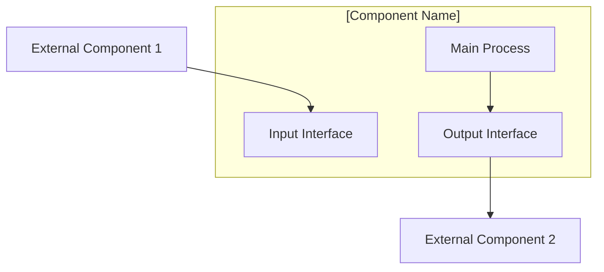

# [Component Name]

**Type**: [Hardware/Software/Container/Service]
**Purpose**: Brief description of the component's function in the system
**Dependencies**: List of required components, services, or hardware
**Interfaces**: Primary communication methods (ports, protocols, file paths)

## Wire Diagram



## Connection Details

### Input Interfaces

| Interface | Type | Protocol | Port/Path | Description |
|-----------|------|----------|-----------|-------------|
| Primary Input | [Network/File/Device] | [TCP/UDP/Serial/etc] | [Port/Path] | Purpose and data format |
| Secondary Input | [Type] | [Protocol] | [Port/Path] | Purpose and data format |

### Output Interfaces

| Interface | Type | Protocol | Port/Path | Description |
|-----------|------|----------|-----------|-------------|
| Primary Output | [Network/File/Device] | [TCP/UDP/Serial/etc] | [Port/Path] | Purpose and data format |
| Secondary Output | [Type] | [Protocol] | [Port/Path] | Purpose and data format |

### Configuration

| Parameter | Type | Default | Location | Description |
|-----------|------|---------|----------|-------------|
| Config Item 1 | [String/Int/Bool] | [Default Value] | [File/Environment] | Purpose |
| Config Item 2 | [Type] | [Default] | [Location] | Purpose |

## Technical Details

### System Requirements
- **Operating System**: [Linux/Docker/etc]
- **Memory**: [RAM requirements]
- **Storage**: [Disk space requirements]
- **Network**: [Bandwidth/connectivity requirements]
- **Hardware**: [Specific hardware dependencies]

### Dependencies
```bash
# Installation commands
sudo apt-get install [package1] [package2]

# Python dependencies (if applicable)
pip install -r requirements.txt

# Docker commands (if applicable)
docker pull [image]
```

### Environment Setup
```bash
# Environment variables
export VAR_NAME="value"

# Service startup
systemctl start [service-name]

# Virtual environment (if applicable)
source venv/bin/activate
```

## Operational Information

### Startup Sequence
1. [First step - dependencies]
2. [Second step - configuration]
3. [Third step - service start]
4. [Verification steps]

### Health Monitoring
```bash
# Status check commands
systemctl status [service]
ps aux | grep [process]
netstat -tulpn | grep [port]

# Log file locations
tail -f /path/to/logfile

# Common diagnostic commands
[diagnostic commands]
```

### Common Issues

#### Issue: [Common Problem]
**Symptoms**: Description of what user sees
**Cause**: Technical explanation
**Solution**: 
```bash
# Fix commands
command1
command2
```

#### Issue: [Another Problem]
**Symptoms**: Description
**Cause**: Explanation
**Solution**: Step-by-step fix

### Performance Characteristics
- **Startup Time**: [Typical startup duration]
- **Memory Usage**: [Normal RAM consumption]
- **CPU Usage**: [Typical CPU load]
- **Network Bandwidth**: [Data throughput]
- **File I/O**: [Disk read/write patterns]

## Integration Points

### Upstream Dependencies
- **[Component A](../component-a.md)**: Provides [data/service]
- **[Component B](../component-b.md)**: Provides [data/service]

### Downstream Consumers
- **[Component C](../component-c.md)**: Consumes [data/service]
- **[Component D](../component-d.md)**: Consumes [data/service]

### Related Flows
- **[Primary Flow](../core-flows/primary-flow.md)**: Main operational sequence
- **[Secondary Flow](../core-flows/secondary-flow.md)**: Alternative or error handling

### Integration Patterns
- **[Pattern A](../integration-patterns/pattern-a.md)**: How this component fits the pattern
- **[Pattern B](../integration-patterns/pattern-b.md)**: Alternative integration approach

## Security Considerations

### Access Control
- **Network Access**: [Port restrictions, firewall rules]
- **File Permissions**: [Required file system permissions]
- **User Accounts**: [Service accounts, sudo requirements]

### Data Handling
- **Sensitive Data**: [What sensitive data is processed]
- **Encryption**: [Encryption requirements]
- **Logging**: [What should/shouldn't be logged]

## Testing and Validation

### Unit Tests
```bash
# Test commands
./run-tests.sh
pytest tests/
```

### Integration Tests
```bash
# Integration test commands
./test-integration.sh
```

### Manual Verification
1. [Step-by-step verification process]
2. [Expected outputs]
3. [Success criteria]

## Maintenance

### Regular Tasks
- **Log Rotation**: [Log management procedures]
- **Updates**: [Update procedures and frequency]
- **Backup**: [Backup requirements and procedures]

### Configuration Backup
```bash
# Backup important configurations
cp /path/to/config /backup/location/
```

### Version Information
- **Current Version**: [Version number]
- **Last Updated**: [Date]
- **Change Log**: [Link to changelog or brief notes]

## Cross References

### Related Documentation
- **[System Overview](../../README.md)**: High-level system architecture
- **[Installation Guide](../../../installation/component-install.md)**: Detailed setup instructions
- **[Troubleshooting Guide](../../../troubleshooting/component-issues.md)**: Problem resolution

### External Resources
- **Official Documentation**: [Link to official docs]
- **Community Resources**: [Forums, wikis, etc]
- **Source Code**: [Repository links]

---

**Document Version**: 1.0
**Last Updated**: [Date]
**Maintainer**: [Team/Person]
**Review Schedule**: [Frequency]