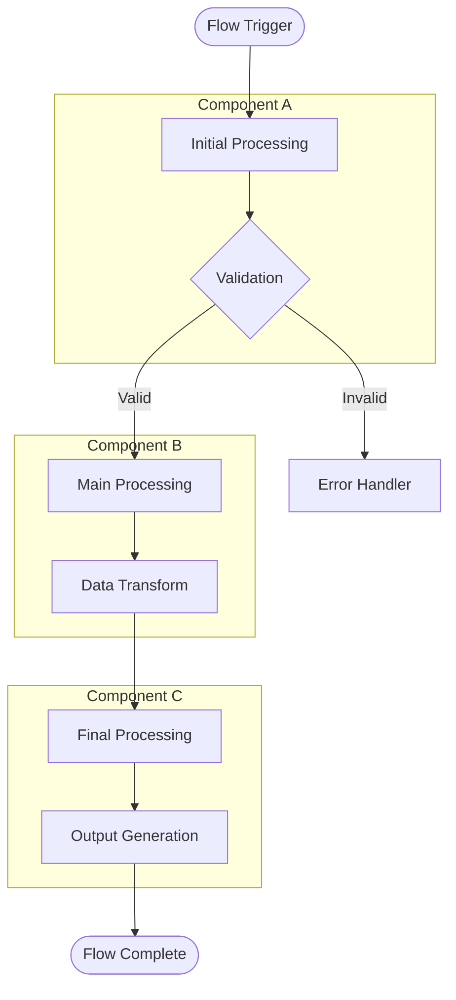
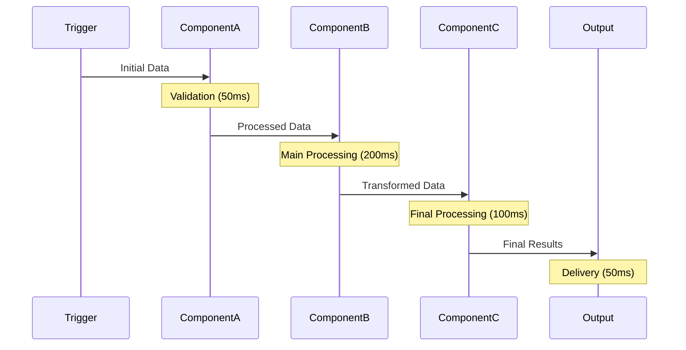
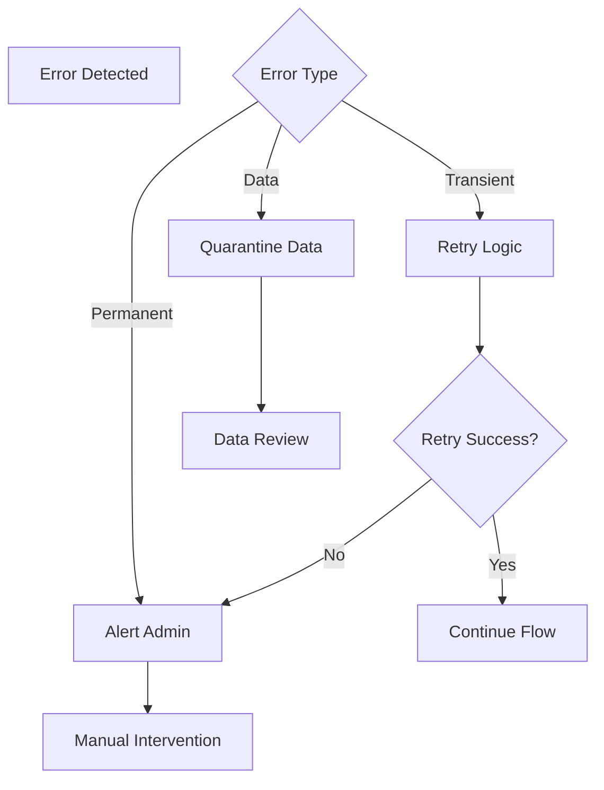

# [Flow Name] - System Data Flow

**Type**: [Core Flow/Integration Pattern/Service Flow]
**Purpose**: Brief description of what this flow accomplishes
**Trigger**: What initiates this flow (event, timer, user action)
**Duration**: Typical time to complete the flow
**Dependencies**: Required services and components

## Flow Overview

### Quick Summary
[2-3 sentence description of the flow's purpose and key steps]

### Key Participants
- **[Component A](../component-details/component-a.md)**: Role in this flow
- **[Component B](../component-details/component-b.md)**: Role in this flow
- **[Component C](../component-details/component-c.md)**: Role in this flow

## Wire Diagram



## Detailed Flow Steps

### Phase 1: Initiation
1. **Trigger Event**: [Description of what starts the flow]
   - **Source**: [Where trigger originates]
   - **Data**: [What data is provided]
   - **Format**: [Data format/protocol]

2. **Initial Validation**: [First validation steps]
   - **Checks**: [What is validated]
   - **Error Handling**: [What happens on failure]

### Phase 2: Processing
3. **Data Ingestion**: [How data enters the system]
   - **Input Interface**: [Port/file/protocol details]
   - **Buffer Size**: [Memory/storage requirements]
   - **Rate Limiting**: [Processing rate constraints]

4. **Primary Processing**: [Main processing logic]
   - **Algorithms**: [Key processing steps]
   - **Transformations**: [Data format changes]
   - **Validation**: [Mid-process checks]

### Phase 3: Output
5. **Data Transform**: [Final data preparation]
   - **Output Format**: [Target format/protocol]
   - **Enrichment**: [Additional data added]
   - **Filtering**: [Data filtering rules]

6. **Delivery**: [How results are delivered]
   - **Target**: [Destination component/service]
   - **Protocol**: [Delivery method]
   - **Confirmation**: [Delivery verification]

## Data Flow Details

### Input Data Specifications

| Field | Type | Source | Validation | Description |
|-------|------|--------|------------|-------------|
| Field1 | [Type] | [Component] | [Rules] | Purpose and format |
| Field2 | [Type] | [Component] | [Rules] | Purpose and format |
| Field3 | [Type] | [Component] | [Rules] | Purpose and format |

### Processing Transformations

| Stage | Input Format | Output Format | Processing | Notes |
|-------|-------------|---------------|------------|-------|
| Stage1 | [Format] | [Format] | [Description] | [Special considerations] |
| Stage2 | [Format] | [Format] | [Description] | [Special considerations] |
| Stage3 | [Format] | [Format] | [Description] | [Special considerations] |

### Output Data Specifications

| Field | Type | Destination | Format | Description |
|-------|------|-------------|--------|-------------|
| Field1 | [Type] | [Component] | [Format] | Purpose and usage |
| Field2 | [Type] | [Component] | [Format] | Purpose and usage |
| Field3 | [Type] | [Component] | [Format] | Purpose and usage |

## Timing and Performance

### Sequence Diagram


### Performance Characteristics
- **Typical Duration**: [Normal processing time]
- **Peak Throughput**: [Maximum data rate]
- **Memory Usage**: [RAM requirements during flow]
- **CPU Load**: [Processing load characteristics]
- **I/O Requirements**: [Disk/network usage]

### Bottlenecks and Constraints
- **Processing Limits**: [What limits throughput]
- **Memory Constraints**: [Memory bottlenecks]
- **Network Limits**: [Bandwidth constraints]
- **External Dependencies**: [Third-party service limits]

## Error Handling

### Common Failure Points

#### Failure Point 1: [Description]
- **Symptoms**: [How failure manifests]
- **Causes**: [Common root causes]
- **Detection**: [How system detects failure]
- **Recovery**: [Automatic recovery mechanisms]
- **Manual Intervention**: [Required manual steps]

#### Failure Point 2: [Description]
- **Symptoms**: [How failure manifests]
- **Causes**: [Common root causes]
- **Detection**: [How system detects failure]
- **Recovery**: [Automatic recovery mechanisms]
- **Manual Intervention**: [Required manual steps]

### Error Recovery Flows


## Configuration and Tuning

### Flow Configuration
```bash
# Configuration file location
/path/to/flow-config.conf

# Key parameters
FLOW_TIMEOUT=300
MAX_RETRIES=3
BUFFER_SIZE=1024
LOG_LEVEL=INFO
```

### Tuning Parameters

| Parameter | Default | Range | Impact | Tuning Guide |
|-----------|---------|-------|--------|--------------|
| Timeout | [Value] | [Min-Max] | [Description] | [When to adjust] |
| Buffer Size | [Value] | [Min-Max] | [Description] | [When to adjust] |
| Retry Count | [Value] | [Min-Max] | [Description] | [When to adjust] |

## Monitoring and Observability

### Key Metrics
- **Flow Duration**: Time from start to completion
- **Success Rate**: Percentage of successful flows
- **Error Rate**: Frequency of different error types
- **Throughput**: Data volume processed per unit time
- **Queue Depth**: Backlog of pending flows

### Monitoring Commands
```bash
# Check flow status
systemctl status [flow-service]

# Monitor logs
tail -f /var/log/flow-processing.log

# Performance metrics
iostat -x 1
top -p [process-id]

# Custom monitoring
curl http://localhost:[port]/metrics
```

### Alerting Thresholds
- **Duration > [Time]**: Flow taking too long
- **Error Rate > [Percentage]**: High failure rate
- **Queue Depth > [Count]**: Backlog building up
- **Memory Usage > [Percentage]**: Resource constraint

## Testing and Validation

### Unit Testing
```bash
# Test individual components
./test-component-a.sh
./test-component-b.sh
./test-component-c.sh
```

### Integration Testing
```bash
# Test complete flow
./test-full-flow.sh

# Load testing
./load-test-flow.sh --rate 100 --duration 300
```

### Test Data
```bash
# Generate test data
./generate-test-data.sh --count 1000

# Test data validation
./validate-test-output.sh
```

## Security Considerations

### Data Security
- **Encryption**: [Encryption requirements in transit/at rest]
- **Access Control**: [Who can trigger/monitor flow]
- **Audit Logging**: [What security events are logged]

### Network Security
- **Firewall Rules**: [Required network access]
- **TLS/SSL**: [Secure communication requirements]
- **Authentication**: [Service authentication methods]

## Operational Procedures

### Manual Flow Trigger
```bash
# Trigger flow manually for testing
./trigger-flow.sh --input-file test-data.json

# Check flow status
./check-flow-status.sh --flow-id [id]
```

### Emergency Procedures
```bash
# Stop all flow processing
./stop-flow-processing.sh

# Clear stuck flows
./clear-flow-queue.sh

# Reset flow state
./reset-flow-state.sh
```

### Maintenance Windows
- **Recommended Schedule**: [When to perform maintenance]
- **Duration**: [Typical maintenance window]
- **Impact**: [Service impact during maintenance]

## Integration Points

### Upstream Flows
- **[Upstream Flow A](upstream-flow-a.md)**: Provides input data
- **[Upstream Flow B](upstream-flow-b.md)**: Triggers this flow

### Downstream Flows
- **[Downstream Flow C](downstream-flow-c.md)**: Consumes output data
- **[Downstream Flow D](downstream-flow-d.md)**: Triggered by this flow

### Related Components
- **[Component Details](../component-details/)**: Detailed component documentation
- **[Integration Patterns](../integration-patterns/)**: Related integration patterns

## Change Management

### Version History
- **v1.0**: Initial implementation
- **v1.1**: Performance improvements
- **v1.2**: Error handling enhancements

### Configuration Changes
- **Backward Compatibility**: [Compatibility considerations]
- **Migration Path**: [How to upgrade from previous versions]
- **Rollback Procedures**: [How to revert changes]

## Cross References

### Related Documentation
- **[System Architecture](../../README.md)**: Overall system design
- **[Component Documentation](../component-details/)**: Individual component details
- **[Troubleshooting Guide](../../../troubleshooting/)**: Problem resolution

### External Resources
- **Standards**: [Industry standards referenced]
- **Best Practices**: [Industry best practices followed]
- **Tools**: [External tools or libraries used]

---

**Document Version**: 1.0
**Last Updated**: [Date]
**Flow Owner**: [Team/Person responsible]
**Review Schedule**: [Review frequency]
**SLA**: [Service level requirements if applicable]