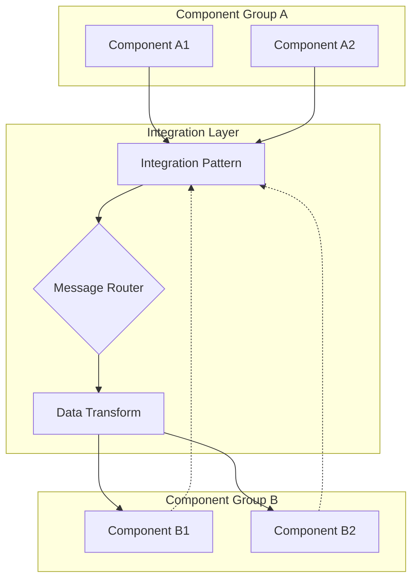

# [Integration Pattern Name]

**Type**: [Port Mapping/File System/Process Communication/Container Integration]
**Scope**: [System-wide/Component-specific/Service-level]
**Complexity**: [Basic/Intermediate/Advanced]
**Dependencies**: [Required infrastructure or services]

## Pattern Overview

### Description
[Detailed description of what this integration pattern accomplishes and why it's needed]

### Use Cases
- **Primary Use Case**: [Main scenario where this pattern applies]
- **Secondary Use Cases**: [Additional scenarios]
- **Anti-patterns**: [When NOT to use this pattern]

### Benefits
- [Benefit 1]: [Explanation]
- [Benefit 2]: [Explanation]
- [Benefit 3]: [Explanation]

### Trade-offs
- **Advantages**: [Positive aspects]
- **Disadvantages**: [Limitations or costs]
- **Complexity**: [Implementation complexity considerations]

## Architecture Diagram



## Implementation Details

### Core Components

#### Component 1: [Name]
- **Purpose**: [What this component does in the pattern]
- **Interface**: [How other components interact with it]
- **Configuration**: [Key configuration parameters]

#### Component 2: [Name]
- **Purpose**: [What this component does in the pattern]
- **Interface**: [How other components interact with it]
- **Configuration**: [Key configuration parameters]

### Data Flow Specifications

| Flow Direction | Protocol | Port/Path | Data Format | Description |
|----------------|----------|-----------|-------------|-------------|
| Component A → Pattern | [Protocol] | [Port/Path] | [Format] | [Purpose] |
| Pattern → Component B | [Protocol] | [Port/Path] | [Format] | [Purpose] |
| Bidirectional | [Protocol] | [Port/Path] | [Format] | [Purpose] |

### Message Formats

#### Input Message Schema
```json
{
  "messageType": "string",
  "timestamp": "ISO8601",
  "source": "string",
  "data": {
    "field1": "type",
    "field2": "type",
    "field3": "type"
  },
  "metadata": {
    "version": "string",
    "priority": "integer"
  }
}
```

#### Output Message Schema
```json
{
  "messageType": "string",
  "timestamp": "ISO8601",
  "destination": "string",
  "transformedData": {
    "processedField1": "type",
    "processedField2": "type",
    "enrichedField3": "type"
  },
  "processingMetadata": {
    "transformVersion": "string",
    "processingTime": "duration"
  }
}
```

## Configuration

### Pattern Configuration File
```yaml
# integration-pattern-config.yaml
pattern:
  name: "[Pattern Name]"
  version: "1.0"
  
routing:
  strategy: "[round-robin/failover/load-balance]"
  timeout: 30
  retries: 3
  
transformation:
  enabled: true
  rules:
    - source: "field1"
      target: "processedField1"
      transform: "[transformation rule]"
    - source: "field2"
      target: "processedField2"
      transform: "[transformation rule]"
      
security:
  authentication: "[method]"
  encryption: "[enabled/disabled]"
  
monitoring:
  metrics: true
  logging: "INFO"
  alerts: true
```

### Environment Variables
```bash
# Required environment variables
export PATTERN_CONFIG="/path/to/config.yaml"
export PATTERN_LOG_LEVEL="INFO"
export PATTERN_TIMEOUT="30"
export PATTERN_MAX_CONNECTIONS="100"

# Optional variables
export PATTERN_ENABLE_METRICS="true"
export PATTERN_ENABLE_TRACING="false"
```

## Implementation Examples

### Basic Implementation
```python
# Python example for pattern implementation
class IntegrationPattern:
    def __init__(self, config_path):
        self.config = self.load_config(config_path)
        self.router = MessageRouter(self.config.routing)
        self.transformer = DataTransformer(self.config.transformation)
    
    def process_message(self, message):
        # Validate input
        if not self.validate_message(message):
            raise ValidationError("Invalid message format")
        
        # Route message
        destination = self.router.route(message)
        
        # Transform data
        transformed = self.transformer.transform(message.data)
        
        # Send to destination
        return self.send_to_destination(destination, transformed)
    
    def validate_message(self, message):
        # Validation logic
        pass
    
    def send_to_destination(self, destination, data):
        # Delivery logic
        pass
```

### Configuration Setup
```bash
#!/bin/bash
# setup-integration-pattern.sh

# Create configuration directory
mkdir -p /etc/stinkster/patterns/

# Copy configuration template
cp pattern-config.template.yaml /etc/stinkster/patterns/pattern-config.yaml

# Set permissions
chmod 644 /etc/stinkster/patterns/pattern-config.yaml
chown stinkster:stinkster /etc/stinkster/patterns/pattern-config.yaml

# Create log directory
mkdir -p /var/log/stinkster/patterns/
chown stinkster:stinkster /var/log/stinkster/patterns/

# Install systemd service
cp pattern.service /etc/systemd/system/
systemctl daemon-reload
systemctl enable pattern.service
```

## Port and Protocol Specifications

### Network Ports

| Port | Protocol | Direction | Purpose | Security |
|------|----------|-----------|---------|----------|
| [Port1] | [TCP/UDP] | [Inbound/Outbound] | [Purpose] | [Firewall rules] |
| [Port2] | [TCP/UDP] | [Inbound/Outbound] | [Purpose] | [Firewall rules] |
| [Port3] | [TCP/UDP] | [Bidirectional] | [Purpose] | [Firewall rules] |

### File System Paths

| Path | Type | Permissions | Purpose | Backup Required |
|------|------|-------------|---------|-----------------|
| `/path/to/data` | [Directory/File] | [Permissions] | [Purpose] | [Yes/No] |
| `/path/to/logs` | [Directory/File] | [Permissions] | [Purpose] | [Yes/No] |
| `/path/to/config` | [Directory/File] | [Permissions] | [Purpose] | [Yes/No] |

### Process Communication

| Method | Interface | Format | Usage | Performance |
|--------|-----------|--------|-------|-------------|
| [IPC Method] | [Interface] | [Format] | [When used] | [Characteristics] |
| [Message Queue] | [Interface] | [Format] | [When used] | [Characteristics] |
| [Shared Memory] | [Interface] | [Format] | [When used] | [Characteristics] |

## Deployment Guide

### Prerequisites
```bash
# System requirements
sudo apt-get update
sudo apt-get install [package1] [package2] [package3]

# Python dependencies
pip install -r requirements.txt

# Docker requirements (if applicable)
docker pull [required-images]
```

### Installation Steps
1. **Download Pattern Implementation**
   ```bash
   git clone [repository-url]
   cd [pattern-directory]
   ```

2. **Configure Environment**
   ```bash
   cp config.template.yaml config.yaml
   # Edit config.yaml with environment-specific values
   ```

3. **Install Dependencies**
   ```bash
   ./install-dependencies.sh
   ```

4. **Deploy Pattern**
   ```bash
   ./deploy-pattern.sh
   ```

5. **Verify Installation**
   ```bash
   ./verify-pattern.sh
   ```

### Docker Deployment
```yaml
# docker-compose.yml for pattern
version: '3.8'
services:
  pattern-service:
    image: stinkster/pattern:latest
    ports:
      - "[host-port]:[container-port]"
    volumes:
      - "./config:/etc/pattern/config"
      - "./logs:/var/log/pattern"
    environment:
      - PATTERN_CONFIG=/etc/pattern/config/config.yaml
      - PATTERN_LOG_LEVEL=INFO
    depends_on:
      - [dependency-service]
    networks:
      - stinkster-network

networks:
  stinkster-network:
    external: true
```

## Monitoring and Observability

### Key Metrics
- **Message Throughput**: Messages processed per second
- **Latency**: Processing time per message
- **Error Rate**: Percentage of failed messages
- **Queue Depth**: Backlog of pending messages
- **Resource Usage**: CPU, memory, network utilization

### Monitoring Endpoints
```bash
# Health check
curl http://localhost:[port]/health

# Metrics endpoint
curl http://localhost:[port]/metrics

# Status endpoint
curl http://localhost:[port]/status
```

### Log Analysis
```bash
# Pattern-specific logs
tail -f /var/log/stinkster/patterns/pattern.log

# Error logs
grep ERROR /var/log/stinkster/patterns/pattern.log

# Performance analysis
awk '/METRIC/ {print $0}' /var/log/stinkster/patterns/pattern.log
```

### Alerting Rules
```yaml
# alerting-rules.yaml
groups:
  - name: pattern-alerts
    rules:
      - alert: HighErrorRate
        expr: error_rate > 0.05
        for: 5m
        labels:
          severity: warning
        annotations:
          summary: "High error rate in integration pattern"
          
      - alert: HighLatency
        expr: avg_latency > 1000
        for: 2m
        labels:
          severity: critical
        annotations:
          summary: "High latency in integration pattern"
```

## Security Considerations

### Authentication and Authorization
- **Authentication Method**: [How components authenticate]
- **Authorization Model**: [Access control mechanism]
- **Token Management**: [How security tokens are handled]

### Data Protection
- **Encryption in Transit**: [TLS/SSL configuration]
- **Encryption at Rest**: [Data storage encryption]
- **Data Sanitization**: [How sensitive data is handled]

### Network Security
```bash
# Firewall rules
sudo ufw allow [port]/tcp
sudo ufw allow from [trusted-ip] to any port [port]

# TLS configuration
openssl req -x509 -newkey rsa:4096 -keyout key.pem -out cert.pem -days 365
```

## Troubleshooting

### Common Issues

#### Issue: Connection Timeouts
**Symptoms**: Components cannot connect to pattern service
**Causes**: 
- Network connectivity issues
- Firewall blocking ports
- Service not running

**Diagnosis**:
```bash
# Check service status
systemctl status pattern-service

# Test network connectivity
telnet [host] [port]

# Check firewall
sudo ufw status
```

**Resolution**:
```bash
# Restart service
systemctl restart pattern-service

# Open firewall port
sudo ufw allow [port]

# Check configuration
./validate-config.sh
```

#### Issue: High Memory Usage
**Symptoms**: Pattern service consuming excessive memory
**Causes**:
- Memory leaks in transformation logic
- Large message backlogs
- Inefficient data structures

**Diagnosis**:
```bash
# Memory usage analysis
ps aux | grep pattern
top -p [process-id]
valgrind --tool=memcheck ./pattern-service
```

**Resolution**:
```bash
# Restart service
systemctl restart pattern-service

# Tune memory settings
export PATTERN_MAX_MEMORY="512M"

# Clear message backlog
./clear-message-queue.sh
```

### Performance Tuning

#### Optimization Areas
1. **Message Routing**: Optimize routing algorithms
2. **Data Transformation**: Cache transformation rules
3. **Connection Pooling**: Reuse connections
4. **Batch Processing**: Process messages in batches

#### Tuning Parameters
```yaml
# performance-tuning.yaml
performance:
  max_connections: 100
  connection_timeout: 30
  batch_size: 50
  cache_size: 1000
  worker_threads: 4
```

## Testing

### Unit Tests
```bash
# Run unit tests
python -m pytest tests/unit/

# Test specific component
python -m pytest tests/unit/test_message_router.py
```

### Integration Tests
```bash
# Run integration tests
./tests/integration/run-all-tests.sh

# Test pattern end-to-end
./tests/integration/test-pattern-e2e.sh
```

### Load Testing
```bash
# Load test configuration
./load-test/config-load-test.sh --rate 1000 --duration 300

# Monitor during load test
./load-test/monitor-performance.sh
```

### Test Data Generation
```python
# generate-test-data.py
import json
import random
from datetime import datetime

def generate_test_message():
    return {
        "messageType": "test-data",
        "timestamp": datetime.now().isoformat(),
        "source": f"test-source-{random.randint(1, 10)}",
        "data": {
            "field1": f"value-{random.randint(1, 1000)}",
            "field2": random.uniform(0, 100),
            "field3": random.choice(["A", "B", "C"])
        }
    }

# Generate test dataset
test_data = [generate_test_message() for _ in range(1000)]
with open('test-data.json', 'w') as f:
    json.dump(test_data, f, indent=2)
```

## Cross References

### Related Patterns
- **[Related Pattern A](related-pattern-a.md)**: Similar integration approach
- **[Related Pattern B](related-pattern-b.md)**: Alternative implementation

### Component Integration
- **[Component A](../component-details/component-a.md)**: Uses this pattern for [purpose]
- **[Component B](../component-details/component-b.md)**: Implements this pattern for [purpose]

### System Flows
- **[Flow A](../core-flows/flow-a.md)**: Implements this pattern
- **[Flow B](../core-flows/flow-b.md)**: Benefits from this pattern

### External Documentation
- **[Architecture Overview](../../README.md)**: System-wide architectural context
- **[Installation Guide](../../../installation/)**: Detailed setup procedures
- **[Troubleshooting Guide](../../../troubleshooting/)**: Problem resolution

---

**Document Version**: 1.0
**Last Updated**: [Date]
**Pattern Owner**: [Team/Person responsible]
**Review Schedule**: [Review frequency]
**Implementation Status**: [Planned/In Development/Production]