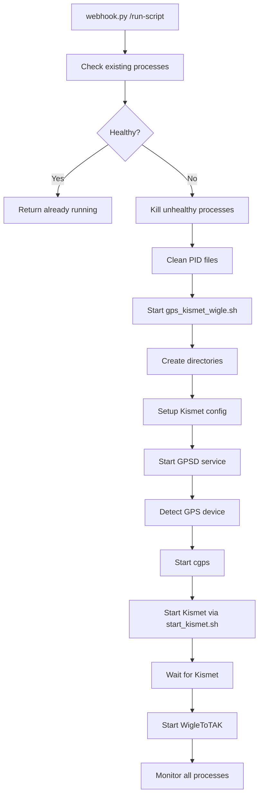
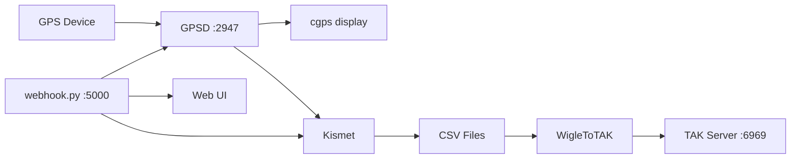
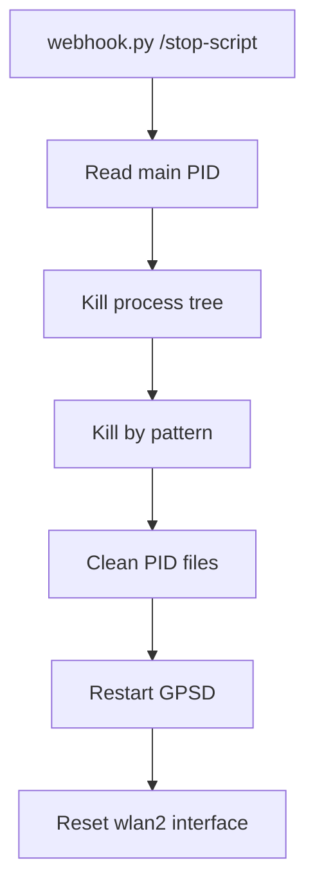

# Background Process Orchestration Analysis

## Overview

The webhook.py service manages a complex system of background processes for GPS, WiFi scanning, and TAK integration. This document provides a detailed analysis of the process management system that needs to be replicated in Node.js.

## Core Components

### 1. Main Orchestration Script: `/home/pi/stinky/gps_kismet_wigle.sh`

**Purpose**: Primary orchestration script that starts and monitors all services

**Key Features**:
- **Startup Sequence**:
  1. Creates `/home/pi/tmp/` directory
  2. Initializes PID and log files
  3. Sets up Kismet configuration
  4. Starts GPSD service
  5. Verifies GPS device connectivity
  6. Starts cgps (GPS display)
  7. Executes Kismet via start_kismet.sh
  8. Launches WigleToTAK in virtual environment
  9. Monitors all processes continuously

- **Process Management**:
  - Stores all PIDs in `/home/pi/tmp/gps_kismet_wigle.pids`
  - Maintains separate PID files for specific services
  - Implements graceful shutdown with signal handling
  - Automatic cleanup on exit (trap handler)
  - Process tree killing for complete cleanup

- **Error Handling**:
  - Retry logic for critical services
  - Verifies process health before continuing
  - Logs all operations to `/home/pi/tmp/gps_kismet_wigle.log`
  - Falls back gracefully if services fail

### 2. Process Management in webhook.py

**Key Functions**:

#### `/run-script` Endpoint:
```python
# Process startup flow:
1. Check if script already running (via PID file)
2. Clean up any stale processes
3. Launch orchestration script with sudo
4. Wait 30 seconds for initial startup
5. Verify Kismet process (12 retries, 5s intervals)
6. Check cgps and WigleToTAK processes
7. Return detailed status message
```

#### `/stop-script` Endpoint:
```python
# Process shutdown flow:
1. Read main script PID from file
2. Kill process tree (parent + children)
3. Kill processes by pattern (kismet, cgps, WigleToTak)
4. Clean up all PID files
5. Restart GPSD service
6. Reset network interface to managed mode
```

#### Process Tree Management:
- Uses `psutil` for cross-platform process management
- Recursive child process termination
- Fallback to SIGKILL if SIGTERM fails

### 3. PID File Management

**Primary PID Files**:
- `/tmp/kismet_pids.txt` - General Kismet PIDs (used by webhook.py)
- `/tmp/kismet_script.pid` - Main orchestration script PID
- `/home/pi/tmp/gps_kismet_wigle.pids` - All process PIDs (main script)
- `/home/pi/kismet_ops/kismet.pid` - Kismet daemon PID
- `/home/pi/tmp/wigletotak.specific.pid` - WigleToTAK service PID

**PID File Operations**:
- Created on process start
- Verified before operations
- Cleaned up on normal/abnormal exit
- Used for health checking

### 4. Service Dependencies

#### GPSD Service:
- **Management**: `systemctl stop/start/restart gpsd`
- **Port**: 2947
- **Device Detection**: Automatic scanning of /dev/ttyUSB*, /dev/ttyACM*
- **Baud Rate Testing**: 9600, 4800, 38400, 57600, 115200
- **NMEA Validation**: Checks for valid GPS sentences

#### Kismet Service:
- **Startup Script**: `/home/pi/Scripts/start_kismet.sh`
- **Configuration**: `~/.kismet/kismet_site.conf`
- **Interface Management**:
  - Sets wlan2 to monitor mode
  - Creates wlan2mon interface (if using airmon-ng)
  - Handles interface state transitions
- **Resource Management**:
  - Sets ulimit for core dumps and file descriptors
  - Checks system memory before starting
  - Logs resource usage

#### WigleToTAK Service:
- **Virtual Environment**: Required for Python dependencies
- **Working Directory**: Must change to service directory
- **Port**: 6969 (default, configurable)
- **Dependencies**: Flask-based web service

### 5. Process Monitoring

**Continuous Monitoring Loop**:
```bash
# Main monitoring logic:
1. Read all PIDs from PID file
2. Verify each process is still running
3. Check critical processes by name pattern
4. Exit script if any critical process dies
5. Sleep 5 seconds between checks
```

**Critical Processes**:
- cgps (GPS display)
- kismet (WiFi scanner)
- python3.*WigleToTak2 (TAK converter)

### 6. Signal Handling

**Trap Handler**:
- Captures INT, TERM, EXIT signals
- Prevents recursive cleanup
- Maintains exit code
- Ensures all processes are terminated

**Cleanup Function**:
- Stops GPSD service
- Kills Kismet using PID file
- Terminates all tracked processes
- Removes PID files
- Resets network interfaces

### 7. Network Interface Management

**Monitor Mode Operations**:
```bash
# Enable monitor mode:
sudo ip link set wlan2 down
sudo iw dev wlan2 set monitor none
sudo ip link set wlan2 up

# OR using airmon-ng:
sudo airmon-ng start wlan2  # Creates wlan2mon

# Reset to managed mode:
sudo ip link set wlan2 down
sudo iw dev wlan2 set type managed
sudo ip link set wlan2 up
```

### 8. Log File Management

**Log Files**:
- `/var/log/webhook.log` - Webhook service operations
- `/home/pi/tmp/gps_kismet_wigle.log` - Main orchestration log
- `/home/pi/tmp/kismet.log` - Kismet output
- `/home/pi/tmp/wigletotak.log` - WigleToTAK output
- `/home/pi/tmp/cgps.log` - GPS display output
- `/home/pi/kismet_ops/kismet_debug.log` - Kismet debug info

### 9. Error Recovery

**Retry Mechanisms**:
- GPSD: 2 restart attempts if not responding
- cgps: 3 retry attempts with GPSD restart
- Kismet: 12 verification attempts (60 seconds total)
- WigleToTAK: 5 retry attempts (50 seconds total)

**Fallback Strategies**:
- Continue without GPS if unavailable
- Warning messages for non-critical failures
- Graceful degradation of functionality

## Node.js Implementation Requirements

### 1. Process Management Module

```javascript
// Required functionality:
- Spawn processes with proper environment
- Track PIDs in multiple files
- Implement process tree killing
- Handle signals gracefully
- Monitor process health
```

### 2. Service Control Module

```javascript
// System service management:
- Execute systemctl commands
- Handle sudo requirements
- Manage service dependencies
- Implement retry logic
```

### 3. Network Interface Module

```javascript
// Interface operations:
- Set monitor/managed modes
- Handle interface state changes
- Kill conflicting processes
- Verify interface availability
```

### 4. PID File Manager

```javascript
// PID file operations:
- Atomic file writes
- Lock file handling
- Multi-file coordination
- Cleanup on crash
```

### 5. Process Monitor

```javascript
// Monitoring requirements:
- Check process existence
- Verify process identity
- Pattern-based process finding
- Continuous health checking
```

### 6. Virtual Environment Support

```javascript
// Python venv handling:
- Activate virtual environments
- Execute Python scripts in venv
- Manage working directories
- Handle environment variables
```

## Critical Implementation Notes

1. **Timing is Critical**: Services have specific startup delays that must be respected
2. **Order Matters**: GPSD must start before Kismet, Kismet before WigleToTAK
3. **Cleanup is Essential**: Stale processes/interfaces will prevent restart
4. **Logging is Vital**: Detailed logs needed for troubleshooting
5. **Permissions Required**: Many operations need sudo access
6. **Resource Constraints**: Raspberry Pi has limited memory/CPU

## Process Control Flow

### Startup Sequence



### Inter-Service Communication



### Shutdown Sequence



## Process Dependencies and Communication

### 1. GPS Data Flow
- **Source**: Physical GPS device (/dev/ttyUSB0, etc.)
- **Bridge**: GPSD daemon (systemd service)
- **Protocol**: JSON over TCP port 2947
- **Consumers**: 
  - cgps (display)
  - Kismet (location tagging)
  - webhook.py (status API)

### 2. WiFi Scan Data Flow
- **Source**: wlan2 interface in monitor mode
- **Processor**: Kismet daemon
- **Output**: CSV files in /home/pi/kismet_ops/
- **API**: REST API on port 2501 (admin:admin)
- **Consumer**: WigleToTAK reads CSV files

### 3. TAK Integration Flow
- **Source**: Kismet CSV files
- **Processor**: WigleToTAK Python service
- **Output**: TAK protocol messages
- **Port**: 6969 (configurable)
- **Protocol**: TAK XML over UDP/TCP

### 4. Web Control Flow
- **Controller**: webhook.py Flask service
- **Port**: 5000
- **Clients**: Web UI (hi.html)
- **Actions**: Start/stop scripts, status monitoring
- **Polling**: 5-second intervals for status updates

## Critical Timing and Dependencies

### Service Start Order (with delays)
1. **GPSD** (5 seconds wait)
   - Must be running before Kismet
   - Requires device detection/configuration
   
2. **cgps** (3 seconds wait)
   - Optional but provides GPS verification
   - Retries 3 times if fails
   
3. **Kismet** (15 seconds wait)
   - Depends on GPSD for location
   - Requires monitor mode interface
   - Creates CSV output files
   
4. **WigleToTAK** (5 seconds wait)
   - Depends on Kismet CSV files
   - Requires virtual environment
   - Must change to service directory

### Resource Constraints
- **Memory**: Check available before Kismet start
- **File Descriptors**: Increase limit to 4096
- **Core Dumps**: Enable for debugging
- **Process Limits**: Monitor CPU usage

## Node.js Implementation Architecture

### Proposed Module Structure
```
kismet-operations/
├── lib/
│   ├── processManager.js      # Core process management
│   ├── pidFileManager.js      # PID file operations
│   ├── serviceController.js   # Systemd service control
│   ├── networkInterface.js    # Network interface management
│   ├── processMonitor.js      # Health checking
│   └── pythonEnv.js          # Virtual environment support
├── services/
│   ├── gpsdService.js        # GPSD management
│   ├── kismetService.js      # Kismet management
│   └── wigleTakService.js    # WigleToTAK management
├── utils/
│   ├── logger.js             # Winston logging
│   ├── retry.js              # Retry logic
│   └── shellExecutor.js      # Shell command execution
└── index.js                  # Main orchestrator
```

## Testing Checklist

- [ ] Process starts successfully
- [ ] All PIDs are tracked correctly
- [ ] Graceful shutdown works
- [ ] Force kill works when needed
- [ ] Interface mode changes work
- [ ] Service restarts are clean
- [ ] Log files are created/rotated
- [ ] Error recovery functions
- [ ] Resource limits are respected
- [ ] Virtual environments activate properly
- [ ] Inter-service communication works
- [ ] Timing dependencies are respected
- [ ] Concurrent operations are safe
- [ ] Memory/resource usage is acceptable
- [ ] Crash recovery functions properly