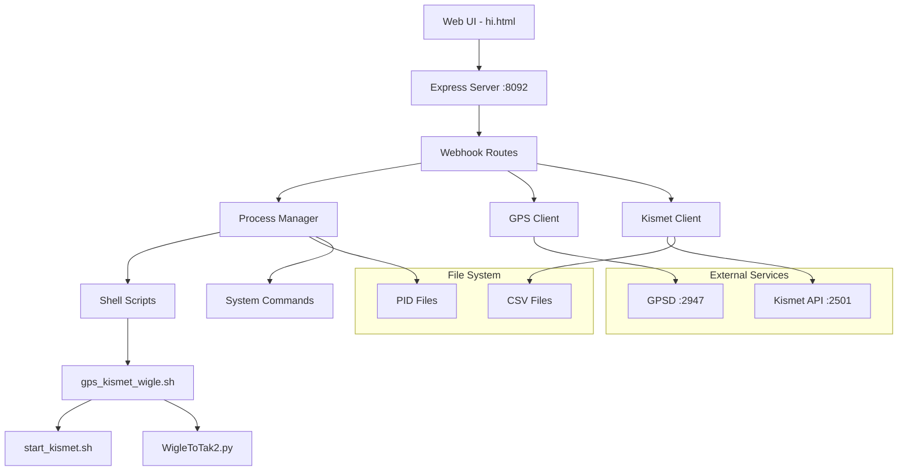

# Webhook Migration Technical Architecture Plan

## Executive Summary

This document provides a comprehensive technical architecture plan for migrating webhook functionality from Python (`/home/pi/web/webhook.py`) to the existing Node.js spectrum-analyzer service. The migration will consolidate services, improve maintainability, and leverage existing Node.js infrastructure.

## Current State Analysis

### Python Webhook Service (`webhook.py`)
- **Framework**: Flask with Flask-CORS
- **Port**: 5000
- **Key Dependencies**:
  - `psutil` for process management
  - `gps` for GPSD communication
  - `requests` for HTTP calls
  - System commands via `subprocess`

### Node.js Spectrum Analyzer Service
- **Framework**: Express with Socket.IO
- **Port**: 8092
- **Existing Dependencies**:
  - `express`, `cors`, `helmet`, `morgan`
  - `winston` for logging
  - `axios` for HTTP requests
  - WebSocket support via Socket.IO

## Architecture Design

### 1. Core Dependencies Mapping

```javascript
// Required new dependencies
{
  "node-gpsd": "^0.3.0",        // GPS daemon communication
  "glob": "^10.3.10",           // File pattern matching
  "ps-list": "^8.1.1",          // Process listing
  "tree-kill": "^1.2.2",        // Process tree termination
  "csv-parser": "^3.0.0",       // Already installed
  "pidusage": "^3.0.2"          // Already installed
}
```

### 2. Module Architecture

```
src/nodejs/kismet-operations/
├── server.js                   # Main server (enhanced)
├── routes/
│   ├── webhook.js             # Webhook endpoints
│   ├── spectrum.js            # Existing spectrum routes
│   └── index.js               # Route aggregator
├── lib/
│   ├── spectrumCore.js        # Existing
│   ├── processManager.js      # Process lifecycle management
│   ├── gpsClient.js           # GPSD communication
│   ├── kismetClient.js        # Kismet API wrapper
│   └── systemControl.js       # System command wrapper
├── utils/
│   ├── pidManager.js          # PID file operations
│   ├── commandExecutor.js     # Safe command execution
│   └── fileMonitor.js         # CSV file monitoring
└── services/
    ├── webhookService.js      # Business logic layer
    └── integrationService.js  # Service orchestration
```

### 3. API Endpoint Implementation

#### Process Management Endpoints

```javascript
// POST /api/webhook/run-script
{
  request: {},
  response: {
    status: "success|error",
    message: "Script started successfully",
    details: {
      main_pid: 12345,
      services: {
        kismet: "running",
        gps: "running",
        wigletotak: "running"
      }
    }
  }
}

// POST /api/webhook/stop-script
{
  request: {},
  response: {
    status: "success|error",
    message: "All services stopped",
    details: {
      processes_killed: 5,
      interfaces_reset: true,
      gpsd_restarted: true
    }
  }
}
```

#### Status and Information Endpoints

```javascript
// GET /api/webhook/info
{
  response: {
    gps: {
      lat: 40.7128,
      lon: -74.0060,
      alt: 10.5,
      mode: 3,
      time: "2025-06-16T10:30:00Z",
      speed: 0.5,
      track: 180.0,
      status: "3D Fix"
    },
    kismet: "Running",
    wigle: "Running",
    ip: "192.168.1.100"
  }
}

// GET /api/webhook/script-status
{
  response: {
    running: true,
    message: "Script is running",
    kismet_running: true,
    kismet_api_responding: true,
    wigle_running: true,
    uptime_seconds: 3600
  }
}

// GET /api/webhook/kismet-data
{
  response: {
    devices_count: 42,
    networks_count: 15,
    recent_devices: [
      {
        name: "MyPhone",
        type: "Wi-Fi Client",
        channel: "6"
      }
    ],
    feed_items: [
      {
        type: "Device",
        message: "MyPhone (Wi-Fi Client) - Channel 6"
      }
    ],
    last_update: "10:30:45"
  }
}
```

### 4. Service Integration Architecture

```javascript
// Process Manager Implementation
class ProcessManager {
  constructor(logger) {
    this.logger = logger;
    this.processes = new Map();
    this.pidFiles = {
      main: '/tmp/kismet_script.pid',
      kismet: '/home/pi/kismet_ops/kismet.pid',
      wigletotak: '/home/pi/tmp/wigletotak.specific.pid',
      general: '/tmp/kismet_pids.txt'
    };
  }

  async startMainScript() {
    // Implementation using child_process.spawn
  }

  async stopAllProcesses() {
    // Implementation using tree-kill
  }

  async checkProcessHealth() {
    // Implementation using ps-list and pidusage
  }
}

// GPS Client Implementation
class GPSClient {
  constructor(logger) {
    this.logger = logger;
    this.gpsd = null;
    this.lastFix = null;
  }

  async connect() {
    // Implementation using node-gpsd
  }

  async getCurrentPosition() {
    // Return latest GPS fix
  }
}

// Kismet Client Implementation
class KismetClient {
  constructor(logger, axios) {
    this.logger = logger;
    this.axios = axios;
    this.baseUrl = 'http://10.42.0.1:2501';
    this.auth = { username: 'admin', password: 'admin' };
  }

  async getDevices() {
    // Implementation using axios
  }

  async parseCSVData(filePath) {
    // Implementation using csv-parser
  }
}
```

### 5. Data Flow Architecture



### 6. Process Lifecycle Management

```javascript
// Process Lifecycle States
const ProcessStates = {
  STOPPED: 'stopped',
  STARTING: 'starting',
  RUNNING: 'running',
  STOPPING: 'stopping',
  ERROR: 'error',
  HEALTH_CHECK: 'health_check'
};

// Health Check Implementation
class HealthMonitor {
  constructor(processManager, interval = 30000) {
    this.processManager = processManager;
    this.interval = interval;
    this.monitors = new Map();
  }

  startMonitoring(processName, checkFunction) {
    const monitor = setInterval(async () => {
      try {
        const healthy = await checkFunction();
        if (!healthy) {
          await this.processManager.restartProcess(processName);
        }
      } catch (error) {
        this.logger.error(`Health check failed for ${processName}:`, error);
      }
    }, this.interval);
    
    this.monitors.set(processName, monitor);
  }
}
```

### 7. Error Handling Strategy

```javascript
// Centralized Error Handler
class WebhookError extends Error {
  constructor(message, code, details) {
    super(message);
    this.code = code;
    this.details = details;
  }
}

// Error Codes
const ErrorCodes = {
  PROCESS_START_FAILED: 'PROCESS_START_FAILED',
  PROCESS_NOT_FOUND: 'PROCESS_NOT_FOUND',
  GPS_CONNECTION_FAILED: 'GPS_CONNECTION_FAILED',
  KISMET_API_ERROR: 'KISMET_API_ERROR',
  PERMISSION_DENIED: 'PERMISSION_DENIED',
  INVALID_STATE: 'INVALID_STATE'
};

// Error Middleware
function webhookErrorHandler(err, req, res, next) {
  if (err instanceof WebhookError) {
    logger.error(`Webhook error: ${err.code}`, err.details);
    res.status(err.statusCode || 500).json({
      status: 'error',
      message: err.message,
      code: err.code,
      details: process.env.NODE_ENV === 'development' ? err.details : undefined
    });
  } else {
    next(err);
  }
}
```

### 8. Security Considerations

```javascript
// Command Execution Security
class CommandExecutor {
  constructor() {
    this.allowedCommands = new Set([
      'sudo systemctl restart gpsd',
      'sudo ip link set wlan2 down',
      'sudo ip link set wlan2 up',
      'sudo iw dev wlan2 set type managed',
      'sudo iw dev wlan2 set monitor none',
      'gpspipe -w -n 1'
    ]);
  }

  async execute(command, args = []) {
    // Validate command against whitelist
    if (!this.isAllowed(command, args)) {
      throw new WebhookError('Command not allowed', ErrorCodes.PERMISSION_DENIED);
    }
    
    // Execute with timeout and resource limits
    return new Promise((resolve, reject) => {
      const child = spawn(command, args, {
        timeout: 30000,
        killSignal: 'SIGTERM'
      });
      // ... implementation
    });
  }
}

// Input Validation
const validators = {
  scriptAction: Joi.object({
    force: Joi.boolean().default(false)
  }),
  
  kismetQuery: Joi.object({
    limit: Joi.number().min(1).max(100).default(10),
    offset: Joi.number().min(0).default(0)
  })
};
```

### 9. Performance Optimizations

```javascript
// Caching Layer
class CacheManager {
  constructor() {
    this.cache = new Map();
    this.ttl = {
      gps: 1000,        // 1 second
      kismet: 5000,     // 5 seconds
      status: 2000      // 2 seconds
    };
  }

  async get(key, fetchFunction) {
    const cached = this.cache.get(key);
    if (cached && Date.now() - cached.timestamp < this.ttl[key]) {
      return cached.data;
    }
    
    const data = await fetchFunction();
    this.cache.set(key, { data, timestamp: Date.now() });
    return data;
  }
}

// Connection Pooling
class ConnectionPool {
  constructor() {
    this.connections = {
      gpsd: null,
      kismet: null
    };
  }

  async getConnection(service) {
    if (!this.connections[service] || !this.connections[service].isAlive()) {
      this.connections[service] = await this.createConnection(service);
    }
    return this.connections[service];
  }
}
```

### 10. Migration Strategy

#### Phase 1: Infrastructure Setup
1. Install required Node.js dependencies
2. Create directory structure
3. Implement base classes (ProcessManager, GPSClient, etc.)
4. Set up logging and error handling

#### Phase 2: Core Functionality
1. Implement process management endpoints
2. Implement GPS communication
3. Implement Kismet integration
4. Add system command execution

#### Phase 3: Integration
1. Wire up all routes
2. Test with existing UI
3. Implement health monitoring
4. Add performance optimizations

#### Phase 4: Testing & Deployment
1. Unit tests for all components
2. Integration tests with real services
3. Load testing
4. Gradual rollout with fallback

### 11. Monitoring and Observability

```javascript
// Metrics Collection
class MetricsCollector {
  constructor() {
    this.metrics = {
      requests: new Map(),
      processes: new Map(),
      errors: new Map()
    };
  }

  recordRequest(endpoint, duration, status) {
    // Implementation
  }

  recordProcessEvent(process, event, details) {
    // Implementation
  }

  getMetrics() {
    return {
      uptime: process.uptime(),
      requests: this.aggregateRequests(),
      processes: this.getProcessStats(),
      errors: this.getErrorStats()
    };
  }
}
```

### 12. Backwards Compatibility

The Node.js implementation will maintain 100% API compatibility with the Python webhook:
- Same endpoint paths
- Same request/response formats
- Same error codes and messages
- Same process behavior

### 13. Configuration Management

```javascript
// Configuration Schema
const webhookConfig = {
  process: {
    mainScript: '/home/pi/stinky/gps_kismet_wigle.sh',
    startupDelay: 30000,
    healthCheckInterval: 30000
  },
  gpsd: {
    host: 'localhost',
    port: 2947,
    reconnectInterval: 5000
  },
  kismet: {
    url: 'http://10.42.0.1:2501',
    auth: {
      username: 'admin',
      password: 'admin'
    },
    csvPath: '/home/pi/kismet_ops'
  },
  network: {
    interface: 'wlan2',
    resetOnStop: true
  }
};
```

## Implementation Checklist

- [ ] Install Node.js dependencies
- [ ] Create directory structure
- [ ] Implement ProcessManager class
- [ ] Implement GPSClient class
- [ ] Implement KismetClient class
- [ ] Implement SystemControl class
- [ ] Create webhook routes
- [ ] Implement /run-script endpoint
- [ ] Implement /stop-script endpoint
- [ ] Implement /info endpoint
- [ ] Implement /script-status endpoint
- [ ] Implement /kismet-data endpoint
- [ ] Add error handling middleware
- [ ] Implement health monitoring
- [ ] Add caching layer
- [ ] Create unit tests
- [ ] Create integration tests
- [ ] Update documentation
- [ ] Test with existing UI
- [ ] Deploy and monitor

## Summary

This architecture provides a robust, scalable, and maintainable solution for migrating webhook functionality to Node.js. It leverages existing infrastructure, improves performance through caching and connection pooling, and maintains full backwards compatibility while adding enhanced monitoring and error handling capabilities.