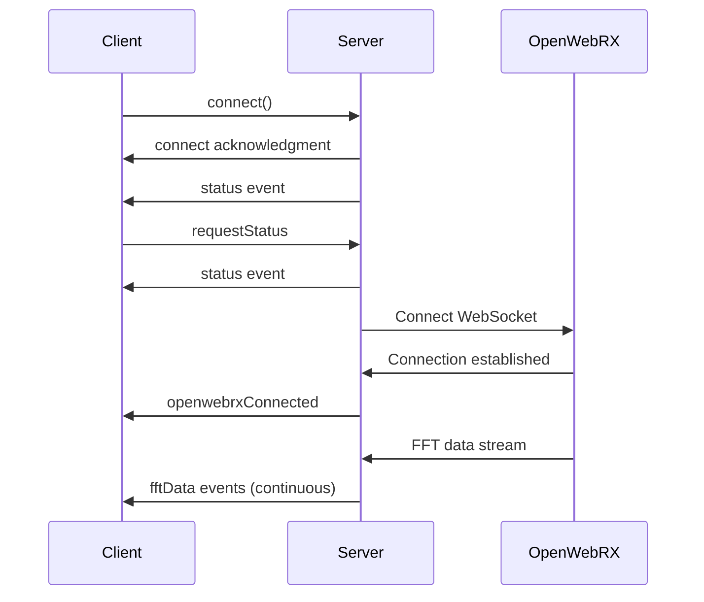
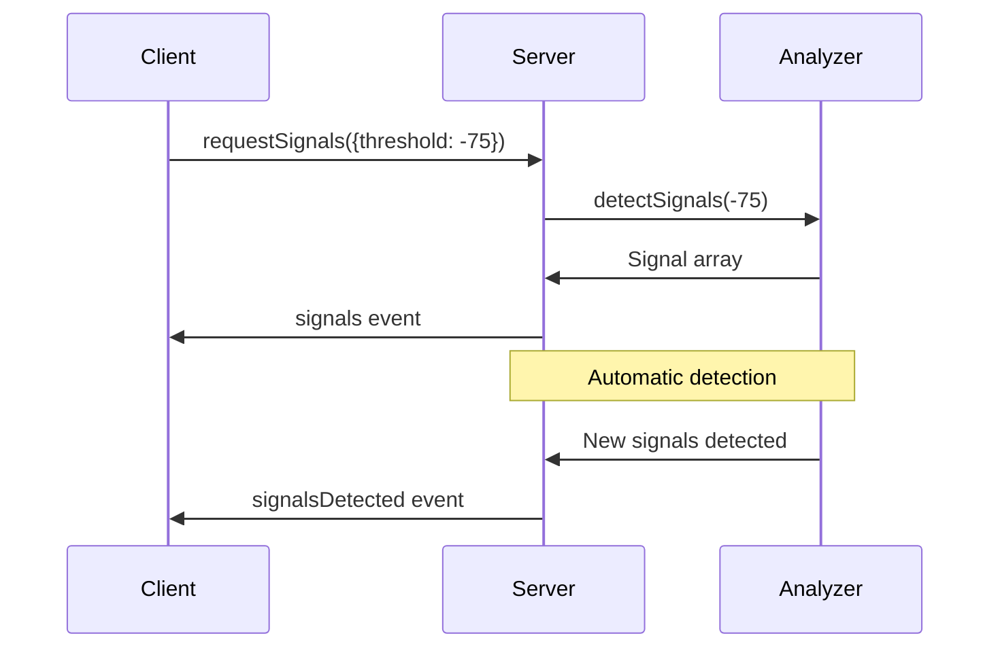

# WebSocket Events Specification

## Overview

The Spectrum Analyzer service uses Socket.IO for real-time bidirectional communication. This document details all WebSocket events, their payloads, and usage patterns.

## Connection

### Socket.IO Client Configuration
```javascript
const socket = io('http://localhost:8092', {
    // Transport options
    transports: ['websocket', 'polling'],
    
    // Reconnection options
    reconnection: true,
    reconnectionAttempts: 5,
    reconnectionDelay: 1000,
    reconnectionDelayMax: 5000,
    randomizationFactor: 0.5,
    
    // Timeout options
    timeout: 20000,
    
    // Authentication (future)
    auth: {
        token: 'YOUR_AUTH_TOKEN'
    }
});
```

### Connection Events
```javascript
// Connection established
socket.on('connect', () => {
    console.log('Connected with ID:', socket.id);
});

// Connection error
socket.on('connect_error', (error) => {
    console.error('Connection error:', error.message);
});

// Disconnection
socket.on('disconnect', (reason) => {
    console.log('Disconnected:', reason);
    // Reasons: 'io server disconnect', 'io client disconnect', 
    //          'ping timeout', 'transport close', 'transport error'
});

// Reconnection attempt
socket.on('reconnect_attempt', (attemptNumber) => {
    console.log('Reconnection attempt:', attemptNumber);
});

// Successful reconnection
socket.on('reconnect', (attemptNumber) => {
    console.log('Reconnected after', attemptNumber, 'attempts');
});
```

## Client-to-Server Events

### 1. Request Status
**Event**: `requestStatus`

**Description**: Request current system status

**Payload**: None

**Example**:
```javascript
socket.emit('requestStatus');
```

**Expected Response**: `status` event

---

### 2. Request Latest FFT
**Event**: `requestLatestFFT`

**Description**: Request the most recent FFT data sample

**Payload**: None

**Example**:
```javascript
socket.emit('requestLatestFFT');
```

**Expected Response**: `latestFFT` event

---

### 3. Request Signals
**Event**: `requestSignals`

**Description**: Request detected signals with optional threshold

**Payload**:
```typescript
interface RequestSignalsPayload {
    threshold?: number;  // Optional threshold in dBm
}
```

**Example**:
```javascript
// With custom threshold
socket.emit('requestSignals', { threshold: -75 });

// With default threshold
socket.emit('requestSignals', {});
```

**Expected Response**: `signals` event

---

## Server-to-Client Events

### 1. Connection Status
**Event**: `status`

**Description**: System status update (sent on connection and when requested)

**Payload**:
```typescript
interface StatusPayload {
    connected: boolean;           // WebSocket connection status
    openwebrx_status: boolean;   // OpenWebRX connection status
    buffer_size: number;         // Current FFT buffer size
    config: {
        fft_size: number;
        center_freq: number;
        samp_rate: number;
        fft_compression: string;
        signal_threshold: number;
    };
}
```

**Example Handler**:
```javascript
socket.on('status', (data) => {
    console.log('System status:', data);
    updateUIStatus(data);
});
```

---

### 2. Real-time FFT Data
**Event**: `fftData`

**Description**: Real-time FFT data stream from OpenWebRX

**Payload**:
```typescript
interface FFTDataPayload {
    data: number[];          // Power values in dBm
    center_freq: number;     // Center frequency in Hz
    samp_rate: number;       // Sample rate in Hz
    timestamp: number;       // Unix timestamp in milliseconds
}
```

**Example Handler**:
```javascript
socket.on('fftData', (data) => {
    console.log(`FFT: ${data.data.length} bins @ ${data.center_freq/1e6} MHz`);
    updateSpectrumDisplay(data);
});
```

**Data Rate**: Typically 5-10 updates per second depending on OpenWebRX configuration

---

### 3. Latest FFT Response
**Event**: `latestFFT`

**Description**: Response to requestLatestFFT

**Payload**:
```typescript
interface LatestFFTPayload {
    fft_data: number[] | null;   // FFT data or null if unavailable
    center_freq: number;
    samp_rate: number;
    timestamp: number;
} | null  // Can be null if no data available
```

**Example Handler**:
```javascript
socket.on('latestFFT', (data) => {
    if (data && data.fft_data) {
        console.log('Latest FFT received');
        processFFTData(data);
    } else {
        console.log('No FFT data available');
    }
});
```

---

### 4. Detected Signals
**Event**: `signals`

**Description**: Response to requestSignals

**Payload**:
```typescript
interface SignalsPayload {
    signals: Array<{
        frequency: number;    // Frequency in Hz
        power: number;       // Power in dBm
        bin: number;         // FFT bin index
        confidence: number;  // Detection confidence (0.0-1.0)
    }>;
    threshold: number;       // Threshold used for detection
    timestamp: number;       // Detection timestamp
}
```

**Example Handler**:
```javascript
socket.on('signals', (data) => {
    console.log(`Detected ${data.signals.length} signals`);
    data.signals.forEach(signal => {
        console.log(`Signal at ${signal.frequency/1e6} MHz: ${signal.power} dBm`);
    });
});
```

---

### 5. Signals Auto-Detection
**Event**: `signalsDetected`

**Description**: Automatic notification when new signals are detected

**Payload**:
```typescript
interface SignalsDetectedPayload {
    signals: Array<{
        frequency: number;
        power: number;
        bin: number;
        confidence: number;
    }>;
    count: number;           // Number of signals
    timestamp: number;       // Detection timestamp
}
```

**Example Handler**:
```javascript
socket.on('signalsDetected', (data) => {
    showNotification(`${data.count} new signals detected!`);
    updateSignalsList(data.signals);
});
```

---

### 6. OpenWebRX Connection Events
**Event**: `openwebrxConnected`

**Description**: OpenWebRX connection established

**Payload**:
```typescript
interface OpenWebRXConnectedPayload {
    url: string;             // WebSocket URL
    timestamp: number;       // Connection timestamp
}
```

**Example Handler**:
```javascript
socket.on('openwebrxConnected', (data) => {
    console.log('Connected to OpenWebRX:', data.url);
    showConnectionStatus('connected');
});
```

---

**Event**: `openwebrxDisconnected`

**Description**: OpenWebRX connection lost

**Payload**:
```typescript
interface OpenWebRXDisconnectedPayload {
    reason: string;          // Disconnection reason
    timestamp: number;       // Disconnection timestamp
}
```

**Example Handler**:
```javascript
socket.on('openwebrxDisconnected', (data) => {
    console.log('Disconnected from OpenWebRX:', data.reason);
    showConnectionStatus('disconnected');
});
```

---

**Event**: `openwebrxError`

**Description**: OpenWebRX connection error

**Payload**:
```typescript
interface OpenWebRXErrorPayload {
    error: string;           // Error message
    code?: string;           // Error code (if available)
    timestamp: number;       // Error timestamp
}
```

**Example Handler**:
```javascript
socket.on('openwebrxError', (data) => {
    console.error('OpenWebRX error:', data.error);
    showError(data.error);
});
```

---

### 7. Configuration Updated
**Event**: `configUpdated`

**Description**: Notification when configuration changes

**Payload**:
```typescript
interface ConfigUpdatedPayload {
    config: {
        fft_size: number;
        center_freq: number;
        samp_rate: number;
        fft_compression: string;
        signal_threshold: number;
    };
    timestamp: number;
}
```

**Example Handler**:
```javascript
socket.on('configUpdated', (data) => {
    console.log('Configuration updated:', data.config);
    updateConfigDisplay(data.config);
});
```

---

### 8. Buffer Cleared
**Event**: `bufferCleared`

**Description**: FFT buffer has been cleared

**Payload**:
```typescript
interface BufferClearedPayload {
    timestamp: number;       // Clear timestamp
}
```

**Example Handler**:
```javascript
socket.on('bufferCleared', (data) => {
    console.log('FFT buffer cleared');
    clearSpectrumDisplay();
});
```

---

## Event Flow Diagrams

### Connection Flow


### Signal Detection Flow


## Error Handling

### Client-Side Error Handling
```javascript
// Generic error handler
socket.on('error', (error) => {
    console.error('Socket error:', error);
    handleSocketError(error);
});

// Specific error scenarios
socket.on('openwebrxError', (data) => {
    if (data.code === 'CONNECTION_REFUSED') {
        // OpenWebRX is not running
        showAlert('OpenWebRX service is not available');
    } else if (data.code === 'TIMEOUT') {
        // Connection timeout
        showAlert('Connection to OpenWebRX timed out');
    }
});

// Reconnection handling
socket.io.on('reconnect_error', (error) => {
    console.error('Reconnection error:', error);
    if (socket.io.reconnectionAttempts > 3) {
        showAlert('Unable to reconnect. Please check your connection.');
    }
});
```

### Server-Side Error Broadcasting
```javascript
// Server emits errors to specific clients
socket.emit('error', {
    code: 'INVALID_REQUEST',
    message: 'Invalid threshold parameter',
    details: 'Threshold must be a number'
});

// Broadcast errors to all clients
io.emit('openwebrxError', {
    error: 'OpenWebRX connection lost',
    code: 'CONNECTION_LOST',
    timestamp: Date.now()
});
```

## Best Practices

### 1. Event Acknowledgments
```javascript
// Client-side with acknowledgment
socket.emit('requestSignals', { threshold: -75 }, (response) => {
    if (response.error) {
        console.error('Error:', response.error);
    } else {
        console.log('Request acknowledged');
    }
});

// Server-side acknowledgment
socket.on('requestSignals', (data, callback) => {
    try {
        const signals = detectSignals(data.threshold);
        socket.emit('signals', signals);
        callback({ success: true });
    } catch (error) {
        callback({ error: error.message });
    }
});
```

### 2. Event Throttling
```javascript
// Client-side throttling
const throttle = (func, delay) => {
    let timeoutId;
    let lastExecTime = 0;
    return (...args) => {
        const currentTime = Date.now();
        if (currentTime - lastExecTime > delay) {
            func.apply(this, args);
            lastExecTime = currentTime;
        } else {
            clearTimeout(timeoutId);
            timeoutId = setTimeout(() => {
                func.apply(this, args);
                lastExecTime = Date.now();
            }, delay - (currentTime - lastExecTime));
        }
    };
};

const throttledStatusRequest = throttle(() => {
    socket.emit('requestStatus');
}, 1000); // Max once per second
```

### 3. Memory Management
```javascript
// Cleanup event listeners
const fftHandler = (data) => {
    updateSpectrum(data);
};

// Add listener
socket.on('fftData', fftHandler);

// Remove listener when done
socket.off('fftData', fftHandler);

// Remove all listeners for an event
socket.removeAllListeners('fftData');
```

### 4. Connection State Management
```javascript
class SpectrumAnalyzerClient {
    constructor() {
        this.connected = false;
        this.openwebrxConnected = false;
        this.initSocket();
    }
    
    initSocket() {
        this.socket = io('http://localhost:8092');
        
        this.socket.on('connect', () => {
            this.connected = true;
            this.onConnectionChange();
        });
        
        this.socket.on('disconnect', () => {
            this.connected = false;
            this.openwebrxConnected = false;
            this.onConnectionChange();
        });
        
        this.socket.on('openwebrxConnected', () => {
            this.openwebrxConnected = true;
            this.onConnectionChange();
        });
        
        this.socket.on('openwebrxDisconnected', () => {
            this.openwebrxConnected = false;
            this.onConnectionChange();
        });
    }
    
    onConnectionChange() {
        // Update UI based on connection state
        if (this.connected && this.openwebrxConnected) {
            showStatus('Fully connected');
        } else if (this.connected) {
            showStatus('Connected (no OpenWebRX)');
        } else {
            showStatus('Disconnected');
        }
    }
}
```

## Performance Considerations

### Data Rate Management
- FFT data events can generate 5-10 messages per second
- Implement client-side buffering for smooth visualization
- Consider downsampling for low-performance clients

### Event Priorities
1. **High Priority**: Connection state changes, errors
2. **Medium Priority**: Signal detection, configuration updates
3. **Low Priority**: Continuous FFT data stream

### Bandwidth Optimization
```javascript
// Request reduced data rate
socket.emit('setDataRate', { 
    fftRate: 5,  // 5 updates per second
    compression: 'lossy'  // Enable compression
});

// Request data filtering
socket.emit('setFilters', {
    minPower: -80,  // Only send signals above -80 dBm
    frequencyRange: [144e6, 148e6]  // Limit frequency range
});
```

## Testing WebSocket Events

### Manual Testing with Socket.IO Client
```html
<!DOCTYPE html>
<html>
<head>
    <script src="/socket.io/socket.io.js"></script>
    <script>
        const socket = io('http://localhost:8092');
        
        socket.on('connect', () => {
            console.log('Connected:', socket.id);
            
            // Test events
            socket.emit('requestStatus');
            socket.emit('requestSignals', { threshold: -70 });
        });
        
        socket.on('status', data => console.log('Status:', data));
        socket.on('signals', data => console.log('Signals:', data));
        socket.on('fftData', data => console.log('FFT:', data.data.length, 'bins'));
    </script>
</head>
<body>
    <h1>WebSocket Test Client</h1>
    <p>Check console for events</p>
</body>
</html>
```

### Automated Testing
```javascript
const io = require('socket.io-client');
const assert = require('assert');

describe('WebSocket Events', () => {
    let socket;
    
    beforeEach((done) => {
        socket = io('http://localhost:8092', {
            forceNew: true
        });
        socket.on('connect', done);
    });
    
    afterEach(() => {
        socket.close();
    });
    
    it('should receive status on connection', (done) => {
        socket.on('status', (data) => {
            assert(data.hasOwnProperty('connected'));
            assert(data.hasOwnProperty('config'));
            done();
        });
    });
    
    it('should respond to requestSignals', (done) => {
        socket.emit('requestSignals', { threshold: -75 });
        socket.on('signals', (data) => {
            assert(Array.isArray(data.signals));
            assert.equal(data.threshold, -75);
            done();
        });
    });
});
```

## Security Considerations

### Authentication (Future Implementation)
```javascript
// Client-side authentication
const socket = io('http://localhost:8092', {
    auth: {
        token: localStorage.getItem('authToken')
    }
});

// Server-side validation
io.use((socket, next) => {
    const token = socket.handshake.auth.token;
    if (isValidToken(token)) {
        next();
    } else {
        next(new Error('Authentication failed'));
    }
});
```

### Rate Limiting
```javascript
// Server-side rate limiting
const rateLimiter = new Map();

socket.on('requestSignals', (data) => {
    const clientId = socket.id;
    const now = Date.now();
    const lastRequest = rateLimiter.get(clientId) || 0;
    
    if (now - lastRequest < 100) { // 100ms minimum between requests
        socket.emit('error', {
            code: 'RATE_LIMIT',
            message: 'Too many requests'
        });
        return;
    }
    
    rateLimiter.set(clientId, now);
    // Process request...
});
```

### Input Validation
```javascript
// Server-side input validation
socket.on('requestSignals', (data) => {
    if (data && typeof data.threshold === 'number') {
        if (data.threshold < -120 || data.threshold > 0) {
            socket.emit('error', {
                code: 'INVALID_PARAMETER',
                message: 'Threshold must be between -120 and 0 dBm'
            });
            return;
        }
    }
    // Process valid request...
});
```

---

**Document Version**: 1.0  
**Last Updated**: 2025-06-16  
**WebSocket Library**: Socket.IO v4.x